# Signal Function Set

A plugin for [VCV Rack](https://vcvrack.com/) by Stuart Frederich-Smith.

## Contents

Modules grouped by function:

**Sound Sources**
- [Operator](#operator) — DX7-style 6-operator FM voice (.syx cartridges)
- [GSX](#gsx) — Granular synthesis VCO (Truax 1985–86 lineage)
- [Overtone](#overtone) — Additive VCO with 8 togglable harmonics
- [Intone](#intone) — CHANT/FOF formant synthesis voice
- [Phase](#phase) — Dual sample looper with sleep/rotate phase drift
- [Play](#play) — Polyphonic multisample player (SFZ / DecentSampler)

**Filters & Resonators**
- [Band](#band) — Harmonic bandpass bank (isolate individual harmonics)
- [Tine](#tine) — Tunable pingable resonator (Gamelan Resonator circuit)

**Clocks & Sequencers**
- [Arrange](#arrange) — Song-form sequencer: 8 phrases, 4 per-instrument clock buses
- [Meter](#meter) — Time-signature-aware musical clock with swing
  - [Meter X (Expander)](#meter-x-expander) — 24 PPQN, run gate, 1–128 bar triggers
- [Beat](#beat) — Per-voice pattern sequencer (8 patterns × 16 steps)
- [Note](#note) — Pitched CV/gate sequencer with 19 scales
- [Chance](#chance) — Generative melodic walk sequencer (8 seeded patterns)
- [Fugue](#fugue) — 8-step harmonic deviation sequencer (3 voices)
  - [Fugue X (Expander)](#fugue-x-expander)
  - [MetaFugue](#metafugue)
- [Muse](#muse) — Faithful Triadex Muse recreation (Fredkin/Minsky, 1972)

**LFOs & Modulation**
- [Drift](#drift) — 4-channel chaotic LFO with phase spread
- [Cycle](#cycle) — Bar-synced quad LFO with morphing shapes
- [Gravity](#gravity) — Six-mode chaos & motion engine (pendulum / orbits / billiards / Pac-Man / turtle / patterns)

**Envelopes**
- [Swell](#swell) — Ping-driven additive A/D envelope
- [Vac](#vac) — Semi-stable A/R envelope with vactrol-like timing drift
- [OP ENV](#op-env) — Standalone DX7 operator envelope generator

**Utilities**
- [Shift](#shift) — 4-output CV shift register with cascade chain
- [Record](#record) — Auto-sampler: capture any voice to a multisampled SFZ instrument

- [Other Platforms](#other-platforms)
- [Building](#building)
- [License](#license)

## Modules

Modules are grouped by function below.

### Sound Sources

#### Operator

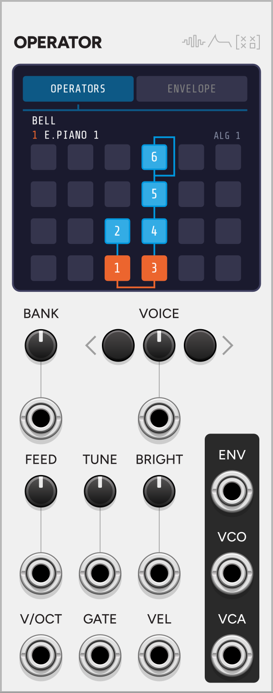 

**[Operator on signalfunctionset.com →](https://signalfunctionset.com/projects/operator)**

A 6-operator FM synth voice in the Yamaha DX7 lineage. Operator loads DX7 `.syx` cartridges (or your own banks exported from [Dexed](https://asb2m10.github.io/dexed/)), lets you pick a voice, and plays it polyphonically on Google's msfa DX7 core — so patches sound faithful to the hardware, with all six operators, every algorithm, feedback, key scaling, and the DX7 envelopes. It ships with four classic Brian Eno DX7 patches so it makes sound the moment you patch a gate.

**Features:**
- **Faithful DX7 voicing** — reads packed VMEM exactly as the hardware stores it; cartridges and Dexed banks play as intended.
- **Three outputs** — AUDIO (the voice with its internal DX7 envelope), VCO (the raw tone, no envelope, for shaping with an external EG/VCA), and ENV (a 0–10V envelope follower of the audio).
- **One-knob timbre** — BRIGHTNESS tilts the whole sound darker/brighter; FEEDBACK offsets the patch's feedback buzz; TUNE is ±12 semitones.
- **Tabbed display** — an OPERATORS view that shows the algorithm and lets you click operators to mute/un-mute them, and an ENVELOPE view with the carrier EG shape plus a live trace.
- **Polyphonic** (up to 16 voices), with velocity input and sample-rate-corrected envelopes.

**Controls:** Voice, Bank, ◀/▶ voice (on screen), Tune, Brightness, Feedback.
**Inputs:** V/Oct (poly), Gate (poly), Vel (poly), Voice CV, Bank CV, Tune CV, Brightness CV, Feedback CV.
**Outputs:** Audio (poly), VCO (poly), Env (poly).

See [docs/operator-manual.md](docs/operator-manual.md) for the full manual.

#### GSX

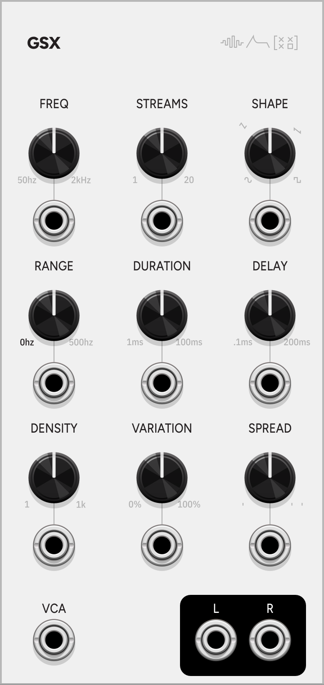 

**[GSX on signalfunctionset.com →](https://signalfunctionset.com/projects/gsx)**

A real-time granular synthesis module inspired by Barry Truax's groundbreaking GSX system (1985–86), the first implementation of real-time granular synthesis. GSX generates dense textures from hundreds of short sound events called "grains," operating in the microsound domain (1–50ms) where changes in the time domain produce changes in the frequency/spectral domain.

**Features:**
- **Multi-Stream Architecture** — Up to 20 independent grain streams for dense, evolving textures
- **Morphing Waveforms** — Continuous waveform morphing from sine to triangle to sawtooth to square
- **Dual Synthesis Modes** — Quasi-synchronous mode (pitched/tonal) and asynchronous mode (stochastic clouds)
- **Real-Time Control** — All parameters respond to CV for dynamic sound sculpting
- **Stereo Output** — Spatial distribution with dramatic stereo spread control
- **VCA Control** — External amplitude modulation for expressive dynamics

**Controls:**
- **Frequency** (50–2000 Hz, default C3): Center frequency of generated grains. CV input tracks 1V/octave.
- **Streams** (1–20, default 10): Number of simultaneous grain generators. More streams = denser texture.
- **Shape** (0–1, default 0): Grain waveform morphing: 0=sine, 0.33=triangle, 0.66=sawtooth, 1.0=square.
- **Range** (0–500 Hz, default 100 Hz): Frequency deviation around center frequency.
- **Duration** (1–100 ms, default 20 ms): Length of individual grains.
- **Delay** (0.1–200 ms, default 0.1 ms): Manual override for time between grains.
- **Density** (1–1000 grains/sec, default 100): Rate of grain generation per stream.
- **Variation** (0–100%, default 50%): 0% = quasi-synchronous (regular/pitched), 100% = fully asynchronous (cloud textures).
- **Spread** (0–100%, default 50%): Stereo width. 0% = mono center, 100% = dramatic hard left/right panning.

**Inputs:**
- 9 CV inputs (one per parameter, ±5V bipolar) plus VCA input (0–5V unipolar)

**Outputs:**
- **Left / Right**: Stereo output pair

#### Overtone

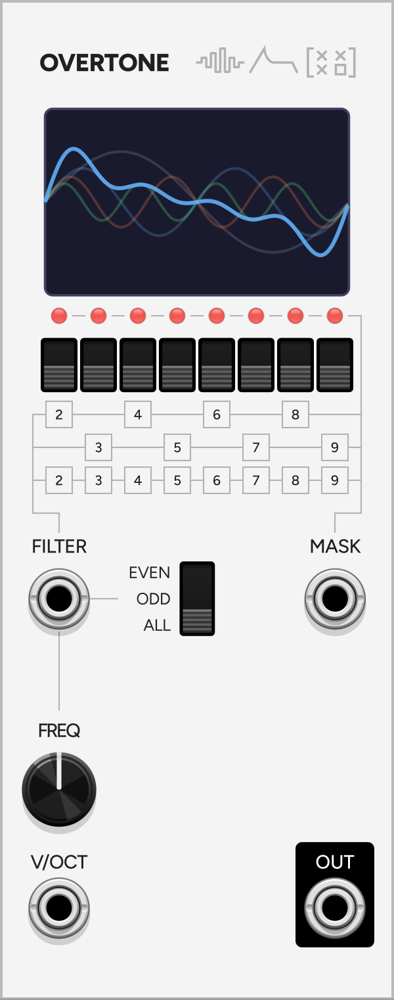 

**[Overtone on signalfunctionset.com →](https://signalfunctionset.com/projects/overtone)**

An additive synthesis VCO that builds waveforms from the harmonic series. The fundamental is always present; 8 toggle switches enable/disable overtones (harmonics 2–9) with natural 1/n amplitude falloff. All overtones on produces a saw-like wave; all off gives a pure sine.

**Features:**
- **8 Harmonic Toggles** — Individual on/off for harmonics 2 through 9
- **Natural Amplitude Falloff** — Each harmonic scaled by 1/n (H2=0.5, H3=0.33, etc.)
- **Even/Odd Filter** — 3-position switch: All, Odd only (square-like), Even only
- **Binary Mask CV** — 0–10V mapped to 8-bit pattern for voltage-controlled timbre
- **Sweep Mask Mode** — Alternative CV mode: 0–10V enables 0–8 harmonics from bottom up
- **Zero-Crossing Gating** — Click-free transitions when toggling harmonics
- **Waveform Display** — Shows composite wave with faint individual harmonic traces and fundamental
- **LED Indicators** — Show actual active state after filter/CV processing

**Controls:**
- **Harmonic 2–9 Toggles**: Enable/disable individual overtones (default: all on)
- **Even/Odd/All Switch**: 3-position filter for harmonic selection
- **Freq** (-4 to +4 octaves, default C4): Coarse frequency control, log2 scaled

**Inputs:**
- **V/Oct** — 1V/octave pitch tracking
- **Mask** (0–10V) — Binary (8-bit) or sweep (0–8 harmonics) mode, selected via context menu
- **Filter** (0–5V) — Even/odd filter CV (0–1.67V=All, 1.67–3.33V=Odd, 3.33–5V=Even)

**Outputs:**
- **Out** — Monophonic audio output (±5V normalized)

**Context Menu:**
- Mask CV Mode: Binary (8-bit pattern) or Sweep (bottom-up harmonics)

#### Intone

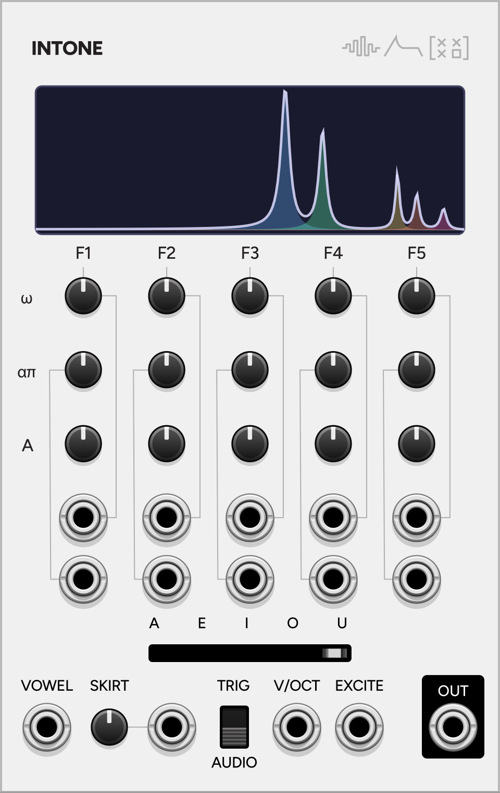 

**[Intone on signalfunctionset.com →](https://signalfunctionset.com/projects/intone)**

A CHANT/FOF formant synthesis voice inspired by the IRCAM CHANT project (Rodet, Potard, Barriere, 1984). Generates vocal-character sound using 5 parallel formant cells, each producing overlapping FOF (Formant Wave Function) grains — damped sinusoids at formant frequencies.

**Features:**
- **5 Parallel Formant Cells** — Each generating overlapping FOF grains at independently controllable center frequencies
- **Vowel Morph Slider** — Smoothly interpolates through /a/, /e/, /i/, /o/, /u/ formant presets
- **Per-Formant Controls** — Frequency offset, bandwidth, and amplitude knobs with CV inputs
- **Skirt Width** — Controls the spectral slope of each formant peak (FOF attack rate)
- **Spectrum Display** — 5 formant bell curves + composite envelope on a logarithmic frequency axis
- **Three Excitation Modes:**
  - **Default** (nothing patched): FOF vocal VCO, V/Oct controls pitch
  - **Audio mode** (audio + switch up): Parallel resonant bandpass filter bank — input audio is formant-filtered through the 5 vowel resonances, V/Oct transposes the formant pattern
  - **Trigger mode** (clock + switch down): External trigger fires FOF grains for rhythmic vowel hits, V/Oct transposes formants

**Controls:**
- **Formant 1–5 Frequency** (±1 octave offset): Adjusts each formant relative to the vowel morph preset
- **Formant 1–5 Bandwidth** (30–500 Hz): Width of each formant resonance
- **Formant 1–5 Amplitude** (0–1): Level of each formant
- **Vowel Morph** (slider): Sweeps through /a/ → /e/ → /i/ → /o/ → /u/
- **Skirt**: Spectral slope control (soft to hard formant edges)
- **Mode Switch** (Audio/Trigger): Selects excitation mode when EXC is patched

**Inputs:**
- **V/Oct** — Pitch (default mode) or formant transposition (audio/trigger modes)
- **EXC** — Excitation source (audio or trigger, behavior depends on mode switch)
- **Formant 1–5 Freq CV, Formant 1–5 BW CV** (±5V) — Per-formant modulation
- **Vowel CV** (0–10V) — Vowel morph position
- **Skirt CV** (±5V) — Skirt width modulation

**Outputs:**
- **Out** — Monophonic audio output

#### Phase

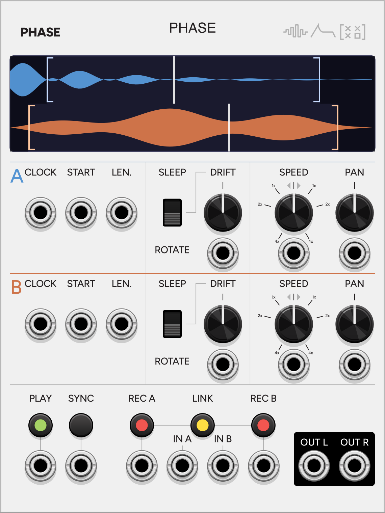 

**[Phase on signalfunctionset.com →](https://signalfunctionset.com/projects/phase)**

A dual sample looper inspired by Steve Reich's phase compositions. Two loops play the same or different audio samples with independent drift controls that create gradual phase relationships. Each loop has a mode switch choosing between Sleep (silence gap after each cycle) and Rotate (continuous tape-style content drift).

**Features:**
- **Dual Loop Playback** — Load one or two WAV files; loading only one cascades to both loops
- **Sleep Mode** — Adds silence after each loop cycle, creating phase drift through timing gaps
- **Rotate Mode** — Continuous content drift like tape machines at slightly different speeds
- **Bipolar Drift** (-500ms to +500ms) — Positive and negative drift in both modes
- **Reverse Playback** — Speed range of -4x to +4x with center at 0 (stopped); reverses both rotate and sleep modes
- **Transient Detection** — Energy-based onset detection with adjustable sensitivity and minimum gap
- **WAV Cue Point Support** — Embedded cue markers used as transient positions when present
- **Clock-Triggered Jumps** — Per-loop clock input jumps playhead to next detected transient
- **Loop Region Controls** — Draggable bracket handles on waveform display, plus Start/End CV inputs
- **Live Recording** — Record into either loop directly via REC A/REC B + GATE inputs, with a LINK button to record both at once
- **Waveform Display** — Dual waveform view with playhead, transient markers, loop handles, and rotation origin line
- **VCA Anti-Click** — 1ms envelope on all discontinuities (enabled by default)

**Controls:**
- **Drift** (-500 to +500 ms): Phase drift amount per loop cycle. In Sleep mode: positive = silence gap, negative = early restart. In Rotate mode: continuous speed offset.
- **Speed** (-4x to +4x, default 1x): Playback speed and direction. Center = stopped.
- **Pan** (-1 to +1): Per-loop stereo position with equal-power panning.
- **Mode Switch** (SLP/ROT): Sleep or Rotate mode per loop.
- **PLAY / SYNC** buttons: Transport.
- **REC A / LINK / REC B** latches: Arm one loop or both for recording.

**Inputs:**
- **CLK A/B** — Trigger: jump to next transient
- **START A/B** (0–10V) — Loop start position (0–100% of sample)
- **END A/B** (0–10V) — Loop end position
- **Drift CV, Speed CV, Pan CV** (±5V) — Per-loop parameter modulation
- **PLAY GATE** — High (>=1V) = play, overrides button
- **SYNC** — Trigger: reset both loops to start
- **A IN / B IN** — Audio in for live recording
- **GATE A / GATE B** — Recording gate triggers

**Outputs:**
- **Left / Right** — Stereo output pair

**Context Menu:**
- Load/Clear Sample A and B
- Clear A&B (one-shot wipe of both)
- Transient sensitivity (High/Medium/Low) and minimum gap (10/50/100ms)
- Re-detect Transients (overrides WAV cue points)
- VCA Mode toggle (anti-click envelope)
- Recording mode (Replace / Append) and "Save recordings with patch"

#### Play

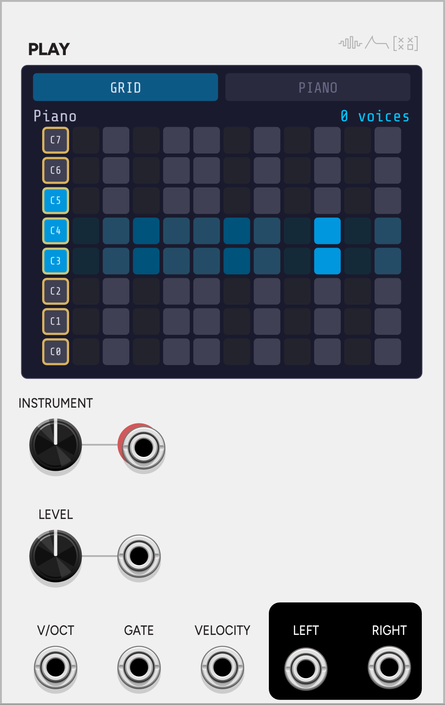 

**[Play on signalfunctionset.com →](https://signalfunctionset.com/projects/play)**

A polyphonic multisample player. Loads an `.sfz` or DecentSampler `.dspreset` instrument and plays it back with up to 16 voices — velocity layers, round-robins, loops, and per-note tuning. It's the other half of [Record](#record): load what you captured and play it. It isn't limited to that, though — it reads a practical SFZ subset, so simple third-party libraries work too. Play is 16HP.

**Features:**
- **16-voice polyphony** — one voice per V/OCT + GATE cable channel. A mono cable broadcasts to all voices, so a single velocity cable applies to the whole chord.
- **SFZ subset** — `sample`, `lokey`/`hikey`/`key`, `pitch_keycenter`, `lovel`/`hivel`, `tune`, `volume`, `loop_mode`/`loop_start`/`loop_end`, `default_path`, `seq_length`/`seq_position`; note-name or numeric keys, cascading global → group → region.
- **DecentSampler** — `.dspreset` parsing with the convention-correct accumulating tuning/volume, loops, and round-robins mapped onto the same engine.
- **Gate-controlled duration** — note-off releases the voice by default; a "One-shot (play through)" option lets drums run to their natural end. Looped regions loop while held.
- **Multiple instruments** — keep several loaded and select with the INSTR knob or CV.
- **Playable display** — 88-key map (mapped = blue, playing = cyan) or a 12×8 Push-style pad grid with three layouts; tap a pad to audition the instrument with nothing patched.

**Controls:** Instr, Level.
**Inputs:** V/Oct (poly), Gate (poly), Vel, Instr CV, Level CV.
**Outputs:** L / R.

See [docs/play-manual.md](docs/play-manual.md) for the full manual.

### Filters & Resonators

#### Band

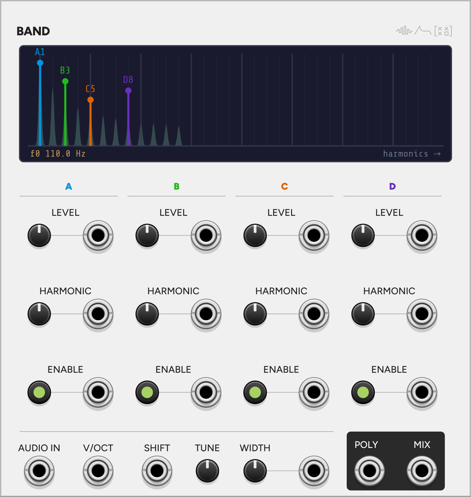 

**[Band on signalfunctionset.com →](https://signalfunctionset.com/projects/band)**

A harmonic bandpass bank for isolating individual harmonics of a sound — inspired by Suzanne Ciani's technique of taking a low, rich wave and filtering out all but one harmonic at a time. Because harmonics are *linearly* spaced (f0, 2·f0, 3·f0…), a normal filter makes them fiddly to find; Band instead locks each of its four bands to an **integer harmonic** of a shared fundamental, so every band lands dead-on a partial.

**Features:**
- **Four bands (A/B/C/D)** — each isolates an integer harmonic, with its own level, harmonic selector, and enable (anti-click). Each has a colour carried into the display so you always know which control owns which harmonic.
- **Auto-follow pitch** — detects the source's fundamental from the audio (FFT autocorrelation) and locks the harmonic grid to it, so the bands track whatever you play with no tuning. Manual 1V/oct (standard 0V = C4) tuning is also available.
- **Width as a fraction of f0** — constant absolute bandwidth, so every harmonic isolates equally cleanly. Narrow = pure single harmonic; wider = neighbours bleed in.
- **Global SHIFT** — continuously slides all bands between harmonics for scanning/impurity.
- **Spectrum display** — FFT of the source on a harmonic axis, with each band's coloured bell sitting on its partial (labelled e.g. `A5`).
- Full CV over every parameter; **MIX** and per-band **POLY** outputs.

**Controls:** per band — Level, Harmonic, Enable; global — Tune, Width.
**Inputs:** In, V/Oct, Shift, W-CV, and per band — Level CV, Harmonic CV, Enable gate.
**Outputs:** Mix, Poly (one channel per band).

See [docs/band-manual.md](docs/band-manual.md) for the full manual.

#### Tine

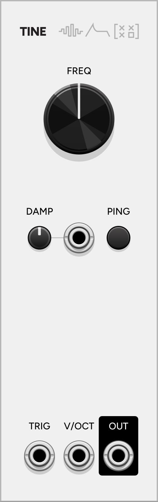 

**[Tine on signalfunctionset.com →](https://signalfunctionset.com/projects/tine)**

A tunable 3rd-order pingable resonator based on the Gamelan Resonator circuit from Paul DeMarinis' *Pygmy Gamelan* (1973), analyzed by Werner & Teboul (AES Convention Paper 10542, 2021). The unique 3rd-order active filter topology — distinct from classic Bridged-T and Twin-T designs — produces metallic, bell-like ringing tones when pinged.

**Features:**
- **3rd-Order IIR Filter** — Bilinear transform of the analog Gamelan Resonator transfer function with frequency pre-warping for accurate V/Oct tracking
- **Variable Damping** — From short percussive thumps to long metallic rings approaching self-oscillation
- **Trigger Input** — Accepts gates and triggers via rising edge detection
- **Manual Ping Button** — Immediate excitation without patching
- **Damping CV** — Expressive ring time modulation
- **VCA Anti-Click Mode** — Crossfade envelope on retrigger eliminates zero-crossing clicks (default: on)
- **Double-Precision Filter** — Numerical stability at high damping values

**Controls:**
- **Freq** (-4 to +4 octaves, default C4): Pitch, log2 scaled with V/Oct tracking
- **Damp** (0–1, default 0.5): Ring time from short thump to long sustain

**Inputs:**
- **TRIG** — Trigger/gate input (rising edge fires ping)
- **V/Oct** — 1V/octave pitch CV
- **Damp CV** (±5V) — Damping modulation

**Outputs:**
- **Out** — Monophonic audio output

**Context Menu:**
- VCA Mode (anti-click): Toggle crossfade envelope on retrigger (default: on)

### Clocks & Sequencers

#### Arrange

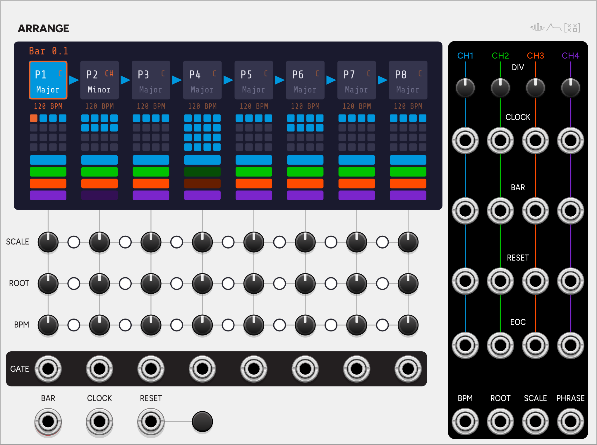 

**[Arrange on signalfunctionset.com →](https://signalfunctionset.com/projects/arrange)**

The song-form brain that sits above the rest of the rig. Where Beat, Note, and Chance each play a part, Arrange decides *what section you're in* — how many bars it lasts, what key and tempo it's in, and which instruments are playing during it. A single chain of 8 phrases (intro, verse, chorus, break) that advances on Meter's bars and wraps. Arrange is 34HP.

**Features:**
- **8 phrases** — each with a bar length (1–16 via a 4×4 grid), an enable, and its own root, scale, and BPM.
- **4 per-instrument clock buses** — each channel has its own clock division (÷1…÷16) plus CLOCK / BAR / RESET / EOC outputs. Toggle a channel off for a phrase and that instrument simply stops; toggle it back on and its RESET fires so it re-enters in sync. Division counters keep running while off, so returning instruments stay phase-locked.
- **Per-phrase GATE outs** — a gate that stays high for the whole time its phrase is playing, for section-length envelopes and fades.
- **Linked key and tempo** — LED dots between the trimpot columns cascade BPM, root, and scale independently down the chain (on by default). A linked phrase inherits its group leader's value exactly; break one dot for a key change.
- **Drives the whole patch's key** — ROOT and SCALE outs use the shared 19-scale convention, interchangeable with Note, Chance, Fugue, Muse, and MetaFugue.
- **Feeds Meter's tempo** — BPM out (0.01V/BPM) into Meter's BPM CV with "BPM CV absolute" enabled.

**Controls:** per phrase — Scale, Root, BPM trimpots + scale/root/BPM link dots; per channel — clock division; Reset.
**Inputs:** Bar (from Meter), Clock, Reset.
**Outputs:** per phrase — Gate; per channel — Clock, Bar, Reset, EOC; master — BPM, Root, Scale, Phrase index (1V/phrase).

See [docs/arrange-manual.md](docs/arrange-manual.md) for the full manual.

#### Meter

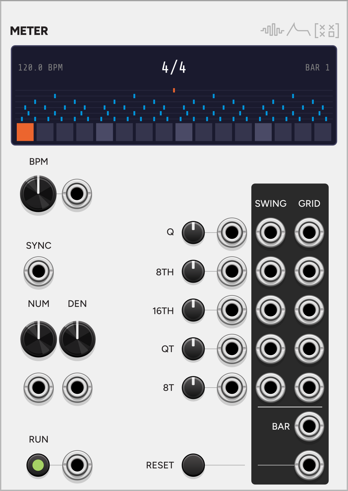 

**[Meter on signalfunctionset.com →](https://signalfunctionset.com/projects/sfs-sequencer-system)**

A time-signature-aware musical clock. Most VCV clocks output evenly-spaced pulses at fixed ratios; Meter understands the *musical* structure of those pulses — bars, beats, swing, and time signatures with CV control. Designed to be the master clock for a Beat-driven rhythm rig: one Meter feeds many downstream sequencers, each potentially clocked from a different swung or grid subdivision.

**Features:**
- **Six Subdivision Outputs** — BAR / Quarter / Eighth / Sixteenth / Quarter Triplet / Eighth Triplet, all gate-style (1ms 10V)
- **Per-Output Swing** — Independent ±50% swing per subdivision (BAR is always on the grid)
- **Grid (Un-Swung) Outputs** — A second copy of each subdivision (Q/E/S/QT/ET) with no swing applied — useful for keeping some elements on the grid while others swing
- **Time Signature with CV** — Numerator + Denominator both knob and CV controllable; changes queued for the next bar by default (or apply immediately via context menu)
- **External Clock Sync** — Configurable PPQN (1/2/4/8/12/16/24); LPF-smoothed BPM measurement
- **Swing Latching** — Per-bar swing latch prevents mid-period accumulator glitches when swing changes
- **BPM-Change Phase Preservation** — All subdivision phase accumulators rescale together when BPM changes so they stay locked relative to each other
- **Display** — BPM readout, current time signature (with pending change indicator), bar counter, sync indicator (when external clock is patched), per-output hit indicator rows with swing ghosts and pulse flashes, and a position tracker scaled to the active sixteenths-per-bar

**Controls:**
- **BPM** (30–300, default 120): Internal clock rate (quarter notes per minute)
- **Numerator** (1–16, default 4) / **Denominator** (1/2/4/8/16/32, default 4): Time signature
- **Run** (light latch): Play/stop
- **Reset**: Reset bar to 1, position to 0; fires Reset OUT
- **Per-Output Swing Trimpots** (×5): -50% to +50% (BAR has none)

**Inputs:**
- **BPM CV** (~27 BPM/V), **Numerator CV**, **Denominator CV**
- **Run gate** (overrides Run latch)
- **External clock** (overrides internal BPM when patched)
- **Per-output Swing CV** (×5, ±5V → ±50%)

**Outputs:**
- **BAR** / **Q** / **E** / **S** / **QT** / **ET** — swung subdivisions
- **Q grid** / **E grid** / **S grid** / **QT grid** / **ET grid** — un-swung versions
- **RESET OUT** — fires when Reset button is pressed (downstream modules use this to reset)

**Context Menu:**
- External Clock PPQN selector (1, 2, 4, 8, 12, 16, 24)
- Apply time signature changes immediately (default: queue for next bar)
- Reset on play (default: resume from current position)

#### Meter X (Expander)

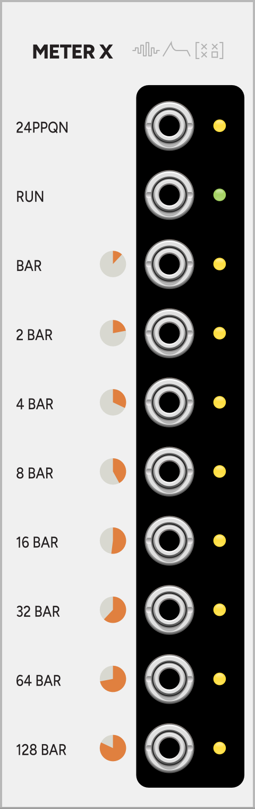 

**[Meter X on signalfunctionset.com →](https://signalfunctionset.com/projects/meter-x)**

An expander for Meter that covers the long game. Meter's own panel handles the musical subdivisions; Meter X adds a high-resolution 24 PPQN clock, a run gate, and bar-multiple triggers out to 128 bars — structure that unfolds over minutes rather than beats. Place it immediately to the right of Meter; there are no cables to patch. Meter X is 8HP.

**Features:**
- **24 PPQN clock** — the MIDI-standard resolution, deliberately un-swung so downstream modules that apply their own swing don't double it.
- **Bar multiples** — Bar / 2 / 4 / 8 / 16 / 32 / 64 / 128 triggers, all firing on the downbeat and aligned to reset (bars 1, 1+N, 1+2N…), so the whole hierarchy stays locked to the song.
- **Cycle pies** — each bar row shows a pie that fills clockwise through its cycle and resets when it fires. You can see you're three-quarters through a 32-bar section instead of counting.
- **Run gate** — 10V while Meter runs.
- **Activity LEDs** on every row.

**Outputs:** 24 PPQN, Run, Bar, 2 / 4 / 8 / 16 / 32 / 64 / 128 bars.

See [docs/meterx-manual.md](docs/meterx-manual.md) for the full manual.

#### Beat

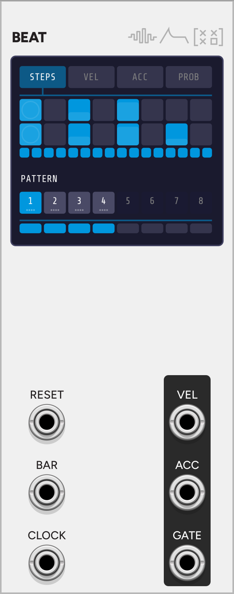 

**[Beat on signalfunctionset.com →](https://signalfunctionset.com/projects/sfs-sequencer-system)**

A single-voice pattern sequencer designed to pair with Meter (or any clock + bar source). One Beat instance = one drum/voice. Eight patterns × sixteen steps each, with per-step velocity, accent, and probability. Per-pattern length and per-pattern repeat count define the macro structure. Most editing happens directly on the screen; the panel itself is a narrow 10HP with just the display + jacks.

**Features:**
- **8 Patterns × 16 Steps** — 128-step memory per Beat
- **Per-Step Velocity, Accent, Probability** — On-screen editable in dedicated edit modes
- **Per-Pattern Length** (1–16) and **Repeats** (1–8 bars) — Define how many steps and how many times each pattern plays
- **Pattern Rotation** — Active patterns advance automatically on bar pulses; double-click any pattern cell to toggle it active/inactive
- **On-Screen Editing** — Tab between STEPS / VEL / ACC / PROB modes; click + drag to paint, scrub velocity/probability vertically
- **BAR/CLOCK Coincidence Handling** — Defer + suppress windows make Beat tolerant of CLOCK and BAR pulses arriving up to a few samples apart at bar boundaries
- **Reset Sync** — First clock after a Reset lands on step 1 (the downbeat) instead of skipping past it

**Inputs:**
- **CLOCK** — Advances the step counter
- **BAR** — Advances to the next active pattern (with `repeats` honored)
- **RESET** — Returns to first active pattern, step 1

**Outputs:**
- **GATE** — 1ms 10V pulse on each fired step
- **VELOCITY** — Sample-and-hold CV 0–10V (held until next fired step)
- **ACCENT** — 1ms 10V pulse on accented steps

**Context Menu:**
- "Advance only on bar trigger" (default ON)
- Patterns: Randomize current pattern / Clear current / Clear all

#### Note

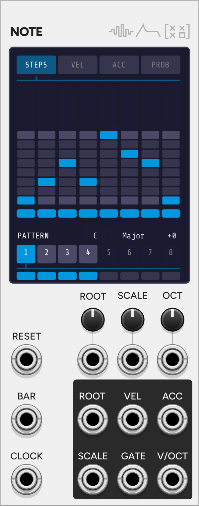 

**[Note on signalfunctionset.com →](https://signalfunctionset.com/projects/sfs-sequencer-system)**

A monophonic CV/gate pattern sequencer — Beat's pitched cousin. Eight patterns × eight steps with a 12-row pitch matrix, scale and root selection, octave shift, and per-step velocity, accent, and probability. Designed for melodic and percussion-tonal sequencing alongside Beat.

**Features:**
- **8 Patterns × 8 Steps** — 64-step melodic memory
- **12-Row Pitch Matrix** — Click any cell to set the pitch for a step (or use a ROOT/SCALE quantizer mode)
- **19 Scales** — From the shared canonical list (interchangeable with Fugue and Muse), including non-12-TET options: Slendro (5 equal divisions), Pelog (Surakarta-style), Harmonic Series (just-intonation harmonics 1–12), Hijaz, Hirajoshi, plus the standard modes and pentatonics
- **Per-Step Velocity, Accent, Probability** — Same edit modes as Beat
- **ROOT / SCALE / OCT** — Trimpots + CV inputs, with ROOT trimpot tooltip showing the actual note name

**Inputs:**
- **CLOCK / BAR / RESET** — Same semantics as Beat
- **ROOT CV** (1V/12), **SCALE CV** (1V/scale-index), **OCT CV** (1V/octave)

**Outputs:**
- **CV** — 1V/octave pitch (sample-and-hold)
- **GATE** — 1ms pulse on each fired step
- **VELOCITY** — 0–10V S&H
- **ACCENT** — 1ms pulse on accented steps

**Context Menu:**
- "Advance only on bar trigger" (default ON)
- Patterns: Randomize / Clear

#### Chance

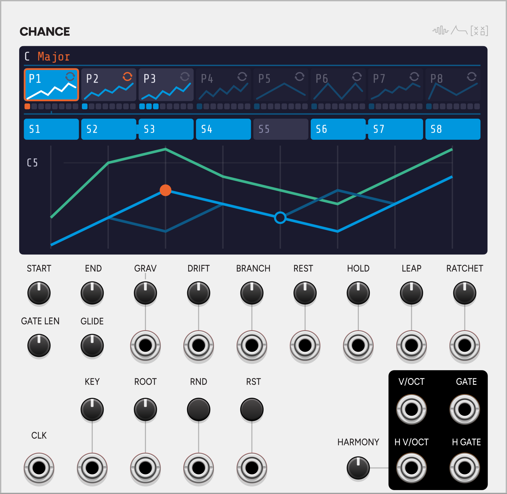 

**[Chance on signalfunctionset.com →](https://signalfunctionset.com/projects/chance)**

A generative melodic sequencer built on one idea: a melody is a *walk*. You don't program notes — you set a key, a window, and a few probabilities, and Chance walks a line through the scale. Every decision is seeded, so a pattern is a fixed, repeatable melody rather than a stream of noise: it plays the same way every time it comes around, and every knob you turn changes it audibly. Chance is 26HP and needs an external clock.

**Features:**
- **Core + branch** — a deterministic skeleton melody (the core), plus a BRANCH probability that strays to a neighbouring note at each step. Strays are non-cascading, so the core always shows through: BRANCH at 0 is the pure tune, higher is the same tune wearing a different coat.
- **Musical note choice** — hand-authored first-order Markov tables rather than a coin flip: chord-tone gravity, leading-tone pull, dominant resolution; dedicated tables for pentatonic and blues. Strays voice-lead from the previous played note.
- **GRAV / DRIFT** — direction bias and move size (stepwise 2nds out to octave leaps).
- **Per-step shaping** — Rest, Hold (2–4 clocks), Leap (±octave), and Ratchet (2–3 bursts *inside* a step), each with CV.
- **8 seeded patterns** — each with its own micro-waveform, gates, and repeat count; rotate at the cycle level. Per-slot mode: *normal* (identical every visit) or *reseed* (a fresh variation each visit).
- **On-screen editing** — click a pattern to load it into the walk, double-click to enable; per-step gates click to toggle, shift-click to tie. Gate edits apply immediately, mid-cycle.
- **Second voice** — Harmony at a fixed diatonic interval, or *Varied*: a seeded weaving counter-line with contrary motion.
- **Shared key convention** — Root and Scale CV interchangeable with Note, Fugue, Muse, and Arrange.

**Controls:** Grav, Drift, Branch, Rest, Hold, Leap, Ratchet, Gate Len, Glide, Key, Root, Start, End, Harmony, Rnd, Rst.
**Inputs:** Clock, Rnd, Rst, Root CV, Scale CV, and a CV jack under each walk/shaping control.
**Outputs:** V/OCT, Gate, Harmony V/OCT, Harmony Gate.

See [docs/chance-manual.md](docs/chance-manual.md) for the full manual.

#### Fugue

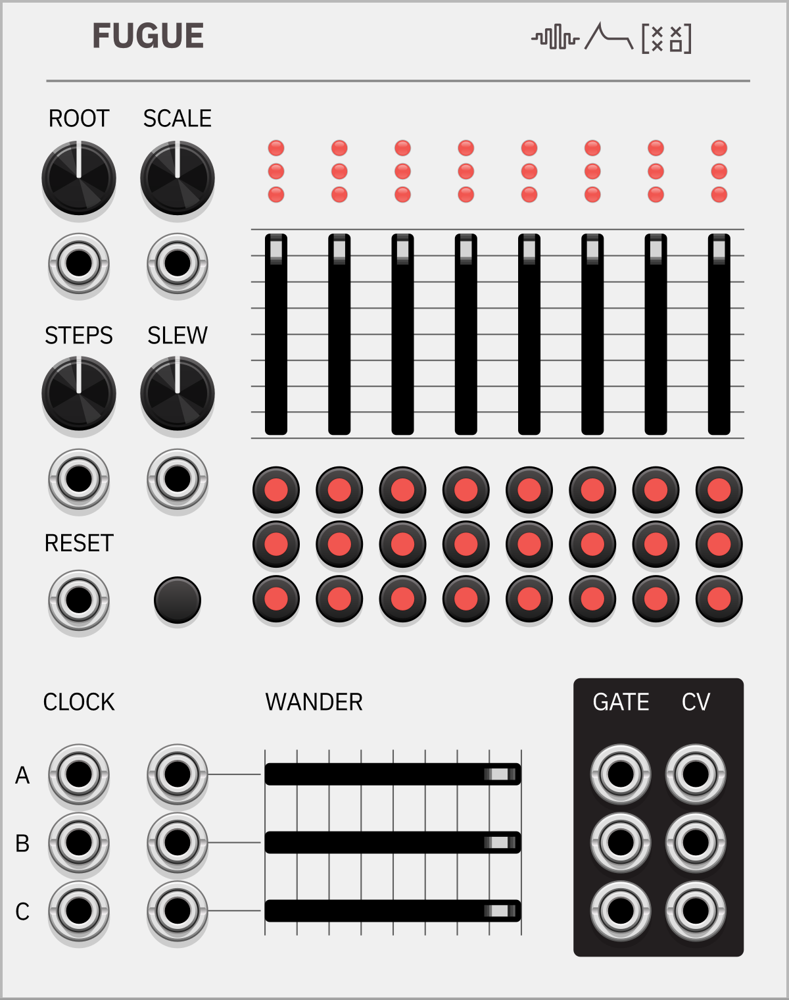 

**[Fugue on signalfunctionset.com →](https://signalfunctionset.com/projects/fugue)**

An 8-step harmonic deviation sequencer with three independent CV/gate voices (A, B, C). Each voice reads the same pitch sequence but wanders harmonically according to its own controls — producing shifting counterpoint from a shared origin.

**Features:**
- **Three Independent Voices** — Each with its own clock, gate pattern, and wander control
- **Harmonic Deviation** — Wander control selects notes from musically-informed tiers: chord tones, extensions, chromatic neighbors
- **Harmonic Lock** — Voices bias toward consonance with each other, creating soft harmonic gravity (enabled by default)
- **Clock Normalling** — Clock B normalled to A, Clock C normalled to B. Patch separate clocks for polyrhythmic effects.
- **19 Scales** — Drawn from a shared canonical scale list used across Fugue, Note, and Muse, so SCALE CV is interchangeable between them (sequence scale changes for the whole rig at once): Chromatic, Major, Minor, Pentatonic Major/Minor, Blues, Whole Tone, Harmonic Series, Dorian, Phrygian, Lydian, Mixolydian, Locrian, Harmonic Minor, Melodic Minor, Hijaz, Hirajoshi, Pelog, Slendro
- **Adaptive Slew** — Portamento that always resolves before the next note arrives
- **Per-Voice Gate Patterns** — 24 toggle buttons (8 steps × 3 voices) for independent rhythmic patterns

**Controls:**
- **Root** (C–B): Root note for scale quantization. CV: 1V = 1 semitone.
- **Scale** (19 modes): Scale selection. CV: 1V = 1 scale index.
- **Steps** (1–8): Active sequence length.
- **Slew** (0–100%): Adaptive portamento.
- **Pitch Faders** (8): Base pitch per step, quantized to the selected scale.
- **Gate Toggles** (3 rows × 8): Per-voice gate on/off per step.
- **Wander A/B/C** (0–100%): Horizontal sliders controlling harmonic deviation per voice.
- **Reset**: Jack + momentary button, returns all voices to step 1.

**Inputs:**
- **Clock A, B, C** — Trigger inputs (B normalled to A, C normalled to B)
- **Reset** — Trigger input
- **Root CV, Scale CV, Steps CV, Slew CV** — Parameter modulation
- **Wander A/B/C CV** — Per-voice wander modulation (±5V)

**Outputs:**
- **CV A, B, C** — 1V/octave pitch
- **Gate A, B, C** — +10V gate

**Context Menu:**
- Fader Range: 1V (1 octave), 2V (2 octaves), or 5V (5 octaves)
- Harmonic Lock: Toggle consonance-biased deviation (default: on)
- Randomize Sequence: Set all faders to random positions

##### Fugue X (Expander)

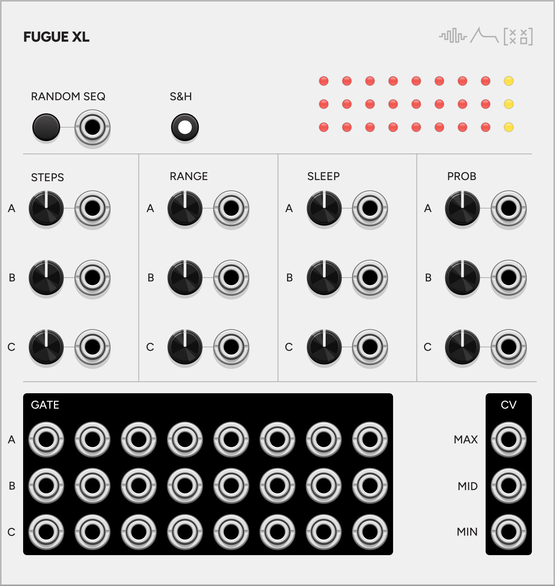 

**[Fugue X on signalfunctionset.com →](https://signalfunctionset.com/projects/fugue)**

An expander module for Fugue that adds per-voice controls for steps, range, sleep, and probability, plus sorted CV outputs and per-step trigger outputs. Place to the right of Fugue to connect automatically.

**Per-Voice Controls (A, B, C):**
- **Steps** (1–8): Independent step count per voice (overrides Fugue's global steps)
- **Range** (1V/2V/5V): Independent fader range per voice (overrides Fugue's global range)
- **Sleep** (0–64 steps): Number of clock ticks to skip between active steps — creates rests and rhythmic variation
- **Probability** (0–100%): Chance that each step actually fires its gate. At 100% every step plays; lower values introduce random silences.

**Additional Features:**
- **Sample & Hold Mode** — Toggle: when enabled, held notes sustain through rests instead of returning to silence
- **Randomize Sequence** — Button + trigger input to randomize the parent Fugue's pitch faders
- **LED Matrix** — 8×3 grid showing the current step position for each voice, plus sleep indicator LEDs
- **Per-Step Trigger Outputs** — 24 individual trigger outputs (8 steps × 3 voices) for driving external modules from specific sequence positions

**Sorted CV Outputs:**
- **Max** — Highest of the three voice CV values
- **Mid** — Middle value
- **Min** — Lowest value

**All per-voice parameters have CV inputs** (±5V).

##### MetaFugue

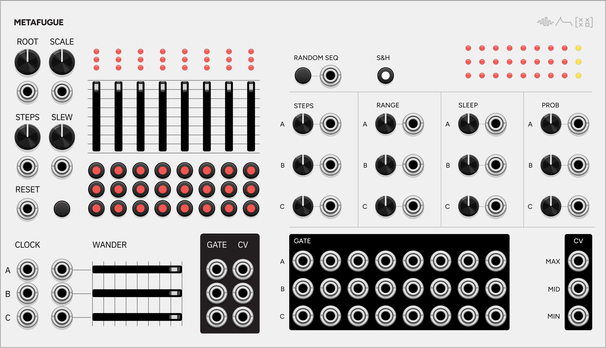 

**[MetaFugue on signalfunctionset.com →](https://signalfunctionset.com/projects/fugue)**

A single-module merge of Fugue + Fugue X — all of Fugue's controls plus the per-voice steps/range/sleep/probability, S&H mode, sorted min/mid/max CV outputs, and per-step trigger outputs, in one wider panel. Ideal for hosts that don't support expanders (e.g. MetaModule) or for anyone who prefers everything in one place.

#### Muse

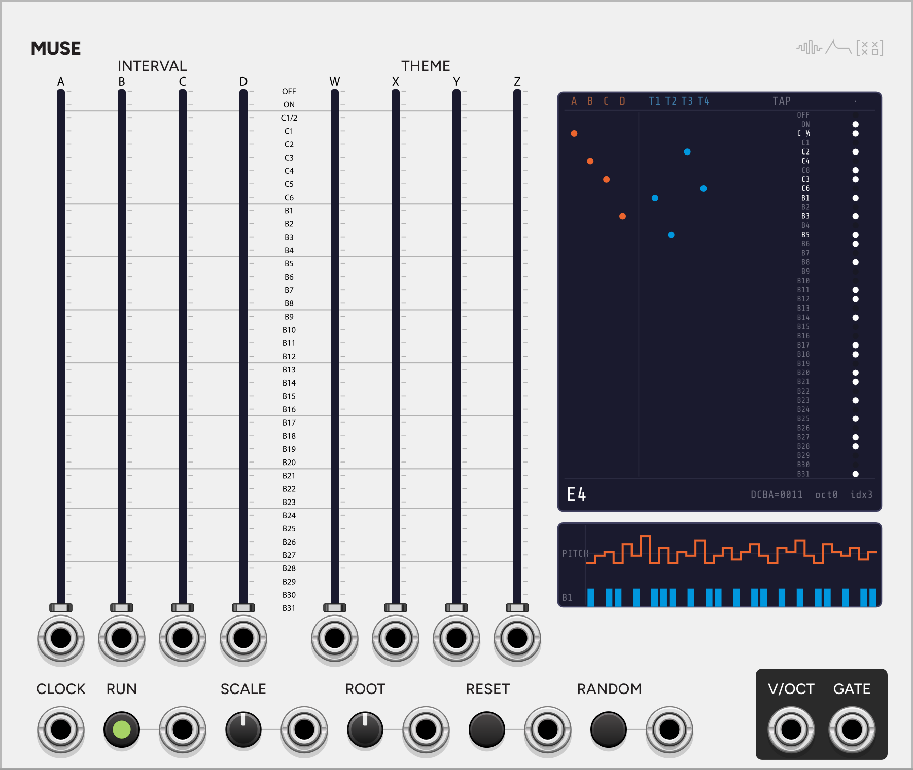 

**[Muse on signalfunctionset.com →](https://signalfunctionset.com/projects/muse)**

A faithful recreation of the **Triadex Muse**, the legendary algorithmic sequencer designed by Edward Fredkin and Marvin Minsky in 1972 (US Patent 3,610,801). It's not a step sequencer — there are no notes to program. Eight sliders tap into a network of binary counters and a 31-bit feedback shift register, and the *interaction* of those digital signals generates long, surprisingly musical melodies that can run for hundreds of steps before repeating. Small slider changes produce dramatically different tunes, but the results are always structured and deterministic.

**Features:**
- **Two Slider Banks** — 4 THEME sliders (XNOR'd together to drive the shift register — the pattern's "DNA") and 4 INTERVAL sliders (form a 4-bit pitch address each clock)
- **40 Taps Per Slider** — OFF, ON, raw clock (C ½), binary counter bits (C1/C2/C4/C8), mod-12 counter taps (C3/C6), and the 31 shift-register bits (B1–B31)
- **Live State Display** — Triadex-style label column with LEDs showing each tap's current value as the engine evolves
- **Scale + Root** — Quantize the output to a selectable scale (shared canonical list, interchangeable with Note and Fugue) with a ±24-semitone root
- **17 Classic Presets** — Slider snapshots straight from the original 1972 manual ("Birds", "Christmas Bells", "Marvin's Yodel", and more)
- **Randomize** — Button + CV; scope to all 8 sliders, theme only, or interval only
- **Expander Linking** — Place a second Muse to the right and it follows the first; chain several for layered voices
- **Selectable Output Range** — Standard 1V/oct, or scale-quantized 1V/2V/5V modes for using Muse as a modulation source

**Controls:**
- **THEME 1–4 / INTERVAL 1–4** (sliders): Tap selection for each bank
- **ROOT** (±24 semitones) / **SCALE**: Output quantization
- **RUN / RESET / RANDOMIZE**: Transport + re-roll

**Inputs:**
- **CLOCK** — Advances one step per rising edge (Muse has no internal clock)
- **RESET / RUN / RANDOMIZE** — Trigger / gate / trigger
- **THEME 1–4 CV, INTERVAL 1–4 CV** (±5V) — Offset each slider's tap
- **ROOT CV** (1V/oct), **SCALE CV** (interchangeable with Note/Fugue)

**Outputs:**
- **V/OCT** — Melody pitch (1V/oct, with Scale + Root)
- **GATE** — Trigger per clocked step

**Context Menu:**
- Presets (from the Triadex manual), Output range (V/oct / 1V / 2V / 5V), Allow expander linking, Gate mode (every clock / only when pitch changes), Randomize scope + Randomize now

See [docs/muse-manual.md](docs/muse-manual.md) for the full manual.

### LFOs & Modulation

#### Drift

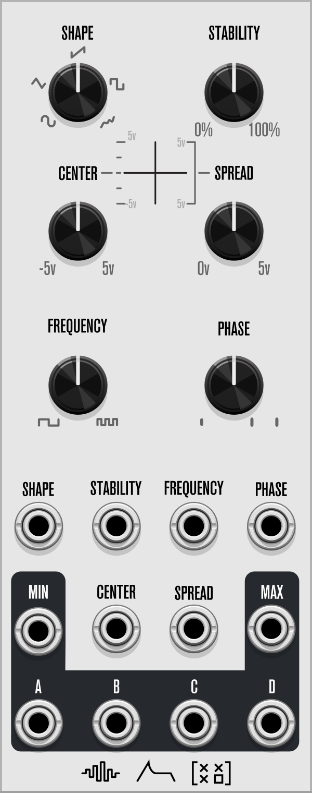 

**[Drift on signalfunctionset.com →](https://signalfunctionset.com/projects/drift)**

A 4-channel LFO with chaos capabilities and advanced phase and scaling control.

**Features:**
- **4 Phase-Shifted Outputs** (A, B, C, D) — Each output can be independently phase-shifted using the Phase control
- **Morphing Waveforms** — Shape control smoothly transitions between sine, triangle, sawtooth, square, and chaos
- **Clock Sync** — Can sync to external clock input or run freely at set frequency
- **Flexible Scaling** — Center and Y Spread controls for precise voltage range adjustment
- **Stability Control** — Modulates chaos behavior and waveform characteristics

**Controls:**
- **Shape**: Morphs between waveform types (sine/triangle/sawtooth/square/chaos)
- **Stability**: Adds uncertainty to the waveforms. Higher values are more stable. Stability is calculated independently per output for subtle variation.
- **Center** (bipolar): DC offset for all outputs.
- **Spread**: Controls the amplitude of the outputs. Bipolar, so 5V means ±5V.
- **Frequency**: Sets LFO frequency in Hz. Slow to the left, fast to the right.
- **Phase**: Sets the phase offset relative to A. At 1, A is 0°, B is 90°, C is 180° and D is 270°.

**Inputs:**
- **Shape**: CV control for waveform morphing
- **Stability**: CV control for stability parameter
- **Clock**: External clock input for sync (overrides frequency control)
- **Phase**: CV control for phase spreading
- **Center**: CV control for DC offset
- **Spread**: CV control for amplitude

**Outputs:**
- **A, B, C, D**: Four phase-shifted LFO outputs
- **Min**: Minimum value across all 4 channels
- **Max**: Maximum value across all 4 channels

#### Cycle

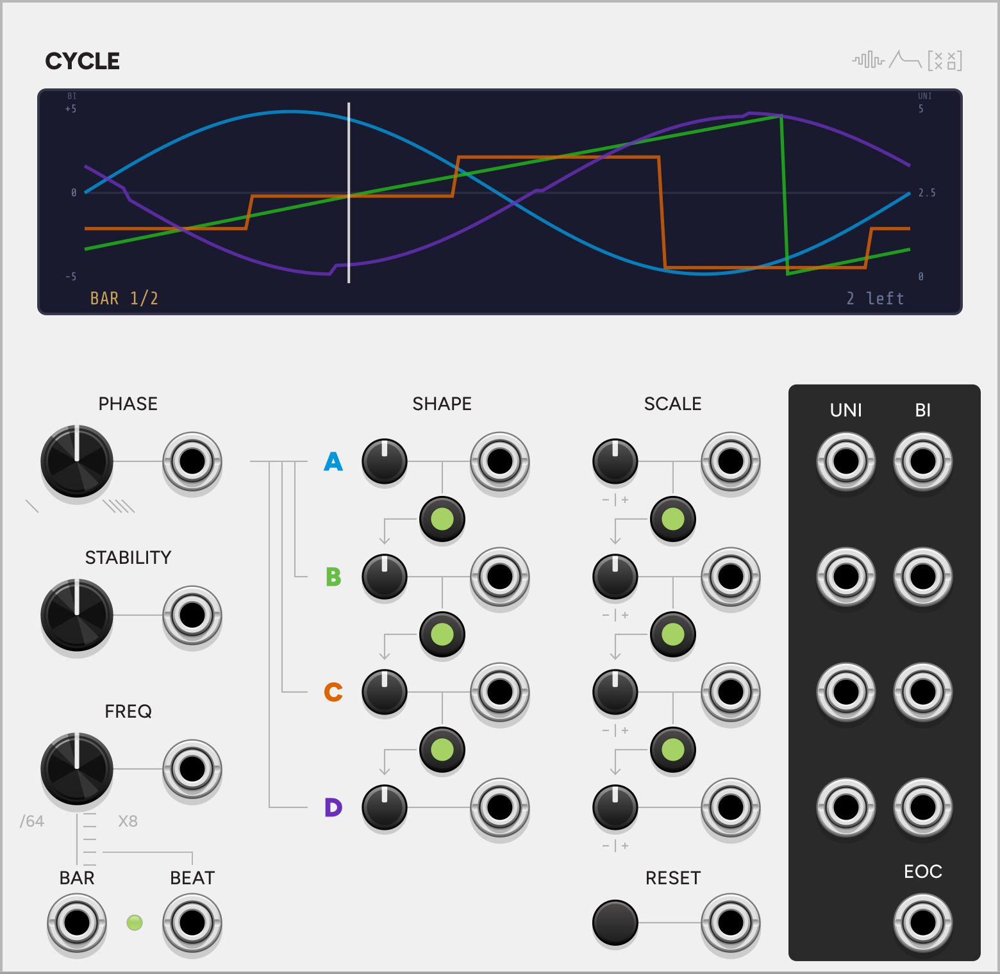 

**[Cycle on signalfunctionset.com →](https://signalfunctionset.com/projects/cycle)**

A four-channel LFO that thinks in bars, not Hertz. All four outputs (A/B/C/D) run the same cycle but can be spread, scaled, and shaped independently, and the whole bank locks to a musical bar via clock + bar inputs — patch it into Meter and every modulation lands on the grid. Unpatched, it free-runs in Hz like an ordinary LFO. It's the tempo-synced companion to Drift.

**Features:**
- **Bar-locked timing** — BAR is the timing authority: Cycle hard-aligns its cycle to every downbeat, so it can't drift out of phase. FREQUENCY becomes a musical divider/multiplier (64 bars … ⅛ bar) when locked, or 0.02–20 Hz when free.
- **Shape ring** — each channel morphs through sine → triangle → saw → square → staircase → stepped-random → back to sine. The loop is closed, so shape CV and link offsets wrap continuously instead of clamping.
- **Clock-quantized steps** — patch CLOCK and the staircase / stepped-random shapes advance one step per pulse, so they land on real beats. Stepped-random generates a fresh set of voltages each cycle, shared by all four channels.
- **Per-channel depth** — bipolar SCALE per channel (negative inverts), plus global PHASE spread to fan the channels across the cycle and Drift-style STABILITY for amplitude wander.
- **Linking with offsets** — shape/scale link buttons gang adjacent channels (on by default); a linked channel's knob becomes a wrapping (shape) or bounded (scale) offset from the group leader.
- **Display** — all four waveforms with a playhead, bar gridlines, a bar-position readout, and bipolar/unipolar voltage scales on the edges.

**Controls:** per channel — Shape, Scale; global — Frequency, Phase, Stability, Reset, plus shape/scale link buttons.
**Inputs:** Bar, Clock, Reset, Frequency CV, Phase CV, Stability CV, and per channel — Shape CV, Scale CV.
**Outputs:** per channel — Uni (0–5V) and Bi (±5V); End-of-cycle trigger.

See [docs/cycle-manual.md](docs/cycle-manual.md) for the full manual.

#### Gravity

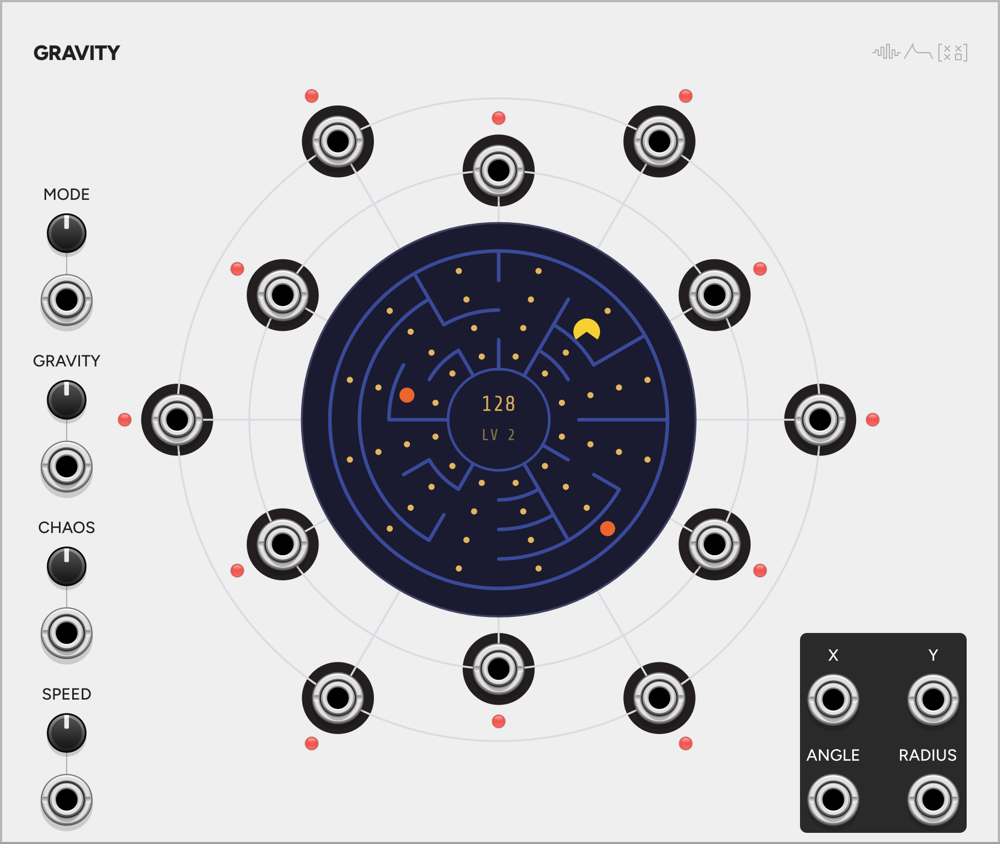 

**[Gravity on signalfunctionset.com →](https://signalfunctionset.com/projects/gravity)**

A multi-mode chaos and motion engine. A single moving point — driven by one of six very different physical or generative systems — is read out as a rich set of control voltages: bipolar X/Y position, radius, angle, six "sector" distance CVs, and six boundary-ray gates. One small set of controls (Speed, Chaos, and a mode-dependent Gravity) reshapes whatever engine is running, and a large circular display shows exactly what the voltages are doing.

**The six modes:**
- **Pendulum** — A double pendulum (RK4). The lower bob is the tracked point; Chaos sets the energy. Drag either joint to relaunch (ragdoll).
- **Gravity Well** — A spring-bound rocket orbits a central sun, perturbed by heavy outer planets. Always bounded — it can't escape or get captured.
- **Billiards** — Elastic balls in the circle; the cue is the tracked point, any ball fires gates. Drag the cue for a slingshot launch.
- **Hungry Man** — A random single-width Pac-Man maze; chases big dots, eats small ones, scores (1/5) and advances levels with a fresh maze each time. Chaos = big-dot count, Gravity = center/edge bias.
- **Turtle** — A LOGO-style turtle drawing generative artwork. Gravity biases common vs esoteric commands; a live instruction log and long-persistence trail are shown.
- **Pattern** — A turtle tracing spirograph / Maurer-rose figures, always built from integer-degree divisions of 360 so each figure closes cleanly. Gravity sets the form (simple roses → woven rose-stars → dense webs); Chaos sets the intricacy.

**Controls:**
- **MODE** (snap): Selects the active engine (also CV-selectable, 0–10V spans all six)
- **SPEED**: Time scale / draw speed
- **CHAOS** (0–1): Complexity — energy, ball/dot count, command rate, or figure intricacy depending on mode
- **GRAVITY** (±1): Mode-dependent — pull direction, sun strength, dot bias, command bias, or pattern form

**Inputs:**
- **SPEED CV, CHAOS CV, GRAVITY CV, MODE CV** — One per knob, in the left-hand column

**Outputs:**
- **X / Y** (±5V) — Position of the tracked point
- **RADIUS** (±5V) — Distance from center (−5 = center, +5 = rim)
- **ANGLE** (±5V) — Angle relative to the gravity direction
- **SECTOR 1–6** (0–10V) — Six morph-crossfaded distance CVs, one per 60° wedge
- **GATE 1–6** (0/10V) — Retriggerable gates as the point crosses each boundary ray (with activity LEDs)

**Context Menu:**
- Relaunch (kick), Clear drawing (Turtle/Pattern), Gate hold (tight/medium/gluey), Trail length

See [docs/gravity-manual.md](docs/gravity-manual.md) for the full manual.

### Envelopes

#### Swell

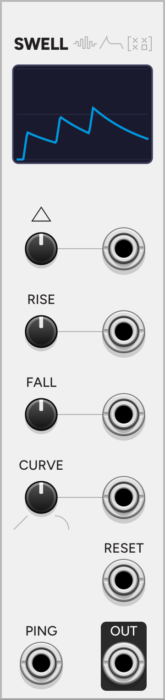 

**[Swell on signalfunctionset.com →](https://signalfunctionset.com/projects/swell)**

A ping-driven envelope generator. Each rising edge on the PING input adds a configurable voltage rise to the current envelope value, then the envelope decays back toward zero. Multiple pings stack — you can build up a slow swell from a stream of triggers, or get a single sharp attack from a single ping.

Where a typical AD/AR envelope produces one fixed-shape ramp per gate, Swell *accumulates* contributions from every trigger and bleeds them off continuously. The output is a single 0–10V CV that smoothly soft-saturates near the ceiling and is paused from decaying while a rise is still in flight.

**Features:**
- **Additive Stacking** — Multiple in-flight rises sum together, giving naturally swelling envelopes from rapid trigger streams
- **Soft Saturation** — Output asymptotes smoothly at 10V (no hard clipping)
- **Curve Morph** — Linear → exponential blend on both rise and decay
- **Scope Display** — 1.2-second view: past trace on the left, current voltage at center, projected future trace simulated forward from the current state
- **Decay Pause During Rise** — Rises always reach their full delta (decay is held off until in-flight rises complete)

**Controls:**
- **Δ** (Delta, 0–10V): Voltage added per ping
- **Rise** (1ms–2s): Time for each ping's contribution to climb to its full value
- **Fall** (10ms–10s): Decay time constant when no pings are active
- **Curve** (Linear ↔ Exponential): Blends both rise and decay shapes

**Inputs:**
- **Ping** — Rising edge adds Δ
- **Reset** — Zeros the envelope and clears all in-flight rises
- **Δ CV / Rise CV / Fall CV / Curve CV** (±5V → ±50%)

**Outputs:**
- **CV out** — 0–10V soft-saturated envelope

#### Vac

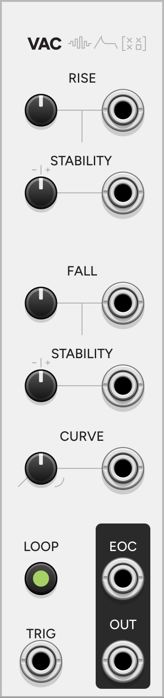 

**[Vac on signalfunctionset.com →](https://signalfunctionset.com/projects/vac)**

A semi-stable attack/release envelope generator. It has the classic A/R shape, but with a per-stage **STAB** control that adds *controlled, musical* cycle-to-cycle variation in timing — the way a real vactrol drifts. At STAB=0 it's a perfectly repeatable envelope; turn it up or down and each trigger's rise and/or fall stretches or shortens by a fresh random amount, so repeated patterns breathe.

**Features:**
- **Per-stage STAB** — independent bipolar stability for rise and fall. The random factor is `exp(STAB · r · ln 2.5)`, log-symmetric around 1 so a stage never collapses to zero (STAB +1 → 1×–2.5× longer, −1 → 0.4×–1× shorter).
- **Curve** — linear ↔ exponential stage shaping (with CV).
- **Loop** — latches auto-retriggering; toggling it on from idle also starts a cycle.
- **END trigger** — 1ms pulse at the end of each fall, for chaining at the envelope's natural (drifting) rate.
- **Continuous-drift mode** (context menu) — the rate wobbles smoothly *through* each stage for an even more thermal feel.

**Controls:** Rise, Rise Stab, Fall, Fall Stab, Curve, Loop (LED button).
**Inputs:** Trig, Rise CV, Rise Stab CV, Fall CV, Fall Stab CV, Curve CV.
**Outputs:** Env (0–10V), End (1ms trigger).

See [docs/vac-manual.md](docs/vac-manual.md) for the full manual.

#### OP ENV

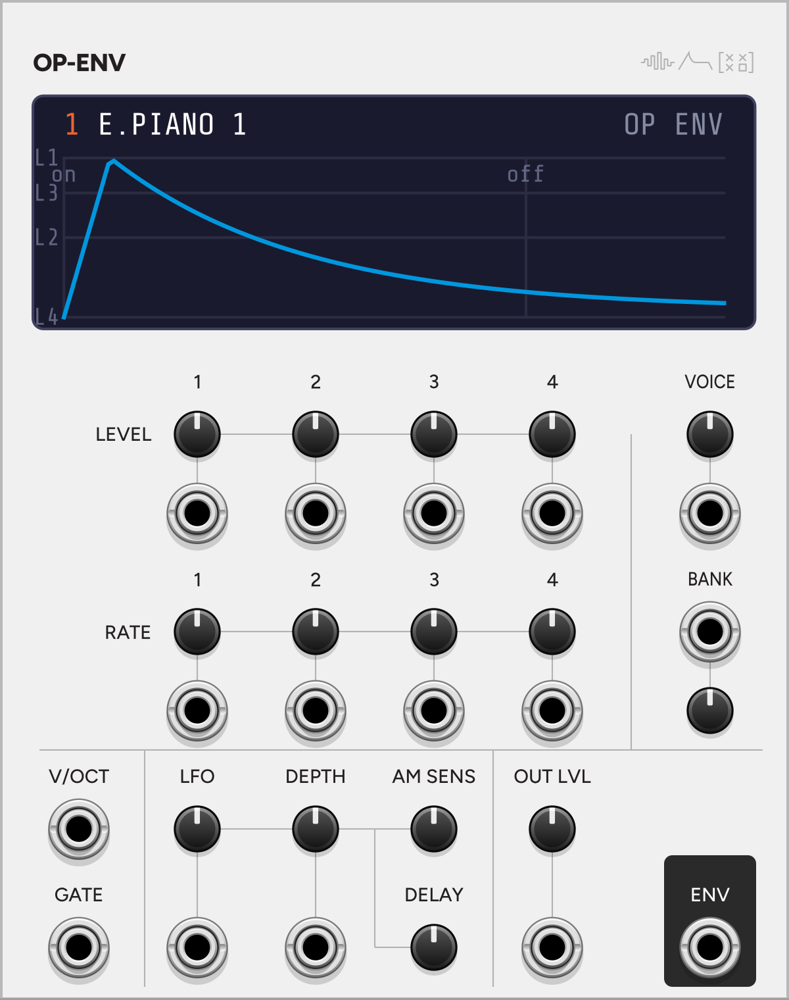 

**[OP ENV on signalfunctionset.com →](https://signalfunctionset.com/projects/op-env)**

The DX7 operator envelope, freed from the oscillator. OP ENV loads a voice from a DX7 `.syx` bank (just like Operator), takes that voice's carrier envelope, and turns it into a gate-driven 0–10V CV envelope for shaping any VCA, filter, or modulation target. On top of the loaded shape you can offset all eight DX7 EG attributes — four rates and four levels — by trimpot or CV, key-track the rates with a V/oct input, and add the DX7's global LFO tremolo.

**Features:**
- **Loads any DX7 carrier envelope** — pick a voice and its 4-rate / 4-level EG becomes the envelope shape, drawn live on screen.
- **Eight offsettable attributes** — R1–R4 and L1–L4, each ±99 by trimpot and CV, clamped to the DX7 range.
- **Key-tracked rates** — patch pitch into V/OCT for DX7 rate scaling (faster envelopes higher up the keyboard).
- **DX7 LFO tremolo** — LFO rate / depth / delay and carrier AM sensitivity, with a selectable LFO waveform.
- **Release to 0V** (default) so it behaves like an envelope generator, or switch it off for the authentic DX7 L4 release level.

**Controls:** L1–L4, R1–R4, Voice, Bank, LFO, Depth, Delay, AM Sens, Out Lvl.
**Inputs:** Gate, V/Oct, L1–L4 CV, R1–R4 CV, Voice CV, Bank CV, LFO CV, Depth CV, Out Lvl CV.
**Outputs:** Env (0–10V).

See [docs/op-env-manual.md](docs/op-env-manual.md) for the full manual.

### Utilities

#### Shift

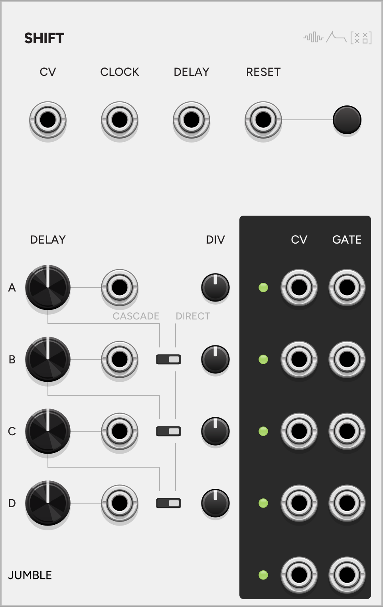 

**[Shift on signalfunctionset.com →](https://signalfunctionset.com/projects/shift)**

A 4-output CV shift register with per-lane controls. Sample input CV at the clock rate; route it through a chain of buffered delay/cascade stages with independent step counts, clock dividers, and step-CV modulation. Designed for generative-sequencer and CV-shaping work where you want a small forest of related-but-distinct CV streams from a single input.

**Features:**
- **Per-Lane Controls (×4)** — Independent N pot, Step CV input, Mode switch (parallel/cascade), Clock divider knob, CV output, Gate output, and LED
- **Parallel Mode (per lane)** — N-step delay line on the input. Output = input from N lane-clocks ago. Updates every lane-clock.
- **Cascade Mode (per lane)** — Tape-loop FIFO of length N, fed by the previous lane's value on each parent tick. CV cycles through the buffer continuously at clock rate; new content drips in at parent's rate. Cascade-on-A falls back to parallel.
- **Clock Divider Per Lane** — ÷1 / ÷2 / ÷3 / ÷4 / ÷8 (slows that lane's reads + writes; combines multiplicatively with N)
- **Disconnect Playback** — When the CV input cable is unpatched, lane reads cycle through a 16-slot full-depth history ring at clock rate so even cascade-N=1 lanes keep playing accumulated content
- **Jumble Output Pair** — CV (random pick across A/B/C/D held values, re-rolled every input clock) + accompanying CLK trigger + LED
- **Reset Button** — Paired with RESET trigger input; clears all buffers + held values

**Controls:**
- **Per Lane (×4):** N (1–16, snap), Step CV input (±5V → ±N), Mode switch (cascade left / parallel right), DIV knob (÷1 / ÷2 / ÷3 / ÷4 / ÷8, snap)
- **Reset button** + **RESET** trigger input
- **N CV** input (global, sums into every lane's N)

**Inputs:**
- **CV** — Data signal (sampled by all lanes)
- **CLOCK** — Lane-step trigger source for every lane
- **N CV** — Global N modulator
- **RESET** — Trigger to clear all lane state
- **Step CV A/B/C/D** — Per-lane N modulation

**Outputs:**
- **A / B / C / D CV** — Lane CV outputs
- **A / B / C / D GATE** — 1ms pulse on each lane tick
- **JUMBLE CV** + **JUMBLE CLK** — Random-pick S&H + accompanying clock

**Context Menu:**
- "Clear all" — Wipes all buffer contents, held values, jumble S&H, and all read/write/divider indices (same as a Reset trigger)

#### Record

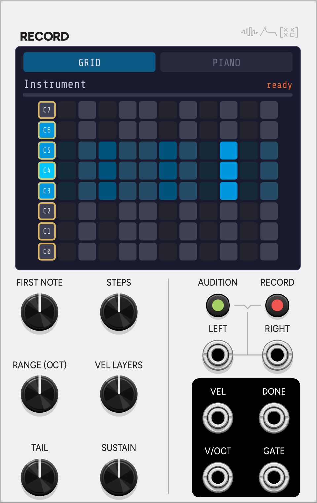 

**[Record on signalfunctionset.com →](https://signalfunctionset.com/projects/record)**

An auto-sampler. Point it at any voice in your rack — a patch you've built, a granular texture, an FM bell — press RECORD, and it plays that voice across a range of notes and velocities, captures each one, and writes a complete multisampled instrument to disk: a folder of WAVs plus an `.sfz`. The result loads straight into [Play](#play), or any sampler that reads SFZ. Record is 16HP.

**Features:**
- **Drives and listens** — outputs V/OCT + GATE + VELOCITY to your patch, records the stereo return; per capture it holds the gate for SUSTAIN, records the TAIL after release, waits for silence, and advances.
- **Sweep control** — Start note, Spacing (semitones between samples), Octaves, and Velocity layers.
- **Audition** — run the same sweep with no capture or write, to check tuning and tail length before committing.
- **Round-robins (1–4)** — capture each note several times for instruments that never repeat exactly (only worth it if the voice actually varies).
- **Loop detection** — finds a loop point on positive zero-crossings, minimising the seam error, and writes `loop_start`/`loop_end`. Best on sustained material.
- **Latency calibration** — measures your patch's round-trip delay and trims to the true onset instead of a threshold.
- **Live scope + playable pads** — see the input arriving; tap a key or pad to audition the voice you're about to sample.
- **File options** — mono/stereo, 16/24/32-bit float, normalize, auto-trim, gate vs trigger mode.

**Controls:** Start, Spacing, Octaves, Vel Layers, Tail, Sustain, Audition, Record.
**Inputs:** L / R (the voice's return).
**Outputs:** V/Oct, Gate, Velocity, Done.

See [docs/record-manual.md](docs/record-manual.md) for the full manual.

## Other Platforms

Signal Function Set modules have been ported to other hardware/software platforms:

- **[MetaModule port](https://github.com/stuart78/metamodule-SignalFunctionSet)** — Signal Function Set running on the [4ms MetaModule](https://4mscompany.com/metamodule.php).
- **[Disting NT port](https://github.com/stuart78/SignalFunctionSet-DistingNT)** — Signal Function Set ported to the [Expert Sleepers disting NT](https://www.expert-sleepers.co.uk/distingNT.html).

## Building

See [build-doc.md](build-doc.md) for detailed build instructions.

```bash
# Mac
./build.sh dev   # Development build + auto-install
./build.sh prod  # Production build for distribution

# Windows — native (run from the MSYS2 MinGW64 shell)
./build.sh dev  win   # Build + auto-install to %LOCALAPPDATA%\Rack2\plugins-win-x64
./build.sh prod win   # Production build for distribution

# Windows — cross-compile from Mac (requires MinGW + GNU coreutils)
./build.sh prod win
```

`./build.sh ... win` auto-detects whether it's running natively on Windows
(MSYS2/MinGW64) or cross-compiling from macOS.

## License

GPL-3.0-or-later. See [LICENSE](LICENSE) for details.
