# Signal Function Set

A plugin for [VCV Rack](https://vcvrack.com/) by Stuart Frederich-Smith.

### **[Website](https://signalfunctionset.com)** · **[Discord](https://discord.gg/zRRUez59dB)**

Module walkthroughs, patch notes and demos live on the site. The Discord is the
place for questions, bug reports and works in progress.

## Contents

Modules grouped by function:

**Sound Sources**
- [Operator](#operator): DX7-style 6-operator FM voice (.syx cartridges)
  - [OP MORPH (Expander)](#op-morph-expander): the DX7 routing as a field you travel
- [GSX](#gsx): Granular synthesis VCO (Truax 1985–86 lineage)
- [Overtone](#overtone): Additive VCO with 8 togglable harmonics
- [Intone](#intone): CHANT/FOF formant synthesis voice
- [Phase](#phase): Dual sample looper with sleep/rotate phase drift
- [Play](#play): Polyphonic multisample player (SFZ / DecentSampler)
- [Spool](#spool): Four short tapes played by gates, and the tape never rewinds
- [Loom](#loom): Eight-string waveguide resonator you strum with the mouse
- [Slide](#slide): Electric lap steel, a steel bar across eight strings
  - [SLIDE XP (Expander)](#slide-xp-expander): the eight strings on eight jacks
- [Chime](#chime): Eight-note drone machine with rotating resonator tubes
- [Sigma](#sigma): Additive voice, up to 64 partials, after the Crumar GDS
- [Kit](#kit): Struck membrane modelled mode by mode
  - [PolyKit In (Expander)](#polykit-in-expander): every input of every instrument as its own jack
- [Wheel](#wheel): Hurdy-gurdy drone instrument, one wheel bowing six strings

**Filters & Resonators**
- [Band](#band): Harmonic bandpass bank (isolate individual harmonics)
- [Tine](#tine): Tunable pingable resonator (Gamelan Resonator circuit)

**Effects**
- [Slice](#slice): Cuts a stereo stream onto a grid and reworks each piece
- [Crystal](#crystal): Quad echo chamber shaped like a real crystal

**Clocks & Sequencers**
- [Arrange](#arrange): Song-form sequencer: 8 phrases, 4 per-instrument clock buses
- [Meter](#meter): Time-signature-aware musical clock with swing
  - [Meter X (Expander)](#meter-x-expander): 24 PPQN, run gate, 1–128 bar triggers
- [Beat](#beat): Per-voice pattern sequencer (8 patterns × 16 steps)
- [Fill](#fill): Auto-playing 8-channel drum sequencer with a pressure engine
- [Note](#note): Pitched CV/gate sequencer with 19 scales
- [Chance](#chance): Generative melodic walk sequencer (8 seeded patterns)
- [Fugue](#fugue): 8-step harmonic deviation sequencer (3 voices)
  - [Fugue X (Expander)](#fugue-x-expander)
  - [MetaFugue](#metafugue)
- [Muse](#muse): Faithful Triadex Muse recreation (Fredkin/Minsky, 1972)

**LFOs & Modulation**
- [Drift](#drift): 4-channel chaotic LFO with phase spread
- [Cycle](#cycle): Bar-synced quad LFO with morphing shapes
- [Gravity](#gravity): Six-mode chaos & motion engine (pendulum / orbits / billiards / Pac-Man / turtle / patterns)
- [Trace](#trace): A paper loop and four brushes, for CV you draw
- [Field](#field): Nineteen related random voltages from one smooth random field
- [Flock](#flock): A murmuration as a microtonal granular voice
  - [Flock In (Expander)](#flock-in-expander): the birds sing grains of live audio

**Envelopes**
- [Swell](#swell): Ping-driven additive A/D envelope
- [Vac](#vac): Semi-stable A/R envelope with vactrol-like timing drift
- [OP ENV](#op-env): Standalone DX7 operator envelope generator

**Utilities**
- [Key](#key): Quantizer that takes its key from the patch, and hands it out
- [Shift](#shift): 4-output CV shift register with cascade chain
- [Record](#record): Auto-sampler that captures any voice to a multisampled SFZ instrument

- [Other Platforms](#other-platforms)
- [Building](#building)
- [License](#license)

## Modules

Modules are grouped by function below.

### Sound Sources

#### Operator

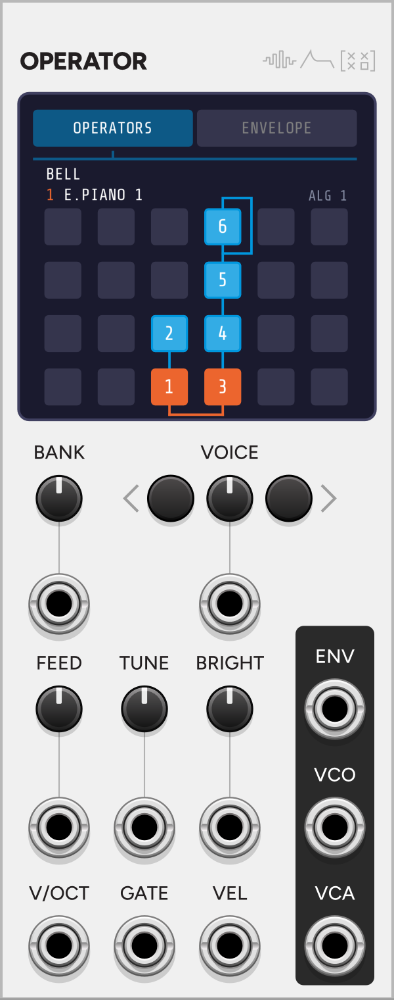 

**[Operator on signalfunctionset.com →](https://signalfunctionset.com/projects/operator)**

A 6-operator FM synth voice in the Yamaha DX7 lineage. Operator loads DX7 `.syx` cartridges (or your own banks exported from [Dexed](https://asb2m10.github.io/dexed/)), lets you pick a voice, and plays it polyphonically on Google's msfa DX7 core, so patches sound faithful to the hardware: all six operators, every algorithm, feedback, key scaling, and the DX7 envelopes. It ships with four classic Brian Eno DX7 patches so it makes sound the moment you patch a gate.

**Features:**
- **Faithful DX7 voicing**: reads packed VMEM exactly as the hardware stores it; cartridges and Dexed banks play as intended.
- **Three outputs**: AUDIO (the voice with its internal DX7 envelope), VCO (the raw tone, no envelope, for shaping with an external EG/VCA), and ENV (a 0–10V envelope follower of the audio).
- **One-knob timbre**: BRIGHTNESS tilts the whole sound darker/brighter; FEEDBACK offsets the patch's feedback buzz; TUNE is ±12 semitones.
- **Tabbed display**: an OPERATORS view that shows the algorithm and lets you click operators to mute/un-mute them, and an ENVELOPE view with the carrier EG shape plus a live trace.
- **Polyphonic** (up to 16 voices), with velocity input and sample-rate-corrected envelopes.

**Controls:** Voice, Bank, ◀/▶ voice (on screen), Tune, Brightness, Feedback.
**Inputs:** V/Oct (poly), Gate (poly), Vel (poly), Voice CV, Bank CV, Tune CV, Brightness CV, Feedback CV.
**Outputs:** Audio (poly), VCO (poly), Env (poly).

See [docs/operator-manual.md](docs/operator-manual.md) for the full manual.

##### OP MORPH (Expander)

 

Place it to the **right** of Operator. It puts the DX7 operator routing on screen as a matrix, and gives you a field of sixteen of them to travel across.

A DX7 algorithm is a stack machine over three buses, which turns out to be a fast way of evaluating something much simpler: a table of "how much of operator *i* is added to operator *j*'s phase", plus "how much of operator *i* reaches the output". All 32 evaluate in operator order with every modulator strictly before what it modulates, so the table is upper triangular: 15 modulation weights and 6 output weights. Once it's a table, it's something you can interpolate.

**Features:**
- **The field is a torus.** Sixteen slots on a 4×4 grid, an X/Y position blending the four nearest, and **both axes wrap**. That isn't decoration: on a square, x=0 and x=1 hold different routings, so wrapping past the edge would jump between two structures mid-note, and a routing discontinuity is a click. Tiling means you can travel in one direction forever and interpolate back into the first column with no seam.
- **The two column groups feel nothing alike.** Columns 1–6 feed a phase input, so they're an FM *index*. Turning one up grows sidebands, it doesn't get louder. The OUT column feeds the output bus and is a plain *level*. An operator with both is modulating its neighbour and audible in its own right, which no stock DX7 algorithm does.
- **Four routings Yamaha never shipped.** Only 11 of the 15 possible modulation edges appear anywhere in the 32 algorithms. No blend of stock algorithms can reach the other four, because a blend only produces edges one of its endpoints already has. Edit a slot's matrix and they're yours.
- **STEP quantizes the movement rather than replacing it.** The path keeps running underneath and the clock snaps the output to the nearest slot, so whatever shape the turtle or the walk is drawing arrives on the beat. Linear is the exception: there a clock means one slot forward.
- **Five movements:** Drift, Turtle, Random walk, Circle, Linear.

**Controls:** Speed, Shape, Depth, Move, Step.
**Inputs:** Speed, Shape, Depth and Move CV (Move at 1V per mode), Clock, Reset.
**Outputs:** none. It drives Operator over the expander bus.

**Context menu:** Slots, set a row at a time.

See [docs/opmorph-manual.md](docs/opmorph-manual.md) for the full manual.

#### GSX

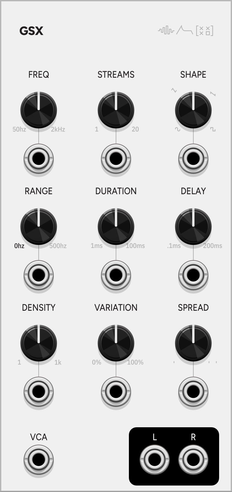 

**[GSX on signalfunctionset.com →](https://signalfunctionset.com/projects/gsx)**

A real-time granular synthesis module inspired by Barry Truax's groundbreaking GSX system (1985–86), the first implementation of real-time granular synthesis. GSX generates dense textures from hundreds of short sound events called "grains," operating in the microsound domain (1–50ms) where changes in the time domain produce changes in the frequency/spectral domain.

**Features:**
- **Multi-Stream Architecture**: Up to 20 independent grain streams for dense, evolving textures
- **Morphing Waveforms**: Continuous waveform morphing from sine to triangle to sawtooth to square
- **Dual Synthesis Modes**: Quasi-synchronous mode (pitched/tonal) and asynchronous mode (stochastic clouds)
- **Real-Time Control**: All parameters respond to CV for dynamic sound sculpting
- **Stereo Output**: Spatial distribution with dramatic stereo spread control
- **VCA Control**: External amplitude modulation for expressive dynamics

**Controls:**
- **Frequency** (50–2000 Hz, default C3): Center frequency of generated grains. CV input tracks 1V/octave.
- **Streams** (1–20, default 10): Number of simultaneous grain generators. More streams = denser texture.
- **Shape** (0–1, default 0): Grain waveform morphing: 0=sine, 0.33=triangle, 0.66=sawtooth, 1.0=square.
- **Range** (0–500 Hz, default 100 Hz): Frequency deviation around center frequency.
- **Duration** (1–100 ms, default 20 ms): Length of individual grains.
- **Delay** (0.1–200 ms, default 0.1 ms): Manual override for time between grains.
- **Density** (1–1000 grains/sec, default 100): Rate of grain generation per stream.
- **Variation** (0–100%, default 50%): 0% = quasi-synchronous (regular/pitched), 100% = fully asynchronous (cloud textures).
- **Spread** (0–100%, default 50%): Stereo width. 0% = mono center, 100% = dramatic hard left/right panning.

**Inputs:**
- 9 CV inputs (one per parameter, ±5V bipolar) plus VCA input (0–5V unipolar)

**Outputs:**
- **Left / Right**: Stereo output pair

#### Overtone

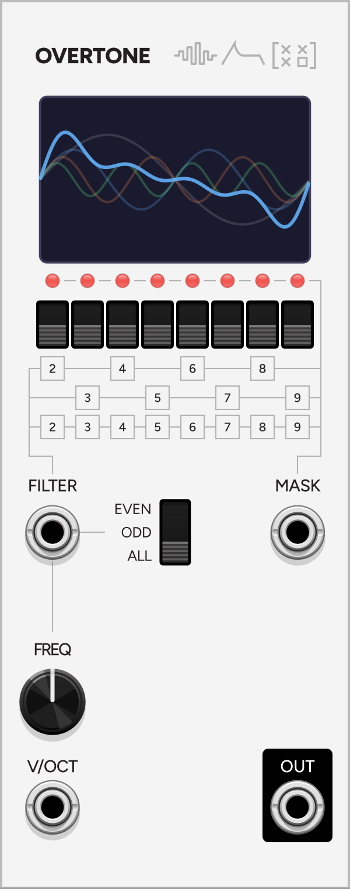 

**[Overtone on signalfunctionset.com →](https://signalfunctionset.com/projects/overtone)**

An additive synthesis VCO that builds waveforms from the harmonic series. The fundamental is always present; 8 toggle switches enable/disable overtones (harmonics 2–9) with natural 1/n amplitude falloff. All overtones on produces a saw-like wave; all off gives a pure sine.

**Features:**
- **8 Harmonic Toggles**: Individual on/off for harmonics 2 through 9
- **Natural Amplitude Falloff**: Each harmonic scaled by 1/n (H2=0.5, H3=0.33, etc.)
- **Even/Odd Filter**: 3-position switch: All, Odd only (square-like), Even only
- **Binary Mask CV**: 0–10V mapped to 8-bit pattern for voltage-controlled timbre
- **Sweep Mask Mode**: Alternative CV mode: 0–10V enables 0–8 harmonics from bottom up
- **Zero-Crossing Gating**: Click-free transitions when toggling harmonics
- **Waveform Display**: Shows composite wave with faint individual harmonic traces and fundamental
- **LED Indicators**: Show actual active state after filter/CV processing

**Controls:**
- **Harmonic 2–9 Toggles**: Enable/disable individual overtones (default: all on)
- **Even/Odd/All Switch**: 3-position filter for harmonic selection
- **Freq** (-4 to +4 octaves, default C4): Coarse frequency control, log2 scaled

**Inputs:**
- **V/Oct**: 1V/octave pitch tracking
- **Mask** (0–10V): Binary (8-bit) or sweep (0–8 harmonics) mode, selected via context menu
- **Filter** (0–5V): Even/odd filter CV (0–1.67V=All, 1.67–3.33V=Odd, 3.33–5V=Even)

**Outputs:**
- **Out**: Monophonic audio output (±5V normalized)

**Context Menu:**
- Mask CV Mode: Binary (8-bit pattern) or Sweep (bottom-up harmonics)

#### Intone

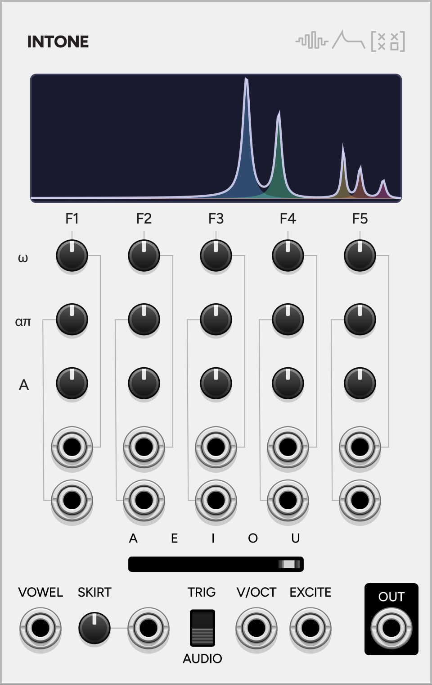 

**[Intone on signalfunctionset.com →](https://signalfunctionset.com/projects/intone)**

A CHANT/FOF formant synthesis voice inspired by the IRCAM CHANT project (Rodet, Potard, Barriere, 1984). Generates vocal-character sound using 5 parallel formant cells, each producing overlapping FOF (Formant Wave Function) grains, which are damped sinusoids at formant frequencies.

**Features:**
- **5 Parallel Formant Cells**: Each generating overlapping FOF grains at independently controllable center frequencies
- **Vowel Morph Slider**: Smoothly interpolates through /a/, /e/, /i/, /o/, /u/ formant presets
- **Per-Formant Controls**: Frequency offset, bandwidth, and amplitude knobs with CV inputs
- **Skirt Width**: Controls the spectral slope of each formant peak (FOF attack rate)
- **Spectrum Display**: 5 formant bell curves + composite envelope on a logarithmic frequency axis
- **Three Excitation Modes:**
  - **Default** (nothing patched): FOF vocal VCO, V/Oct controls pitch
  - **Audio mode** (audio + switch up): Parallel resonant bandpass filter bank. Input audio is formant-filtered through the 5 vowel resonances, V/Oct transposes the formant pattern
  - **Trigger mode** (clock + switch down): External trigger fires FOF grains for rhythmic vowel hits, V/Oct transposes formants

**Controls:**
- **Formant 1–5 Frequency** (±1 octave offset): Adjusts each formant relative to the vowel morph preset
- **Formant 1–5 Bandwidth** (30–500 Hz): Width of each formant resonance
- **Formant 1–5 Amplitude** (0–1): Level of each formant
- **Vowel Morph** (slider): Sweeps through /a/ → /e/ → /i/ → /o/ → /u/
- **Skirt**: Spectral slope control (soft to hard formant edges)
- **Mode Switch** (Audio/Trigger): Selects excitation mode when EXC is patched

**Inputs:**
- **V/Oct**: Pitch (default mode) or formant transposition (audio/trigger modes)
- **EXC**: Excitation source (audio or trigger, behavior depends on mode switch)
- **Formant 1–5 Freq CV, Formant 1–5 BW CV** (±5V): Per-formant modulation
- **Vowel CV** (0–10V): Vowel morph position
- **Skirt CV** (±5V): Skirt width modulation

**Outputs:**
- **Out**: Monophonic audio output

#### Phase

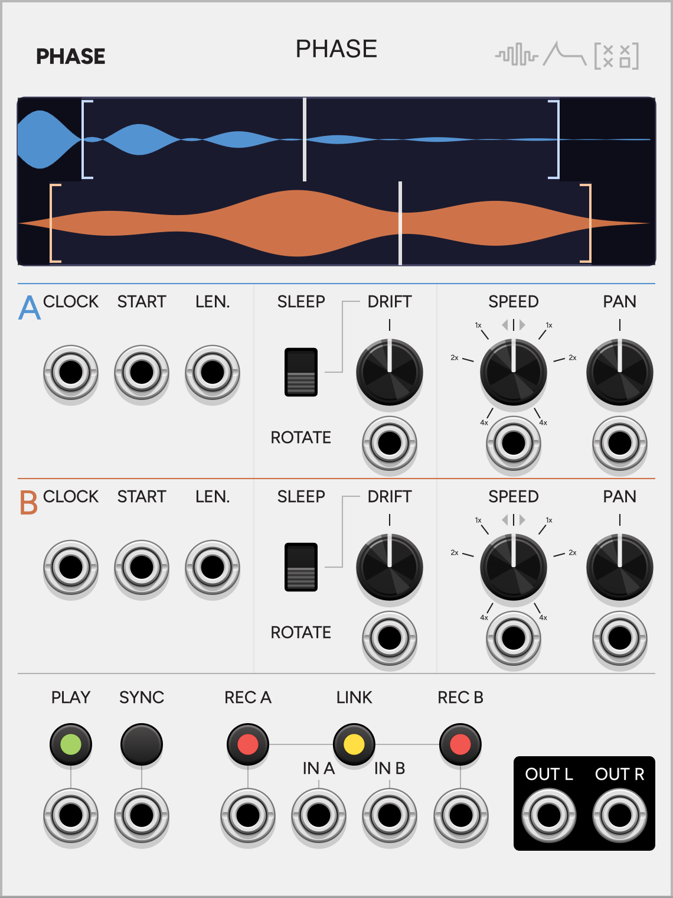 

**[Phase on signalfunctionset.com →](https://signalfunctionset.com/projects/phase)**

A dual sample looper inspired by Steve Reich's phase compositions. Two loops play the same or different audio samples with independent drift controls that create gradual phase relationships. Each loop has a mode switch choosing between Sleep (silence gap after each cycle) and Rotate (continuous tape-style content drift).

**Features:**
- **Dual Loop Playback**: Load one or two WAV files; loading only one cascades to both loops
- **Sleep Mode**: Adds silence after each loop cycle, creating phase drift through timing gaps
- **Rotate Mode**: Continuous content drift like tape machines at slightly different speeds
- **Bipolar Drift** (-500ms to +500ms): Positive and negative drift in both modes
- **Reverse Playback**: Speed range of -4x to +4x with center at 0 (stopped); reverses both rotate and sleep modes
- **Transient Detection**: Energy-based onset detection with adjustable sensitivity and minimum gap
- **WAV Cue Point Support**: Embedded cue markers used as transient positions when present
- **Clock-Triggered Jumps**: Per-loop clock input jumps playhead to next detected transient
- **Loop Region Controls**: Draggable bracket handles on waveform display, plus Start/End CV inputs
- **Live Recording**: Record into either loop directly via REC A/REC B + GATE inputs, with a LINK button to record both at once
- **Waveform Display**: Dual waveform view with playhead, transient markers, loop handles, and rotation origin line
- **VCA Anti-Click**: 1ms envelope on all discontinuities (enabled by default)

**Controls:**
- **Drift** (-500 to +500 ms): Phase drift amount per loop cycle. In Sleep mode: positive = silence gap, negative = early restart. In Rotate mode: continuous speed offset.
- **Speed** (-4x to +4x, default 1x): Playback speed and direction. Center = stopped.
- **Pan** (-1 to +1): Per-loop stereo position with equal-power panning.
- **Mode Switch** (SLP/ROT): Sleep or Rotate mode per loop.
- **PLAY / SYNC** buttons: Transport.
- **REC A / LINK / REC B** latches: Arm one loop or both for recording.

**Inputs:**
- **CLK A/B**: Trigger. Jumps to the next transient
- **START A/B** (0–10V): Loop start position (0–100% of sample)
- **END A/B** (0–10V): Loop end position
- **Drift CV, Speed CV, Pan CV** (±5V): Per-loop parameter modulation
- **PLAY GATE**: High (>=1V) = play, overrides button
- **SYNC**: Trigger. Resets both loops to their start
- **A IN / B IN**: Audio in for live recording
- **GATE A / GATE B**: Recording gate triggers

**Outputs:**
- **Left / Right**: Stereo output pair

**Context Menu:**
- Load/Clear Sample A and B
- Clear A&B (one-shot wipe of both)
- Transient sensitivity (High/Medium/Low) and minimum gap (10/50/100ms)
- Re-detect Transients (overrides WAV cue points)
- VCA Mode toggle (anti-click envelope)
- Recording mode (Replace / Append) and "Save recordings with patch"

#### Play

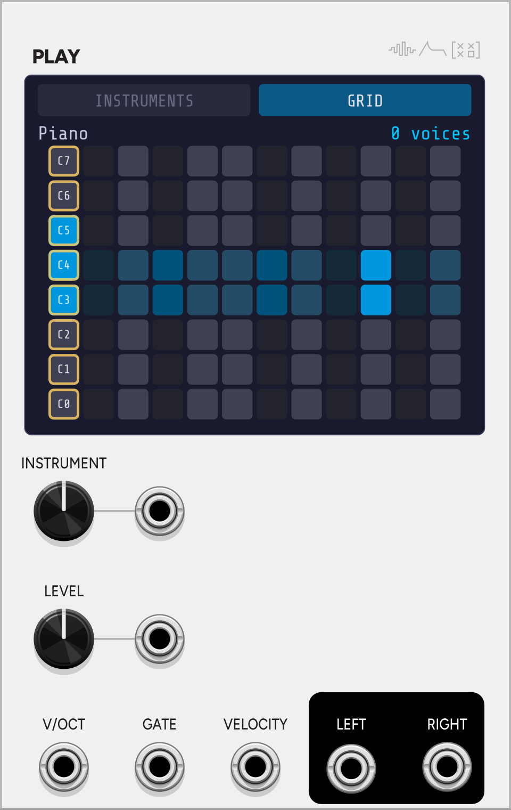 

**[Play on signalfunctionset.com →](https://signalfunctionset.com/projects/play)**

A polyphonic multisample player. Loads an `.sfz` or DecentSampler `.dspreset` instrument and plays it back with up to 16 voices, with velocity layers, round-robins, loops, and per-note tuning. It's the other half of [Record](#record): load what you captured and play it. It also reads a practical SFZ subset, so simple third-party libraries work too. Play is 16HP.

**Features:**
- **16-voice polyphony**: one voice per V/OCT + GATE cable channel. A mono cable broadcasts to all voices, so a single velocity cable applies to the whole chord.
- **SFZ subset**: `sample`, `lokey`/`hikey`/`key`, `pitch_keycenter`, `lovel`/`hivel`, `tune`, `volume`, `loop_mode`/`loop_start`/`loop_end`, `default_path`, `seq_length`/`seq_position`; note-name or numeric keys, cascading global → group → region.
- **DecentSampler**: `.dspreset` parsing with the convention-correct accumulating tuning/volume, loops, and round-robins mapped onto the same engine.
- **Gate-controlled duration**: note-off releases the voice by default; a "One-shot (play through)" option lets drums run to their natural end.
- **Loop modes**: `loop_continuous` keeps wrapping through the release, so the note fades out inside the loop. `loop_sustain` (and DecentSampler's `loopMode="sustain"`) only loops while the note is held: at note-off the voice leaves the loop when it next reaches `loop_end` and plays the recorded tail (the string ringing off, the room) under the release envelope.
- **Multiple instruments**: keep several loaded and select with the INSTR knob or CV.
- **Playable display**: 88-key map (mapped = blue, playing = cyan) or a 12×8 Push-style pad grid with three layouts; tap a pad to audition the instrument with nothing patched.

**Controls:** Instr, Level.
**Inputs:** V/Oct (poly), Gate (poly), Vel, Instr CV, Level CV.
**Outputs:** L / R.

See [docs/play-manual.md](docs/play-manual.md) for the full manual.

#### Spool

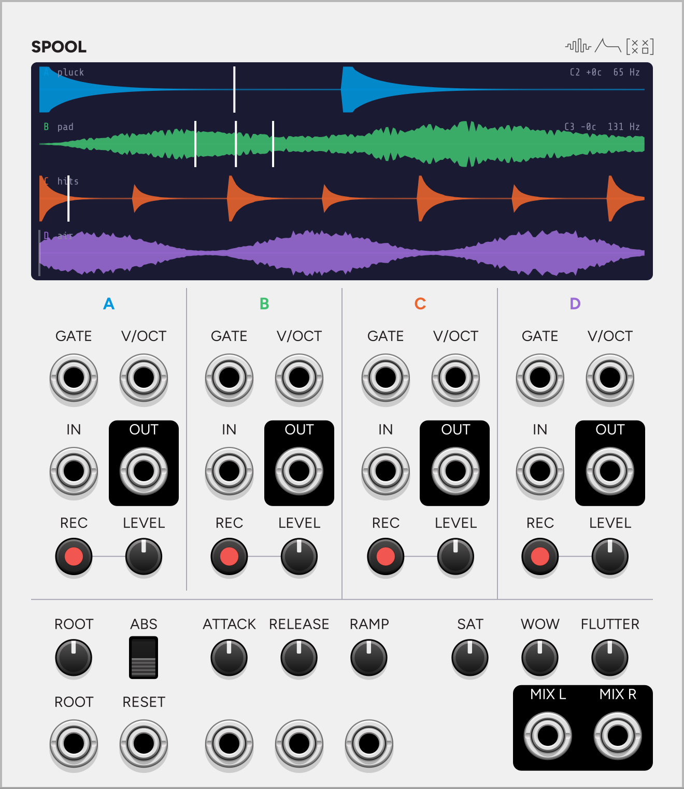 

Four short tapes, one transport, and no rewind. After the Mellotron, and departing from it in the one place that matters: a Mellotron springs its tape back the moment the key comes up, so every press starts from the same instant. Here the tape stays where it stopped. Press again and it carries on from there, so a repeated stab walks through the loop, and the phrase you get out is a function of how you played rather than of where the file happens to begin.

**Features:**
- **Four tapes, five seconds each**, loaded from WAV or recorded in through their own jacks. A recording is saved into the patch's own storage folder, so what you played into it is there when you reopen the patch.
- **Eight playheads per tape.** A polyphonic GATE plays chords on one tape, one head per channel, each at the pitch its own V/OCT channel gave it. Every head starts at the tape's bookmark, which follows the newest note while its gate is held and stops where that note stopped.
- **Pitch is varispeed, not transposition.** V/OCT changes how fast the tape runs, so pitch and loop length move together, as they do on any machine with a capstan. ABS switches V/OCT to a note: the tape is measured for pitch and retuned to what was asked for, relative to ROOT. A menu mode, *Pitch only*, time-stretches instead: the loop keeps its length and only the pitch moves, with the two read heads kept a whole number of the tape's own periods apart so the handover between them does not warble.

- **One transport.** ATTACK, RELEASE, RAMP, SAT, WOW and FLUTTER are shared, because there is one capstan: four independent wobbles sound like four machines. RAMP is the motor getting up to speed, so it scales the playback rate and glides a note in and out rather than fading it. Motor sag, in the menu, makes a chord go flat the way more pinch rollers on one capstan do.
- **What stops the tape isn't what stops the sound.** The gate stops the tape; the envelope stops the sound, so a long release plays out rather than freezing.

**Controls:** Per tape, Level and Rec; shared Root, Abs, Attack, Release, Ramp, Sat, Wow, Flutter.
**Inputs:** Per tape, Gate (poly), V/Oct (poly) and Rec In; Root, Reset (poly, one channel per tape), and CV for Attack, Release and Ramp.
**Outputs:** Tapes A to D, Mix L, Mix R.

**Context menu:** Load tape 1 to 4, Rewind all tapes, Motor sag, New note starts (where the tape stopped, or at the beginning), V/OCT changes (speed, or pitch only), Pitch detection (once or continuous).

See [docs/spool-manual.md](docs/spool-manual.md) for the full manual.

#### Loom

 

Eight strings sharing a bridge. Each is a digital waveguide: a delay loop for pitch, a lowpass inside the loop, a four-section allpass chain for stiffness, and a comb on the output tap for where along the string you pick it. The display is the instrument. Strum it with the mouse, or drive the strings from gates.

**Features:**
- **EXCITE is a continuous axis**, not a menu. HAMMER, PLUCK, BOW and WIND are nodes on it, and you can sit anywhere between them. At a pure node the code path is identical to the single-exciter version, down to how many random numbers it draws, so pluck and hammer are bit-exact with where they started.
- **A bow that works everywhere.** The friction curve's input is normalised by the string's own envelope, so its operating point doesn't drift with pitch or damping, and a pressure regulator holds the string at a target amplitude. Bow speed sets loudness, not whether the string speaks. The hair noise matters. Without it the string locks to its sub-octave.
- **WIND is an aeolian harp.** Vortex shedding drives a narrow band that *moves with the gust* (Strouhal), so the harp climbs and falls between partials rather than sitting on one. The fundamental is ~26 dB down and the dominant partial roams from the 3rd to the 8th.
- **COUPLE is a real bridge.** String motion feeds a shared bus and each string takes back a band-limited fraction. Only the transmitted band is damped and the in-phase mode has gain 1, so it is unconditionally stable.
- **Seven display tabs**: PLAY strums with the mouse (Y = where along the string), and TUNE · DECAY · STIFF · POS · EXCITE · LEVEL each edit one attribute per string by height.
- **Eighteen patterns** for the clocked auto-player: twelve shapes (up, down, converge, thumb, strum) plus six built from a wrapping 4-bit adder, where two chained operations such as +3 and ×5 walk the eight strings around a 16-step ring.
- Output is soft-clipped, linear to ±6 V and asymptotic to ±10. Eight bowed strings have a crest factor no pluck approaches.

**Controls:** Body, Couple, Decay, Damp, Pick, Spread, Root, Octave, Scale, Pattern, Density, Auto, Reset.
**Inputs:** V/Oct, Gate, Velocity (poly), Clock, Reset, 8 × per-string gate, and CV for Body / Couple / Decay / Damp / Pick / Spread / Root / Octave / Scale / Density.
**Outputs:** Mix L, Mix R, 8 × per-string audio.

**Context menu:** Tuning (with quantize), Mouse strum (hover or click-drag only), Stereo width, Auto rate when no clock is patched, and *Hover plays when Rack is in the background*, off by default. An instrument that plays on hover shouldn't make a noise while you're reading a manual.

> **Note:** DAMP is floored at 10× each string's own pitch. As an absolute cutoff it filtered a high string below its second partial, and with so few partials left the pick-position comb's null removed what was left. A dark, high, bowed string made almost no sound.

See [docs/loom-manual.md](docs/loom-manual.md) for the full manual.
#### Slide

 

An electric lap steel. Eight waveguide strings stopped by a **steel bar** instead of frets. The bar is one rigid object lying across every string, so it moves them all by the same ratio and the tuning's intervals survive wherever you put it. That is why lap steel lives in 6th and 7th tunings (C6, E7, E13, A6): a straight bar is already a chord.

**Features:**
- **SLANT** angles the bar across the strings. This is the technique that gets major, minor and dominant voicings out of one tuning without retuning, and it's why Slide is its own module rather than a glide mode on Loom.
- **Rate-based glide, not time-based.** A hand crosses the neck at roughly constant speed, so a twelfth takes 2.4× as long as a fifth. Nearly every synth portamento is constant-time-per-interval, and that is most of why synth glides don't sound like slides. Bar travel is an S-curve scaled to the distance, so a short move isn't all ease and a long one isn't a hard ramp.
- **The pickup is fixed in space** while the speaking length changes, so its position as a fraction of the string runs 14%→48% up the neck and the comb null walks from the 7th harmonic down to the 2nd. The tone hollows as you climb. (Loom's comb is a fixed fraction, which is right for a fretted instrument and wrong for this one.)
- **A volume pedal**, SWELL per note plus a VOL input, that swells in past the pick attack. The missing transient is what makes a steel cry, and it's the one thing a slide model can do that a portamento can't fake.
- **Vibrato is a rocking motion**, wide and centred on the pitch, rather than a bend up to it. The bar is a lossy, mass-loaded termination, returning less treble than a fret clamping against wood.
- **The body is a magnetic pickup**, not a soundboard: a resonant lowpass (coil inductance against cable capacitance) with TONE moving the peak 1.6–6.2 kHz, then amp DRIVE.
- **The display is a fretboard lying flat**: strings horizontal, logarithmic fret spacing, the bar drawn as a line whose *angle* is the slant, and the segment behind the bar drawn dead. Drag the bar with the mouse; hover across the strings to pick them.
- **Sixteen fingerpicking rolls**: forward, backward, alternating, thumb & index, inside out, climb, fall, pinch, random, strum, and six from the same wrapping 4-bit adder Loom uses. Each carries per-step accents, because the thumb is a heavier finger than the index: bass strokes land harder, and the stroke that starts a roll hardest of all. DYN brings in that shape first and note-to-note jitter second.
- **Ten tunings:** C6, C6 add 9, E7, E13, A6, Open major, Open minor, Dobro G, Fourths, Unison.

**Controls:** Pos (bar position), Slant, Glide, Vibrato depth + speed, Decay, Damp, Pick, Pickup, Tone, Drive, Block, Swell, Couple, Root, Scale, Octave, Roll, Density, Dyn, Auto, Reset.
**Inputs:** Bar (1V/oct, which the POS trimpot then transposes in key), Slant, V/Oct, Gate (poly), Velocity (poly), Clock, Reset, Vol, and CV for Decay / Damp / Pick / Tone / Roll / Density / Root / Scale.
**Outputs:** Mix L, Mix R, Even strings, Odd strings.

**Context menu:** Tuning, V/oct behaviour (transpose the instrument vs place the bar and pick the string), Pickup character (modern single coil, or Horseshoe for bark and midrange honk), Mouse behaviour, Auto roll moves the bar, and *Hover plays when Rack is in the background*.

> **Getting the crying Hawaiian sound:** SWELL up so the volume pedal hides the pick attack, GLIDE around 0.5–0.7 so moves take real time, VIBRATO shallow and slow (≈5 Hz), DAMP fairly high, and a C6 or E7 tuning. Then move the bar between two chord positions rather than picking new notes.

See [docs/slide-manual.md](docs/slide-manual.md) for the full manual.

##### SLIDE XP (Expander)

 

Place it to the **right** of Slide. The eight strings get a jack each: out, gate in, velocity in, and a level trimpot.

Slide used to carry the strings on a polyphonic output. A poly cable is the right answer when eight channels are one voice played polyphonically; it's the wrong one here, because these are eight strings of a single instrument that you want to send to eight different places: separate amps, a per-string filter, a mixer with its own pan. Splitting a poly cable back out costs a module and a row of cables anyway, so the jacks belong on the instrument.

The **gates address strings**. That is not what Slide's own poly GATE does. There, channel N is the Nth note, and which string it lands on is the bar solver's business, because on a real steel you don't choose. Here a jack labelled 3 plays string 3.

Each **velocity trimpot** is more than an attenuator. With nothing patched it's that string's velocity, so the eight of them are a picking-balance control on their own: quieter bass, a leaning-on inner voice. Once a jack is patched, the same trimpot scales it.

**Inputs:** 8 × gate, 8 × velocity (0–10V).
**Controls:** 8 × velocity / attenuator trimpot.
**Outputs:** 8 × string audio, each with an activity LED.

See [docs/slidex-manual.md](docs/slidex-manual.md) for the full manual.
#### Chime

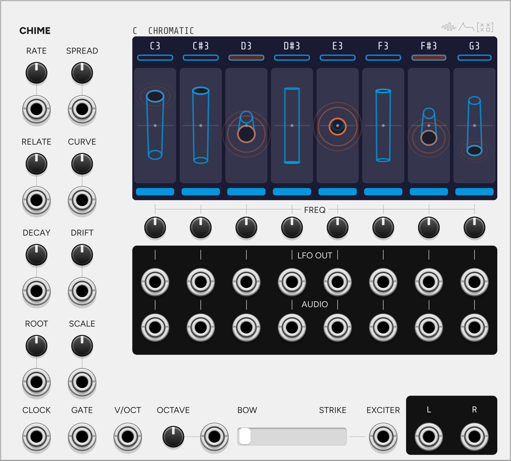 

An eight-note resonating drone machine, after a xylophone whose resonator tubes rotate beneath the bars. Each note has a semi-free bidirectional LFO, its "tube rotation", and the note blooms as its tube swings through centre. Nothing steps. The eight rotations drift against each other, and the pattern is whatever their periods happen to make.

**Features:**
- **Excitation is a continuous bow ↔ strike blend.** Struck notes fire at every centre crossing, two per rotation, as the mechanism gives.
- **RELATE sets how the eight rates relate**: ramp, stepped, random, or **ripple**, where a crossing excites its neighbours and blooms travel down the row.
- **Per-note weight** is strike probability; **per-note arc width** trades width for strike rate, so a narrow arc strikes more often.
- **Pitch latches at note boundaries**, so retuning never bends a sounding note.
- **SHAPE** bends the rotation curve from exponential through linear to logarithmic, setting how long the tube lingers at the extremes versus rushing through centre.
- Root and scale in the plugin's shared convention, so one key change travels to Note, Chance, Arrange and the rest.

**Controls:** Rate, Spread, Drift, Relate, Shape, Octave, Excite, Decay, Root, Scale, Reseed, and per note: degree, weight, arc width.
**Inputs:** Rate, Spread, Drift, Root, Scale, Reseed, Clock, Excite, Octave, Relate, Shape, Decay.
**Outputs:** 8 × tube LFO (±5V), 8 × note audio, Mix L, Mix R, V/Oct (poly, 8ch), Gate (poly, 8ch, high while a note blooms).

See [docs/chime-manual.md](docs/chime-manual.md) for the full manual.
#### Sigma

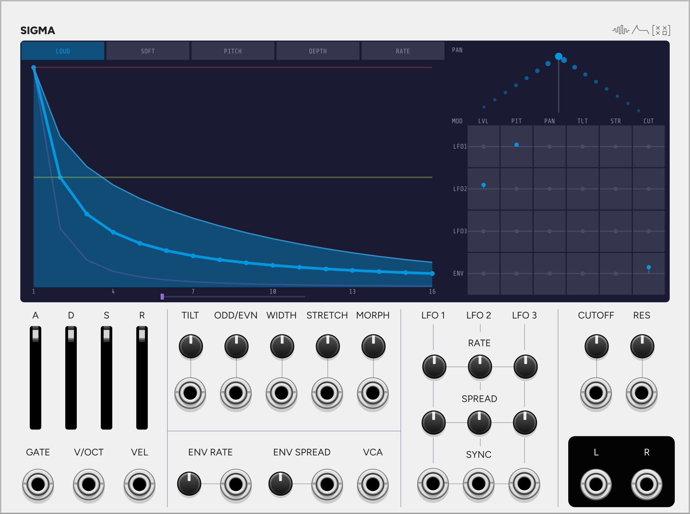 

An additive voice after the Crumar GDS. Nothing here generates a waveform or filters anything away: the output is a sum of sines, and every control is a statement about what enters that sum. It's named for the summation sign. 16, 32 or 64 partials, sixteen voices.

The GDS gave each oscillator a 16-stage amplitude *and* frequency envelope plus two velocity-interpolated envelope sets, 512 breakpoints per voice, which is why it needed a $30,000 computer to program. The bet here is that the behaviour survives **two numbers per partial**, envelope depth and envelope rate, because what makes a struck tone sound struck is that its high partials die *sooner*, not merely quieter.

**Features:**
- **Every macro is a curve across the partial index.** A macro doesn't set a value, it sets how that value varies from the first partial to the last. TILT spreads level, STRETCH spreads pitch (`f_n = n·f₀·√(1+B·n²)`, real string inharmonicity), WIDTH spreads pan, ENV RATE spreads envelope rate, ENV SPREAD spreads envelope *start time*, so the tone blooms upward, or the highs speak first and the fundamental builds underneath them.
- **Velocity morphs the spectrum rather than scaling it.** Two complete level sets, SOFT and LOUD, with velocity crossfading between them. A quiet note is a different timbre, not a quieter copy of a loud one. Past halfway, MORPH SENS hardens the blend into a switch, which is how one preset puts two instruments under one keyboard.
- **The spectral filter removes partials from the sum** rather than filtering the output.
- **Five tabs over one shared spectrum** (LOUD, SOFT, PITCH, DEPTH, RATE), plus a bipolar 4×6 mod matrix, a one-cycle scope and a pan block. Hover anything to read what it is.
- **21 presets**, grouped by the mechanism each exercises rather than by timbre. A preset is the cheapest way to find out whether a control works, and Marimba is what exposed the PITCH tab spanning two cents instead of two octaves.

**Controls:** Tilt, Odd/Even, Width, Stretch, Morph, Cutoff, Res, A/D/S/R, Env rate spread, Env time spread, and three LFOs with rate, depth and spread.
**Inputs:** Gate, V/Oct, Velocity (all polyphonic), VCA, three LFO syncs, and CV for every macro.
**Outputs:** L, R.

**Context menu:** Preset, Partials (16/32/64), Voice allocation, PITCH tab snapping, Touch response, LFO delay and random.

> **The clicking was the note-on, not the attack.** `g = V.mEnv` is the VCA, and a note-on zeroed it outright, so retriggering a still-sounding voice threw the output to silence in one sample, measured at 0.55–0.94 of full scale on thirteen of fourteen presets. It now re-attacks from wherever it already is.

See [docs/sigma-manual.md](docs/sigma-manual.md) for the full manual.
#### Kit

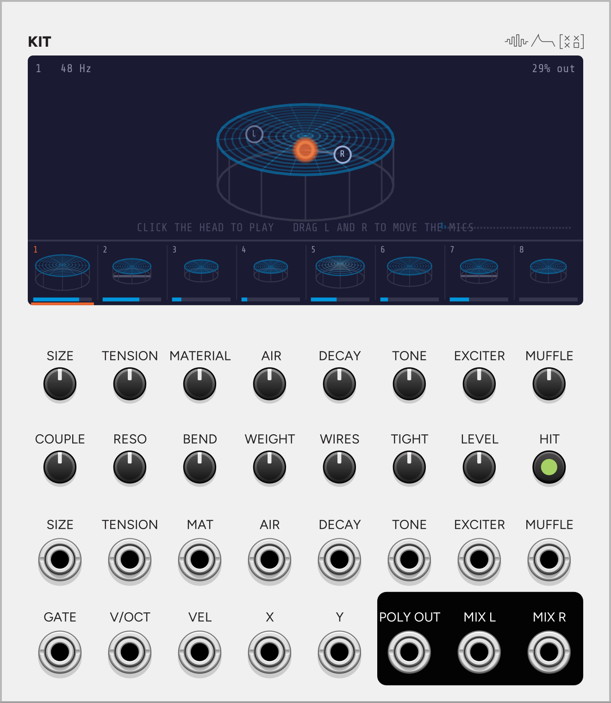 

A struck membrane, modelled mode by mode. A drum head is a 2D wave equation on a disc and its solutions are the Bessel modes, so rather than run a mesh over the disc, Kit runs one resonator per mode. That's cheaper, and much more importantly it puts every parameter you'd want to play in plain sight: strike position becomes a per-mode gain you can evaluate in closed form, and muffling becomes the same evaluation used subtractively.

**Features:**
- **SIZE and TENSION are not a duplicate pair, and the reason is the whole design.** For an ideal membrane, radius and tension scale every mode by the same factor and leave the *ratios* untouched, so acoustically they're one control. What breaks that scale invariance is bending stiffness, the air cavity, and damping that depends on size. That's why MATERIAL and AIR exist, and it's why a small tight drum and a large slack one at the same pitch are different instruments.
- **AIR closes the bottom of the shell.** At zero it's an open shell with a resonant head across it, which is a tom or a kick; wound up it bellies into a sealed bowl, which is a kettledrum. A kettledrum is exactly what the harmonic series AIR imposes belongs to. Same knob, same story, twice.
- **Tooltips report quantities, not percentages.** A drum has a diameter, a head has a pitch, a beater has a weight and a contact time. SIZE reads inches and centimetres, EXCITER reads "hard mallet, 3.4 ms contact".
- **Eight instruments, one panel.** Channel N of every cable is instrument N: a poly gate plays the kit, a poly V/OCT tunes each drum, a mono CV moves all eight. The screen's eight tabs are the drums themselves, drawn small and moving when struck, with a level bar under each so the balance of the kit is visible on one baseline. The knobs edit the selected tab. A drum that is not ringing costs nothing.
- **One poly output**, instrument N on channels 2N-1 and 2N, plus a stereo MIX pair. **PolyKit In**, an expander to the left, exposes every input for every instrument as its own jack, thirteen by eight, for racks whose sources are eight modules rather than one poly cable. A patch saved before there were eight instruments becomes instrument 1 and sounds exactly as it did.
- **The head is drawn as it moves**, and you play it with the mouse. A taut head pulls its grid out toward the rim and a slack one lets it gather in the middle, which is what tension does to a real head's response.
- **A new hit lands on a moving head.** Striking an instrument that is still ringing doesn't stop it or start a second voice: the mallet meets a head that's already displaced and the energy adds, which is why a fast roll on a ringing tom sounds different from the first hit. Instruments are separate objects, so hitting one leaves the other seven alone.
- **Fourteen instruments** in the menu: Tom, Floor tom, Timpani, Kick, Snare, Brush snare, Gong, Steel pan, Frame drum, Tabla, Closed hat, Open hat, Clap, Bell. The default kit is Fill's eight channels in Fill's order, so a poly cable from Fill needs no mapping. The first ten are what the engine was measured against while it was built, so they're also the shortest route to hearing whether something has broken. The last four are provisional: a membrane engine can't yet make a hat, a clap or a bell convincingly, and the engine work that fixes that is listed in the manual.

**Controls:** Size, Tension, Material, Air, Decay, Tone, Exciter, Muffle, Couple, Reso, Bend, Weight, Wires, Tight, Level, Hit.
**Inputs:** Gate, V/Oct, Velocity, Strike X, Strike Y, and CV for all eight voice controls, all polyphonic (channel N is instrument N).
**Outputs:** Poly (16 channels, L/R per instrument), Mix L, Mix R.

**Context menu:** Head view (flat or 3D), Stereo pairs, Reset mic positions, Load into instrument N, Load the default kit.

See [docs/kit-manual.md](docs/kit-manual.md) for the full manual.

#### PolyKit In (Expander)

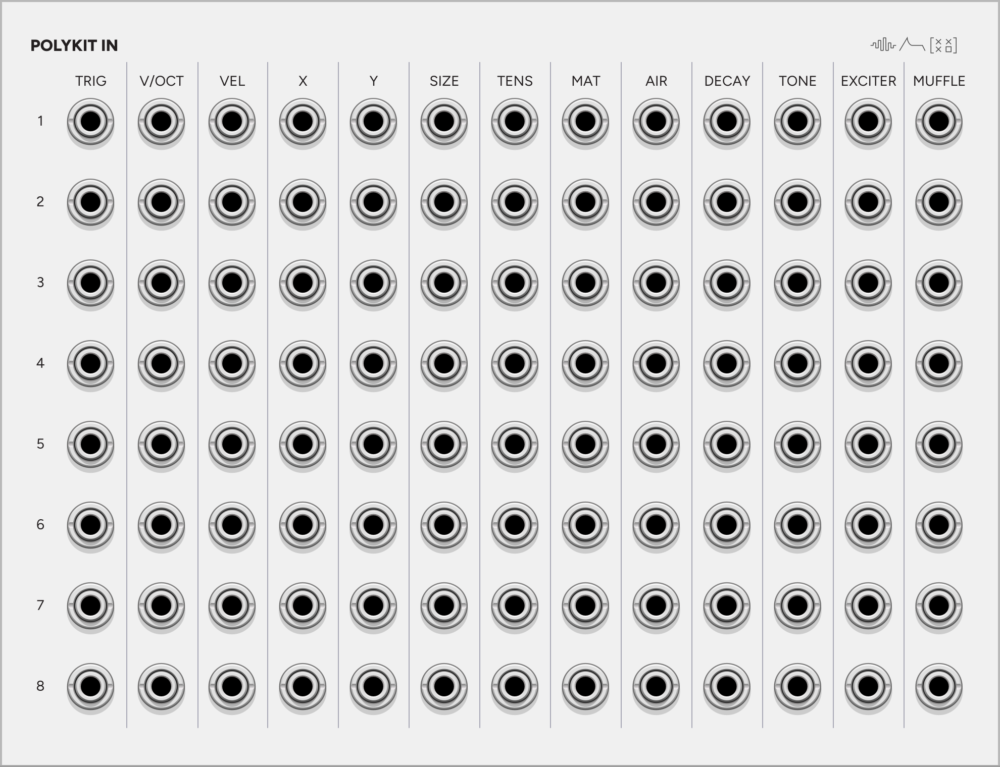 

An expander for Kit that sits immediately to its left and gives every one of the eight instruments its own set of input jacks: thirteen columns, one per Kit input, by eight rows, one per instrument. Where a polyphonic cable into Kit says "channel N is instrument N", PolyKit In says it with a patch cable per drum.

**Features:**
- **Every jack is optional, and the expander's jack wins when it's patched.** Per jack: an instrument whose tension is patched here reads it from here, and every other input of that instrument still comes from channel N of Kit's own poly cable. A poly trigger from Fill and one hand-patched envelope coexist.
- **The columns are Kit's inputs in Kit's order**: TRIG, V/OCT, VEL, X, Y, SIZE, TENSION, MATERIAL, AIR, DECAY, TONE, EXCITER, MUFFLE. The rows are instruments 1 to 8.

**Inputs:** 104 mono jacks, 13 by 8.
**Outputs:** None; it speaks to the Kit on its right over the expander bus.

See [docs/polykitin-manual.md](docs/polykitin-manual.md) for the full manual.

#### Wheel

 

A drone instrument after the hurdy-gurdy. One rosined wheel bows every string at once, and that is the whole idea: the wheel is not perfectly round, its rosin is uneven, and it has a seam where it was joined, so every revolution imposes the same ripple of level and brightness on all six voices together. Six oscillators with six LFOs sound like an organ. Six sharing one slightly irregular modulator sound like one object being played by one person.

**Features:**
- **The wheel is one bow, and the ripple is a fixed profile rather than noise.** Eccentricity, uneven rosin, and a narrow dip where the wheel was joined, in the same place every revolution. It moves level, brightness and rosin noise together, because one wheel is doing all three. CRANK sets the rate; patch CLOCK and one pulse locks one revolution, so the instrument runs in time with the patch.
- **The dog is the rhythm section.** The trompette crosses a bridge with one loose foot, and a wrist stroke lifts it and makes it rattle. It is the difference between a hurdy-gurdy and a bagpipe, and a stroke also swells every other voice, which is half of why the accent lands.
- **Rhythm is counted in strokes per turn of the wheel**, as the technique is. COUPS divides the revolution, and the strip along the foot of the display is that turn unwrapped: bar height is each stroke's strength from its position in the bar, the dashed line is the DOG threshold, and a stroke buzzes if its bar clears the line. Crank faster and every bar grows. The strip is the pattern; DOG thins whatever is left.
- **Degrees, not semitones.** Each voice picks a scale degree, so the voicing stays in the key whatever the key is. ROOT and SCALE move all six together, and SCALE reads the plugin's polyphonic scale bus, so a Scala file or a non octave scale set on Key arrives intact.
- **TEMPER snaps to just intonation**, which is how the instrument is tuned by ear. It will look as though it does nothing on a voicing of roots, octaves and fifths, and that is correct: equal temperament is already exact at the octave and within 2 cents at the fifth. It bites on thirds and sixths. The readout says what it is doing rather than what it is set to.
- **Three ways to quieten a voice, doing three different jobs.** LEVEL is the mix, PRESS is how hard that string sits on the wheel and changes timbre before level, and the button takes the string off the wheel entirely. The button is the normalled value of that voice's GATE input.
- **The display is a perspective render of the instrument's own geometry.** The wheel's plane is perpendicular to the strings and its axle runs along them, which is the only orientation that makes a sound. Only the top of the wheel is drawn, emerging through the slot in the soundboard, because only the top is visible. Click a string to take it off the wheel.

**Controls:** Root, Scale, Crank, Coups, Press, Ripple, Dog, Temper, and per voice Degree or Octave, Level, Phase or Decay, Press, Octave, Wave, On.
**Inputs:** Clock, Coup, CV for all eight global controls, and per voice Degree, Level, Phase or Decay, Press, Gate, Wave.
**Outputs:** L, R, Poly (six channels), Wheel (the ripple as CV), Coup (a trigger per buzz).

**Context menu:** Gate presses the string, gate press time, wheel spread, detune, rosin, body, stereo width.

See [docs/wheel-manual.md](docs/wheel-manual.md) for the full manual.

### Filters & Resonators

#### Band

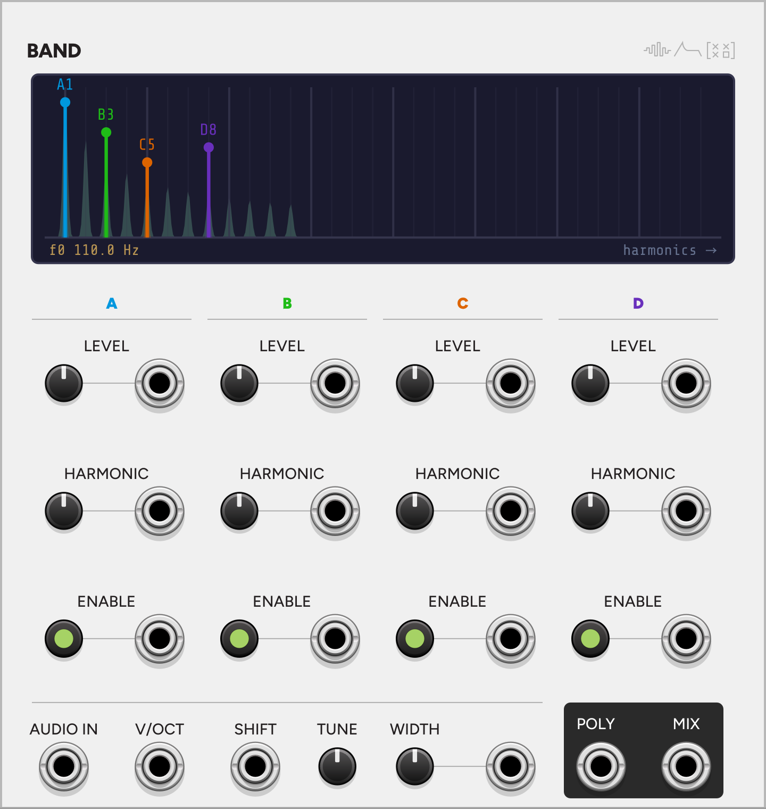 

**[Band on signalfunctionset.com →](https://signalfunctionset.com/projects/band)**

A harmonic bandpass bank for isolating individual harmonics of a sound, inspired by Suzanne Ciani's technique of taking a low, rich wave and filtering out all but one harmonic at a time. Because harmonics are *linearly* spaced (f0, 2·f0, 3·f0…), a normal filter makes them fiddly to find; Band instead locks each of its four bands to an **integer harmonic** of a shared fundamental, so every band lands dead-on a partial.

**Features:**
- **Four bands (A/B/C/D)**: each isolates an integer harmonic, with its own level, harmonic selector, and enable (anti-click). Each has a colour carried into the display so you always know which control owns which harmonic.
- **Auto-follow pitch**: detects the source's fundamental from the audio (FFT autocorrelation) and locks the harmonic grid to it, so the bands track whatever you play with no tuning. Manual 1V/oct (standard 0V = C4) tuning is also available.
- **Width as a fraction of f0**: constant absolute bandwidth, so every harmonic isolates equally cleanly. Narrow = pure single harmonic; wider = neighbours bleed in.
- **Global SHIFT**: continuously slides all bands between harmonics for scanning/impurity.
- **Spectrum display**: FFT of the source on a harmonic axis, with each band's coloured bell sitting on its partial (labelled e.g. `A5`).
- Full CV over every parameter; **MIX** and per-band **POLY** outputs.

**Controls:** per band, Level, Harmonic, Enable; global, Tune and Width.
**Inputs:** In, V/Oct, Shift, W-CV, and per band: Level CV, Harmonic CV, Enable gate.
**Outputs:** Mix, Poly (one channel per band).

See [docs/band-manual.md](docs/band-manual.md) for the full manual.

#### Tine

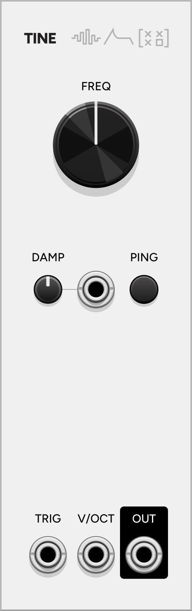 

**[Tine on signalfunctionset.com →](https://signalfunctionset.com/projects/tine)**

A tunable 3rd-order pingable resonator based on the Gamelan Resonator circuit from Paul DeMarinis' *Pygmy Gamelan* (1973), analyzed by Werner & Teboul (AES Convention Paper 10542, 2021). The unique 3rd-order active filter topology, distinct from the classic Bridged-T and Twin-T designs, produces metallic, bell-like ringing tones when pinged.

**Features:**
- **3rd-Order IIR Filter**: Bilinear transform of the analog Gamelan Resonator transfer function with frequency pre-warping for accurate V/Oct tracking
- **Variable Damping**: From short percussive thumps to long metallic rings approaching self-oscillation
- **Trigger Input**: Accepts gates and triggers via rising edge detection
- **Manual Ping Button**: Immediate excitation without patching
- **Damping CV**: Expressive ring time modulation
- **VCA Anti-Click Mode**: Crossfade envelope on retrigger eliminates zero-crossing clicks (default: on)
- **Double-Precision Filter**: Numerical stability at high damping values

**Controls:**
- **Freq** (-4 to +4 octaves, default C4): Pitch, log2 scaled with V/Oct tracking
- **Damp** (0–1, default 0.5): Ring time from short thump to long sustain

**Inputs:**
- **TRIG**: Trigger/gate input (rising edge fires ping)
- **V/Oct**: 1V/octave pitch CV
- **Damp CV** (±5V): Damping modulation

**Outputs:**
- **Out**: Monophonic audio output

**Context Menu:**
- VCA Mode (anti-click): Toggle crossfade envelope on retrigger (default: on)

### Effects

#### Slice

 

Cuts a stereo stream onto a grid and reworks each piece. Audio runs into a circular buffer, a grid of slices runs over it, and every so often one slice is replaced by an altered version of itself. The rest pass through untouched.

**What happens and how often are two knobs, not one.** EFFECT picks one of seven transforms or MIXED to rotate through them; RATIO says how often it fires, as one slice in N. Two earlier designs are worth knowing about because they were worse: seven per-slice probability weights gave the same undifferentiated scatter at every setting, and replacing them with twelve named patterns welded the two questions together so most effects were stuck at one rate.

**Features:**
- **Seven transforms:** cut, swap, delay, shuffle, reverse, repeat, pitch, plus MIXED which walks them in order. The last slice of each group fires, so the effect lands on the approach to the downbeat rather than on it.
- **Zero latency when it passes through.** An untouched slice is read from the write head sample for sample. But you cannot reverse a slice you are still recording, so REVERSE and PITCH work on the previous one; REPEAT stays live, playing the first 1/N as it arrives and then looping it.
- **WINDOW sweeps from declick to grain envelope.** It is a fade time, 5 ms up to half the slice, and at the top the two fades meet so the slice becomes a real window. Near the bottom SHAPE is correctly almost inaudible: the ear hears a taper's length, not its curve. At the top SHAPE decides everything.
- **Three window shapes, because there are only three.** Gaussian keeps 47% of the slice loud, Hann 80%, Log 97%. A longer list of famous names collapses into one wide arc no listener can separate, since window functions are all designed to be smooth. Width is what distinguishes them.
- **REACH is a count.** 1 to 32 steps, or bars once BAR is patched, with the unit swapping in the tooltip. As a percentage of the buffer its whole lower half rounded to the same slice.
- **Everything random is seeded and repeatable.** Each choice is a function of the slice index and one seed, so a pattern repeats exactly instead of scattering afresh. RESEED rolls a different but equally fixed arrangement.
- **The screen is anchored to NOW**, the write head at the right edge, the window exactly REACH wide. Under it one pane per channel: blue filled is what leaves the jack, orange outline is what came in. Only the audible one is solid.

**Controls:** Effect, Ratio, Shape, Depth, Length, Freeze, Reseed, Reach, Div, Window.
**Inputs:** L, R (normalled from L), Clock, Bar, Reset, Freeze, Reseed, and CV for Effect, Ratio, Depth, Length, Reach.
**Outputs:** L, R, Trig (every slice boundary), Gate (high while a slice is altered).

**Context menu:** Buffer length (30 / 60 / 120 s, with the memory cost shown), Repeat splice (clean / dirty), Channels (paired / independent).

Full detail in the [Slice manual](docs/slice-manual.md).

#### Crystal

 

A 3D echo chamber shaped like a real crystal. Stereo in, **quad out**: the four outputs are four listeners standing inside the thing.

Sixteen crystal habits are built as intersections of half-spaces from symmetry-expanded Miller-index normals: cube {100}, octahedron {111}, dodecahedron {110}, the sphalerite tetrahedron, pyrite's {210} pyritohedron, quartz, and the low-symmetry systems, ordered simple to complex. The last four are **clusters**: several whole crystals intergrown, so a ray can be trapped in one point or wander between them.

**Features:**
- **Traced by letting rays loose.** Seven rays × 26 bounces per emitter, a deterministic fan. Every wall strike sheds an echo toward each of the four interior listeners, and that set of arrivals *is* the quad output. Tracing runs on a worker thread (~50 ms) and the audio thread adopts the new tap set with a crossfade.
- **Per sample** it reads a multitap delay, six recirculating "pockets" per emitter, and an FDN tail sized by Sabine's equation on the crystal's own volume and surface area, so a bigger habit rings longer.
- **CHAMBER keeps real acoustic timing. DELAY keeps the geometry's arrival ratios but stretches them to musical times**, with SIZE becoming the delay time. Same shape, two ways to hear it.
- **Two emitters** (stereo in → quad out), each navigable by X/Y **velocity** CV, so you steer where the sound is coming from rather than jumping it.
- **An internal exciter**, Chime's struck bar, so with nothing patched and MIX fully wet it is a bare resonator you can ping.
- **Rotation is camera-only.** Turning the display doesn't move the acoustics; the shape you hear is the shape that's there.

**Controls:** Size, Damp, Material (habit), Tail, Mix, Echoes, Feedback, Decay, Ping, Mode (chamber / delay), emitter A + B azimuth / elevation / heading, emitter axis X / Y / Z, spin X / Y / Z, nav speed, view yaw + pitch.
**Inputs:** Audio, Audio B, Ping, V/Oct, Size, Damp, Material, Tail, Mix, Echoes, Feedback, and X/Y velocity for each emitter.
**Outputs:** Quad A / B / C / D.

**Context menu:** Solid faces (occlusion), Draw on the panel (no screen), Ping alternates A / B, Repeat pitch.

### Clocks & Sequencers

See [docs/crystal-manual.md](docs/crystal-manual.md) for the full manual.
#### Arrange

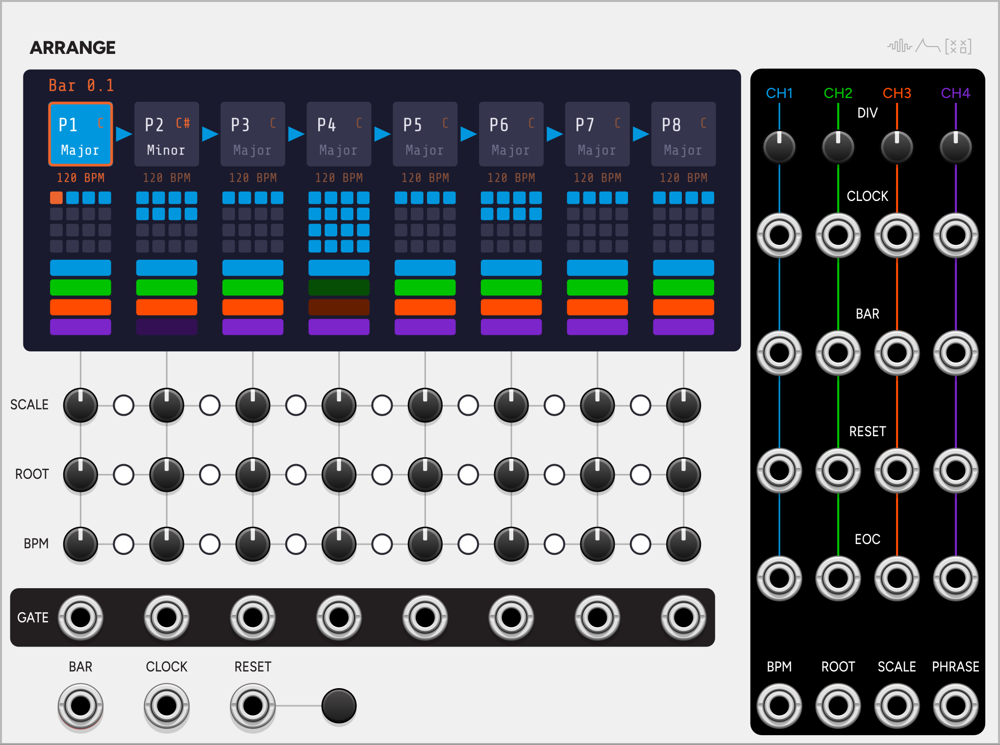 

**[Arrange on signalfunctionset.com →](https://signalfunctionset.com/projects/arrange)**

The song-form brain that sits above the rest of the rig. Where Beat, Note, and Chance each play a part, Arrange decides what section you're in: how many bars it lasts, what key and tempo it's in, and which instruments are playing during it. A single chain of 8 phrases (intro, verse, chorus, break) that advances on Meter's bars and wraps. Arrange is 34HP.

**Features:**
- **8 phrases**: each with a bar length (1–16 via a 4×4 grid), an enable, and its own root, scale, and BPM.
- **4 per-instrument clock buses**: each channel has its own clock division (÷1…÷16) plus CLOCK / BAR / RESET / EOC outputs. Toggle a channel off for a phrase and that instrument simply stops; toggle it back on and its RESET fires so it re-enters in sync. Division counters keep running while off, so returning instruments stay phase-locked.
- **Per-phrase GATE outs**: a gate that stays high for the whole time its phrase is playing, for section-length envelopes and fades.
- **Linked key and tempo**: LED dots between the trimpot columns cascade BPM, root, and scale independently down the chain (on by default). A linked phrase inherits its group leader's value exactly; break one dot for a key change.
- **Drives the whole patch's key**: ROOT and SCALE outs use the shared 19-scale convention, interchangeable with Note, Chance, Fugue, Muse, and MetaFugue.
- **Feeds Meter's tempo**: BPM out (0.01V/BPM) into Meter's BPM CV with "BPM CV absolute" enabled.

**Controls:** per phrase, Scale, Root and BPM trimpots plus scale/root/BPM link dots; per channel, clock division; Reset.
**Inputs:** Bar (from Meter), Clock, Reset.
**Outputs:** per phrase, Gate; per channel, Clock, Bar, Reset and EOC; master, BPM, Root, Scale and Phrase index (1V/phrase).

See [docs/arrange-manual.md](docs/arrange-manual.md) for the full manual.

#### Meter

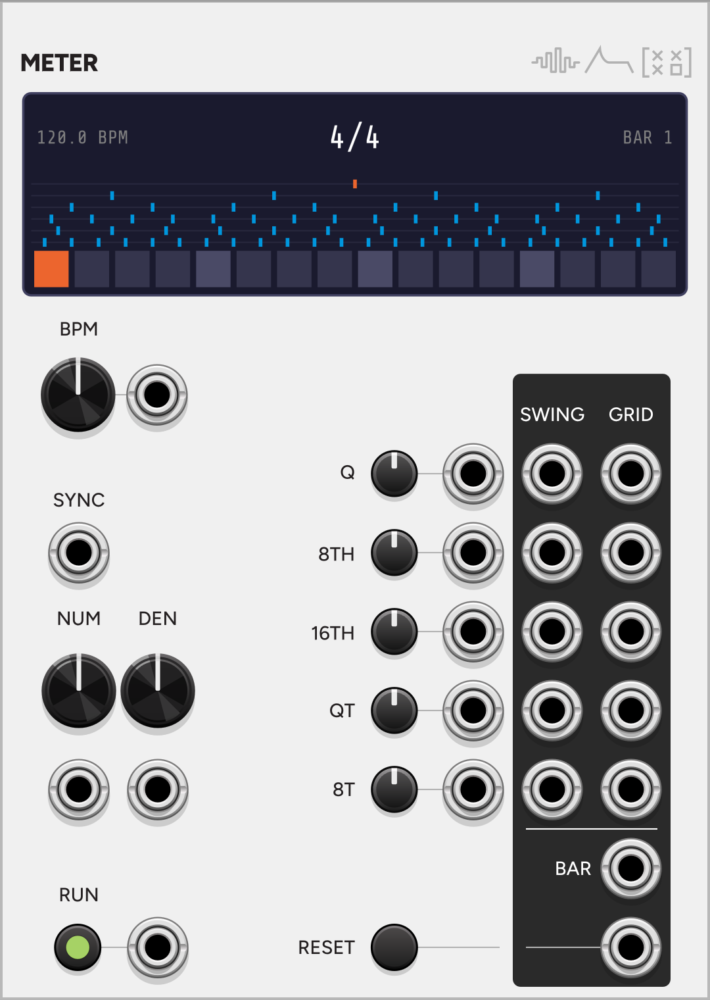 

**[Meter on signalfunctionset.com →](https://signalfunctionset.com/projects/sfs-sequencer-system)**

A time-signature-aware musical clock. Most VCV clocks output evenly-spaced pulses at fixed ratios; Meter understands the musical structure of those pulses: bars, beats, swing, and time signatures with CV control. Designed to be the master clock for a Beat-driven rhythm rig: one Meter feeds many downstream sequencers, each potentially clocked from a different swung or grid subdivision.

**Features:**
- **Six Subdivision Outputs**: BAR / Quarter / Eighth / Sixteenth / Quarter Triplet / Eighth Triplet, all gate-style (1ms 10V)
- **Per-Output Swing**: Independent ±50% swing per subdivision (BAR is always on the grid)
- **Grid (Un-Swung) Outputs**: A second copy of each subdivision (Q/E/S/QT/ET) with no swing applied, for keeping some elements on the grid while others swing
- **Time Signature with CV**: Numerator + Denominator both knob and CV controllable; changes queued for the next bar by default (or apply immediately via context menu)
- **External Clock Sync**: Configurable PPQN (1/2/4/8/12/16/24); LPF-smoothed BPM measurement
- **Swing Latching**: Per-bar swing latch prevents mid-period accumulator glitches when swing changes
- **BPM-Change Phase Preservation**: All subdivision phase accumulators rescale together when BPM changes so they stay locked relative to each other
- **Display**: BPM readout, current time signature (with pending change indicator), bar counter, sync indicator (when external clock is patched), per-output hit indicator rows with swing ghosts and pulse flashes, and a position tracker scaled to the active sixteenths-per-bar

**Controls:**
- **BPM** (30–300, default 120): Internal clock rate (quarter notes per minute)
- **Numerator** (1–16, default 4) / **Denominator** (1/2/4/8/16/32, default 4): Time signature
- **Run** (light latch): Play/stop
- **Reset**: Reset bar to 1, position to 0; fires Reset OUT
- **Per-Output Swing Trimpots** (×5): -50% to +50% (BAR has none)

**Inputs:**
- **BPM CV** (~27 BPM/V), **Numerator CV**, **Denominator CV**
- **Run gate** (overrides Run latch)
- **External clock** (overrides internal BPM when patched)
- **Per-output Swing CV** (×5, ±5V → ±50%)

**Outputs:**
- **BAR** / **Q** / **E** / **S** / **QT** / **ET**: swung subdivisions
- **Q grid** / **E grid** / **S grid** / **QT grid** / **ET grid**: un-swung versions
- **RESET OUT**: fires when Reset button is pressed (downstream modules use this to reset)

**Context Menu:**
- External Clock PPQN selector (1, 2, 4, 8, 12, 16, 24)
- Apply time signature changes immediately (default: queue for next bar)
- Reset on play (default: resume from current position)
- **Gate/trigger width**: either a fixed width (1 / 2 / 5 / 10 ms, for keeping triggers alive through a multiplexed Expert Sleepers path) or a **duty cycle** (12.5 / 25 / 50 / 75 / 87.5%). A duty-cycle gate is a share of *that output's own* period, so 50% is half a sixteenth on the sixteenth jack and half a bar on BAR, and it tracks the tempo. Swing is accounted for: each gate is scaled by the interval it is actually heading into, so a 75% gate on a heavily swung output still falls before the next pulse. RESET OUT stays a trigger regardless.

#### Meter X (Expander)

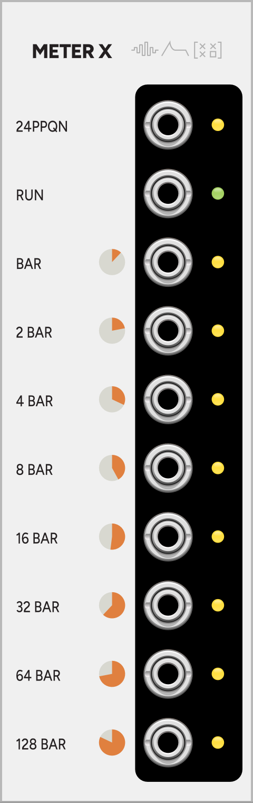 

**[Meter X on signalfunctionset.com →](https://signalfunctionset.com/projects/meter-x)**

An expander for Meter that covers the long game. Meter's own panel handles the musical subdivisions; Meter X adds a high-resolution 24 PPQN clock, a run gate, and bar-multiple triggers out to 128 bars, which is structure that unfolds over minutes rather than beats. Place it immediately to the right of Meter; there are no cables to patch. Meter X is 8HP.

**Features:**
- **24 PPQN clock**: the MIDI-standard resolution, deliberately un-swung so downstream modules that apply their own swing don't double it.
- **Bar multiples**: Bar / 2 / 4 / 8 / 16 / 32 / 64 / 128 triggers, all firing on the downbeat and aligned to reset (bars 1, 1+N, 1+2N…), so the whole hierarchy stays locked to the song.
- **Cycle pies**: each bar row shows a pie that fills clockwise through its cycle and resets when it fires. You can see you're three-quarters through a 32-bar section instead of counting.
- **Run gate**: 10V while Meter runs.
- **Activity LEDs** on every row.

**Outputs:** 24 PPQN, Run, Bar, 2 / 4 / 8 / 16 / 32 / 64 / 128 bars.

**Context Menu:**
- **Gate/trigger width**: the same fixed widths and duty cycles as Meter, each output scaled by its own period. A 50% gate is half a 24th of a quarter on the PPQN jack and half of 128 bars on the last one. Meter X gets the tempo over the expander bus.

See [docs/meterx-manual.md](docs/meterx-manual.md) for the full manual.

#### Beat

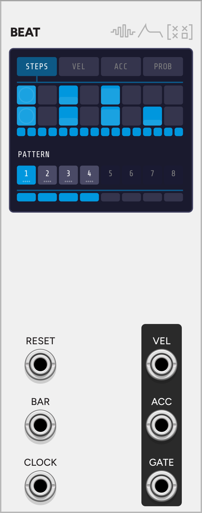 

**[Beat on signalfunctionset.com →](https://signalfunctionset.com/projects/sfs-sequencer-system)**

A single-voice pattern sequencer designed to pair with Meter (or any clock + bar source). One Beat instance = one drum/voice. Eight patterns × sixteen steps each, with per-step velocity, accent, and probability. Per-pattern length and per-pattern repeat count define the macro structure. Most editing happens directly on the screen; the panel itself is a narrow 10HP with just the display + jacks.

**Features:**
- **8 Patterns × 16 Steps**: 128-step memory per Beat
- **Per-Step Velocity, Accent, Probability**: On-screen editable in dedicated edit modes
- **Per-Pattern Length** (1–16) and **Repeats** (1–8 bars): Define how many steps and how many times each pattern plays
- **Pattern Rotation**: Active patterns advance automatically on bar pulses; double-click any pattern cell to toggle it active/inactive
- **On-Screen Editing**: Tab between STEPS / VEL / ACC / PROB modes; click + drag to paint, scrub velocity/probability vertically
- **BAR/CLOCK Coincidence Handling**: Defer + suppress windows make Beat tolerant of CLOCK and BAR pulses arriving up to a few samples apart at bar boundaries
- **Reset Sync**: First clock after a Reset lands on step 1 (the downbeat) instead of skipping past it

**Inputs:**
- **CLOCK**: Advances the step counter
- **BAR**: Advances to the next active pattern (with `repeats` honored)
- **RESET**: Returns to first active pattern, step 1

**Outputs:**
- **GATE**: 1ms 10V pulse on each fired step
- **VELOCITY**: Sample-and-hold CV 0–10V (held until next fired step)
- **ACCENT**: 1ms 10V pulse on accented steps

**Context Menu:**
- "Advance only on bar trigger" (default ON)
- Patterns: Randomize current pattern / Clear current / Clear all

#### Fill

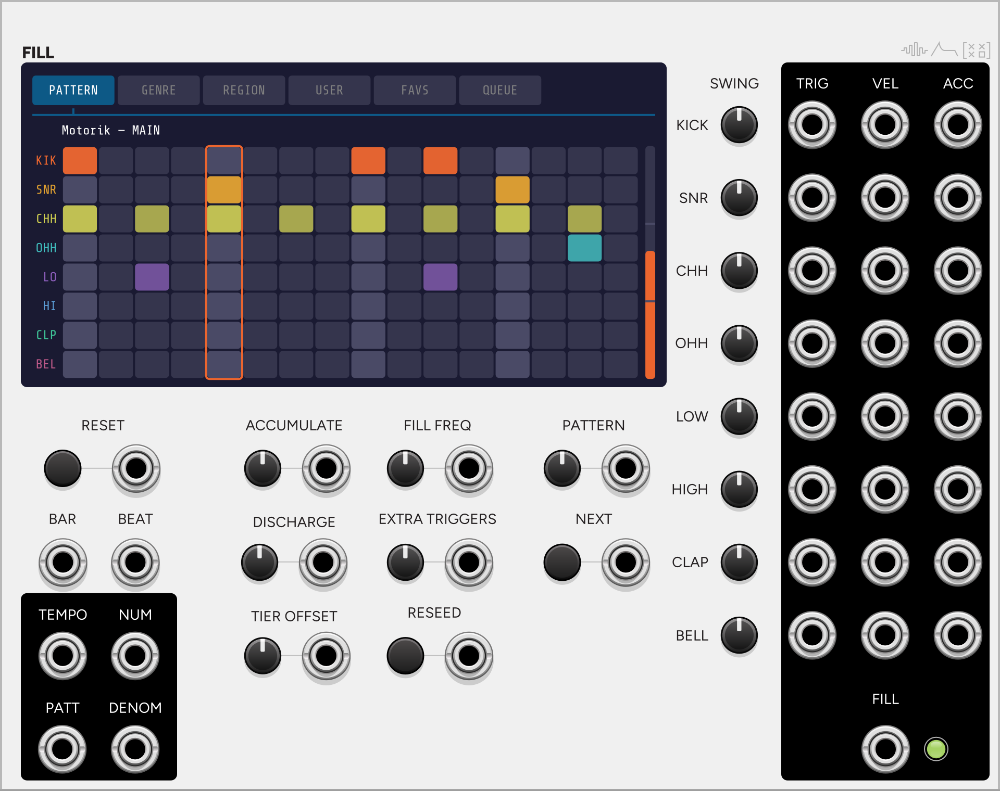 

An auto-playing eight-channel drum sequencer. Where Beat is one voice you program, Fill is a whole kit that plays itself from a library of 343 pattern sets and decides on its own when to break.

The idea it is built around is **pressure**. One internal value accumulates a little every bar and vents as a fill. That single number drives two things at once: the intensity tier (sparse, main, or lift, latched per phrase so it doesn't flicker mid-idea) and a seeded variation layer on top of the pattern. Turn ACCUM up and it gets restless; turn DISCHARGE up and each fill spends more of what it has built.

**Features:**
- **Playback is clock-driven.** Steps fire on CLOCK edges and `clocksPerBar` is measured between BARs, so it freezes the moment the clock stops rather than free-running away from the rest of the patch.
- **Three shipped banks**: a canonical set, a General MIDI set, and a disco bank built from Rothman's method rather than his exercises, plus your own from `<Rack user dir>/SignalFunctionSet/patterns/`. **drum-patterns.com `.txt` exports import natively.**
- **EXTRAS is a hard cap** on engine-added notes per bar, and each set's own `vary` value limits how far its identity may bend. The generator can decorate a pattern; it can't turn it into a different one.
- **Five-tab browser**: PATTERN · GENRE · REGION · USER · FAVS. Favourites persist plugin-wide in `fill-favorites.json`, not per patch.
- **A pattern queue** with a play button per row and drag to reorder, so you can line up an arrangement by hand.
- **Per-channel swing** on the off-beats, independent per channel.
- **NUM and DEN outputs** feed Meter's "Time signature CV absolute", so a set in 5/4 retimes the whole patch.

**Channels:** Kick, Snare, Closed hat, Open hat, Low perc, High perc, Clap/rim, Bell.

**Controls:** Accumulate, Discharge, Tier offset, Phrase (4 / 8 / 16 bars), Extras, Set, Reset, Next, Reseed, and per channel swing.
**Inputs:** Clock (required), Bar, Reset, Next, Reseed, Phrase CV, Accum CV, Discharge CV, Tier CV, Set CV, Extras CV.
**Outputs:** Per channel, gate, velocity and accent (8 × 3); plus Fill gate (high during a fill), Set, Num, Den, BPM.

**Context menu:** Clock resolution, Fills, Play fills, Queue advance, Tier balance, Tier follows.

See [docs/fill-manual.md](docs/fill-manual.md) for the full manual.
#### Note

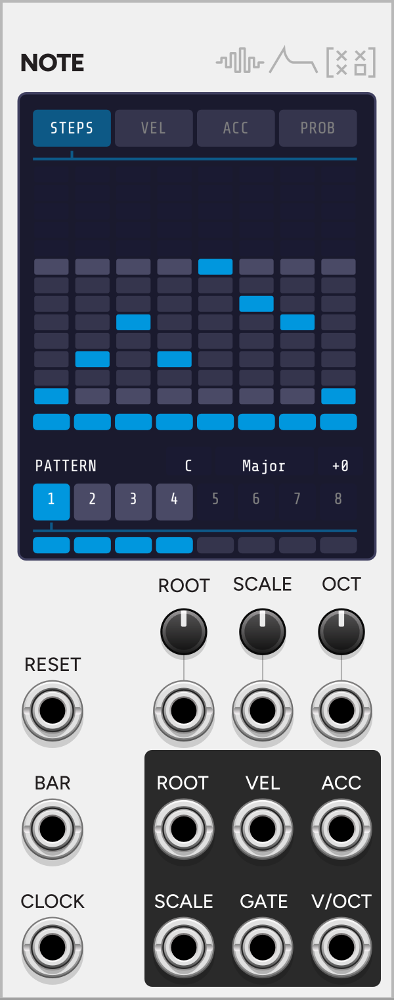 

**[Note on signalfunctionset.com →](https://signalfunctionset.com/projects/sfs-sequencer-system)**

A monophonic CV/gate pattern sequencer, Beat's pitched cousin. Eight patterns × eight steps with a 12-row pitch matrix, scale and root selection, octave shift, and per-step velocity, accent, and probability. Designed for melodic and percussion-tonal sequencing alongside Beat.

**Features:**
- **8 Patterns × 8 Steps**: 64-step melodic memory
- **12-Row Pitch Matrix**: Click any cell to set the pitch for a step (or use a ROOT/SCALE quantizer mode)
- **19 Scales**: From the shared canonical list (interchangeable with Fugue and Muse), including non-12-TET options: Slendro (5 equal divisions), Pelog (Surakarta-style), Harmonic Series (just-intonation harmonics 1–12), Hijaz, Hirajoshi, plus the standard modes and pentatonics
- **Per-Step Velocity, Accent, Probability**: Same edit modes as Beat
- **ROOT / SCALE / OCT**: Trimpots + CV inputs, with ROOT trimpot tooltip showing the actual note name

**Inputs:**
- **CLOCK / BAR / RESET**: Same semantics as Beat
- **ROOT CV** (1V/12), **SCALE CV** (1V/scale-index), **OCT CV** (1V/octave)

**Outputs:**
- **CV**: 1V/octave pitch (sample-and-hold)
- **GATE**: 1ms pulse on each fired step
- **VELOCITY**: 0–10V S&H
- **ACCENT**: 1ms pulse on accented steps

**Context Menu:**
- "Advance only on bar trigger" (default ON)
- Patterns: Randomize / Clear

#### Chance

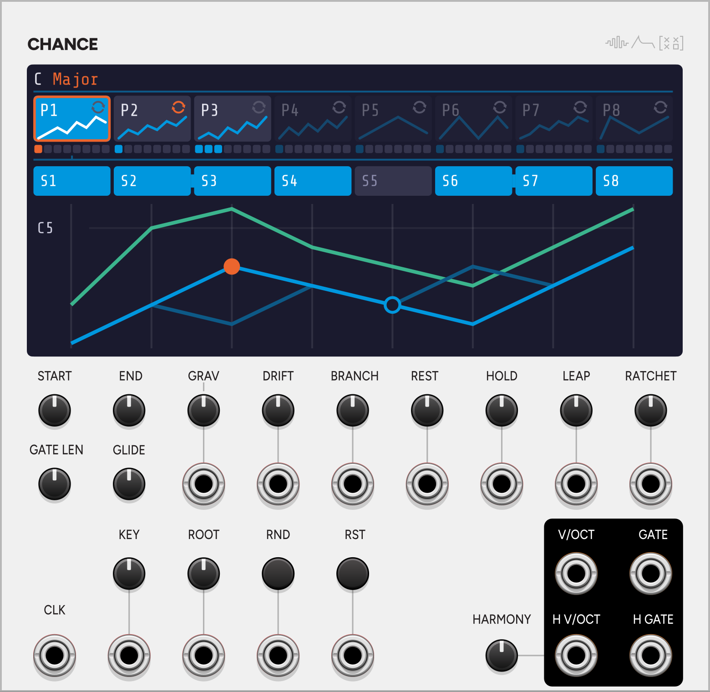 

**[Chance on signalfunctionset.com →](https://signalfunctionset.com/projects/chance)**

A generative melodic sequencer built on one idea: a melody is a *walk*. You don't program notes. You set a key, a window, and a few probabilities, and Chance walks a line through the scale. Every decision is seeded, so a pattern is a fixed, repeatable melody rather than a stream of noise: it plays the same way every time it comes around, and every knob you turn changes it audibly. Chance is 26HP and needs an external clock.

**Features:**
- **Core + branch**: a deterministic skeleton melody (the core), plus a BRANCH probability that strays to a neighbouring note at each step. Strays are non-cascading, so the core always shows through: BRANCH at 0 is the pure tune, higher is the same tune wearing a different coat.
- **Musical note choice**: hand-authored first-order Markov tables rather than a coin flip: chord-tone gravity, leading-tone pull, dominant resolution; dedicated tables for pentatonic and blues. Strays voice-lead from the previous played note.
- **GRAV / DRIFT**: direction bias and move size (stepwise 2nds out to octave leaps).
- **Per-step shaping**: Rest, Hold (2–4 clocks), Leap (±octave), and Ratchet (2–3 bursts *inside* a step), each with CV.
- **8 seeded patterns**: each with its own micro-waveform, gates, and repeat count; rotate at the cycle level. Per-slot mode: *normal* (identical every visit) or *reseed* (a fresh variation each visit).
- **On-screen editing**: click a pattern to load it into the walk, double-click to enable; per-step gates click to toggle, shift-click to tie. Gate edits apply immediately, mid-cycle.
- **Second voice**: Harmony at a fixed diatonic interval, or *Varied*: a seeded weaving counter-line with contrary motion.
- **Shared key convention**: Root and Scale CV interchangeable with Note, Fugue, Muse, and Arrange.

**Controls:** Grav, Drift, Branch, Rest, Hold, Leap, Ratchet, Gate Len, Glide, Key, Root, Start, End, Harmony, Rnd, Rst.
**Inputs:** Clock, Rnd, Rst, Root CV, Scale CV, and a CV jack under each walk/shaping control.
**Outputs:** V/OCT, Gate, Harmony V/OCT, Harmony Gate.

See [docs/chance-manual.md](docs/chance-manual.md) for the full manual.

#### Fugue

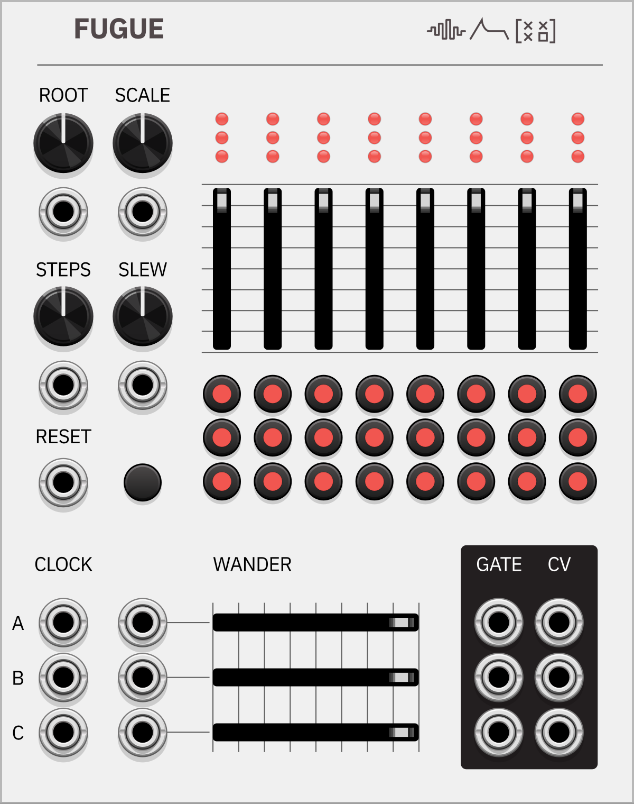 

**[Fugue on signalfunctionset.com →](https://signalfunctionset.com/projects/fugue)**

An 8-step harmonic deviation sequencer with three independent CV/gate voices (A, B, C). Each voice reads the same pitch sequence but wanders harmonically according to its own controls, producing shifting counterpoint from a shared origin.

**Features:**
- **Three Independent Voices**: Each with its own clock, gate pattern, and wander control
- **Harmonic Deviation**: Wander control selects notes from musically-informed tiers: chord tones, extensions, chromatic neighbors
- **Harmonic Lock**: Voices bias toward consonance with each other, creating soft harmonic gravity (enabled by default)
- **Clock Normalling**: Clock B normalled to A, Clock C normalled to B. Patch separate clocks for polyrhythmic effects.
- **19 Scales**: Drawn from a shared canonical scale list used across Fugue, Note, and Muse, so SCALE CV is interchangeable between them (sequence scale changes for the whole rig at once): Chromatic, Major, Minor, Pentatonic Major/Minor, Blues, Whole Tone, Harmonic Series, Dorian, Phrygian, Lydian, Mixolydian, Locrian, Harmonic Minor, Melodic Minor, Hijaz, Hirajoshi, Pelog, Slendro
- **Adaptive Slew**: Portamento that always resolves before the next note arrives
- **Per-Voice Gate Patterns**: 24 toggle buttons (8 steps × 3 voices) for independent rhythmic patterns

**Controls:**
- **Root** (C–B): Root note for scale quantization. CV: 1V = 1 semitone.
- **Scale** (19 modes): Scale selection. CV: 1V = 1 scale index.
- **Steps** (1–8): Active sequence length.
- **Slew** (0–100%): Adaptive portamento.
- **Pitch Faders** (8): Base pitch per step, quantized to the selected scale.
- **Gate Toggles** (3 rows × 8): Per-voice gate on/off per step.
- **Wander A/B/C** (0–100%): Horizontal sliders controlling harmonic deviation per voice.
- **Reset**: Jack + momentary button, returns all voices to step 1.

**Inputs:**
- **Clock A, B, C**: Trigger inputs (B normalled to A, C normalled to B)
- **Reset**: Trigger input
- **Root CV, Scale CV, Steps CV, Slew CV**: Parameter modulation
- **Wander A/B/C CV**: Per-voice wander modulation (±5V)

**Outputs:**
- **CV A, B, C**: 1V/octave pitch
- **Gate A, B, C**: +10V gate

**Context Menu:**
- Fader Range: 1V (1 octave), 2V (2 octaves), or 5V (5 octaves)
- Harmonic Lock: Toggle consonance-biased deviation (default: on)
- Randomize Sequence: Set all faders to random positions

##### Fugue X (Expander)

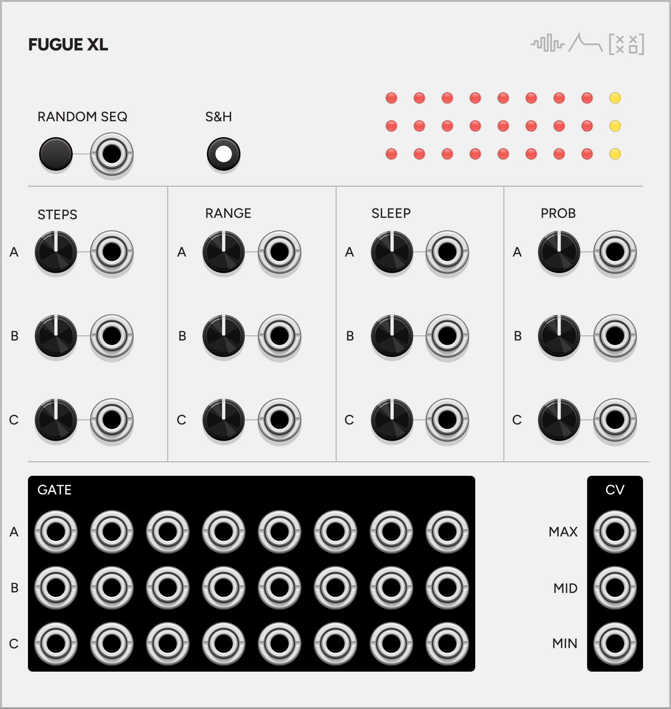 

**[Fugue X on signalfunctionset.com →](https://signalfunctionset.com/projects/fugue)**

An expander module for Fugue that adds per-voice controls for steps, range, sleep, and probability, plus sorted CV outputs and per-step trigger outputs. Place to the right of Fugue to connect automatically.

**Per-Voice Controls (A, B, C):**
- **Steps** (1–8): Independent step count per voice (overrides Fugue's global steps)
- **Range** (1V/2V/5V): Independent fader range per voice (overrides Fugue's global range)
- **Sleep** (0–64 steps): Number of clock ticks to skip between active steps, creating rests and rhythmic variation
- **Probability** (0–100%): Chance that each step actually fires its gate. At 100% every step plays; lower values introduce random silences.

**Additional Features:**
- **Sample & Hold Mode**: Toggle. When enabled, held notes sustain through rests instead of returning to silence
- **Randomize Sequence**: Button + trigger input to randomize the parent Fugue's pitch faders
- **LED Matrix**: 8×3 grid showing the current step position for each voice, plus sleep indicator LEDs
- **Per-Step Trigger Outputs**: 24 individual trigger outputs (8 steps × 3 voices) for driving external modules from specific sequence positions

**Sorted CV Outputs:**
- **Max**: Highest of the three voice CV values
- **Mid**: Middle value
- **Min**: Lowest value

**All per-voice parameters have CV inputs** (±5V).

See [docs/fuguex-manual.md](docs/fuguex-manual.md) for the full manual.

##### MetaFugue

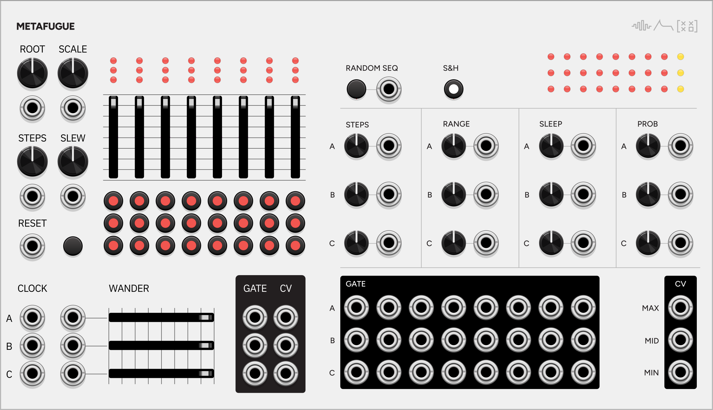 

**[MetaFugue on signalfunctionset.com →](https://signalfunctionset.com/projects/fugue)**

A single-module merge of Fugue and Fugue X: all of Fugue's controls plus the per-voice steps/range/sleep/probability, S&H mode, sorted min/mid/max CV outputs, and per-step trigger outputs, in one wider panel. Ideal for hosts that don't support expanders (e.g. MetaModule) or for anyone who prefers everything in one place.

See [docs/metafugue-manual.md](docs/metafugue-manual.md) for the full manual.

#### Muse

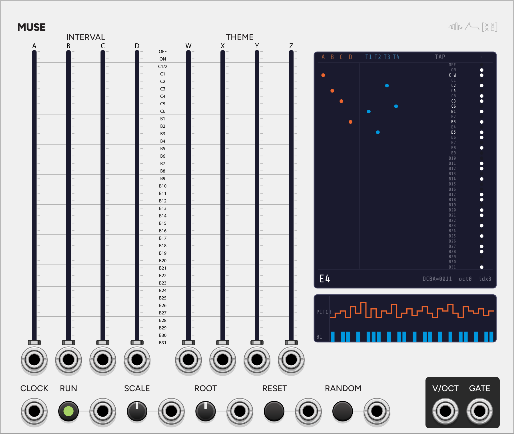 

**[Muse on signalfunctionset.com →](https://signalfunctionset.com/projects/muse)**

A faithful recreation of the **Triadex Muse**, the legendary algorithmic sequencer designed by Edward Fredkin and Marvin Minsky in 1972 (US Patent 3,610,801). It's not a step sequencer, and there are no notes to program. Eight sliders tap into a network of binary counters and a 31-bit feedback shift register, and the *interaction* of those digital signals generates long, surprisingly musical melodies that can run for hundreds of steps before repeating. Small slider changes produce dramatically different tunes, but the results are always structured and deterministic.

**Features:**
- **Two Slider Banks**: 4 THEME sliders (XNOR'd together to drive the shift register, the pattern's "DNA") and 4 INTERVAL sliders (form a 4-bit pitch address each clock)
- **40 Taps Per Slider**: OFF, ON, raw clock (C ½), binary counter bits (C1/C2/C4/C8), mod-12 counter taps (C3/C6), and the 31 shift-register bits (B1–B31)
- **Live State Display**: Triadex-style label column with LEDs showing each tap's current value as the engine evolves
- **Scale + Root**: Quantize the output to a selectable scale (shared canonical list, interchangeable with Note and Fugue) with a ±24-semitone root
- **17 Classic Presets**: Slider snapshots straight from the original 1972 manual ("Birds", "Christmas Bells", "Marvin's Yodel", and more)
- **Randomize**: Button + CV; scope to all 8 sliders, theme only, or interval only
- **Expander Linking**: Place a second Muse to the right and it follows the first; chain several for layered voices
- **Selectable Output Range**: Standard 1V/oct, or scale-quantized 1V/2V/5V modes for using Muse as a modulation source

**Controls:**
- **THEME 1–4 / INTERVAL 1–4** (sliders): Tap selection for each bank
- **ROOT** (±24 semitones) / **SCALE**: Output quantization
- **RUN / RESET / RANDOMIZE**: Transport + re-roll

**Inputs:**
- **CLOCK**: Advances one step per rising edge (Muse has no internal clock)
- **RESET / RUN / RANDOMIZE**: Trigger / gate / trigger
- **THEME 1–4 CV, INTERVAL 1–4 CV** (±5V): Offset each slider's tap
- **ROOT CV** (1V/oct), **SCALE CV** (interchangeable with Note/Fugue)

**Outputs:**
- **V/OCT**: Melody pitch (1V/oct, with Scale + Root)
- **GATE**: Trigger per clocked step

**Context Menu:**
- Presets (from the Triadex manual), Output range (V/oct / 1V / 2V / 5V), Allow expander linking, Gate mode (every clock / only when pitch changes), Randomize scope + Randomize now

See [docs/muse-manual.md](docs/muse-manual.md) for the full manual.

### LFOs & Modulation

#### Drift

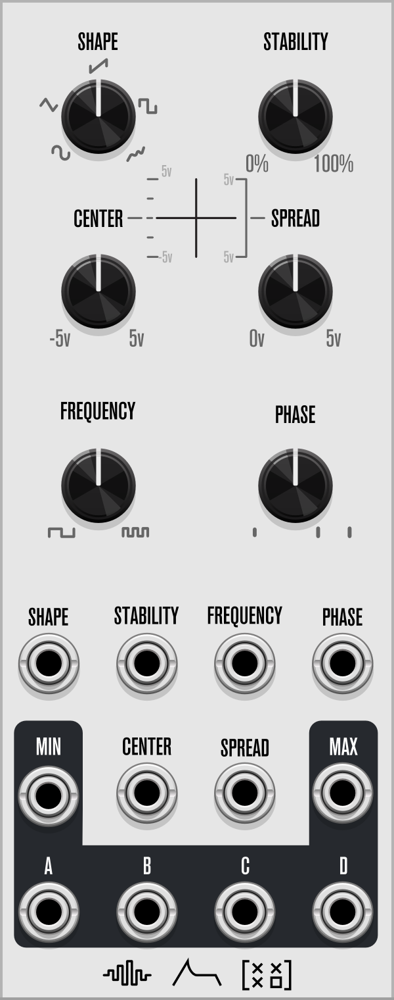 

**[Drift on signalfunctionset.com →](https://signalfunctionset.com/projects/drift)**

A 4-channel LFO with chaos capabilities and advanced phase and scaling control.

**Features:**
- **4 Phase-Shifted Outputs** (A, B, C, D): Each output can be independently phase-shifted using the Phase control
- **Morphing Waveforms**: Shape control smoothly transitions between sine, triangle, sawtooth, square, and chaos
- **Clock Sync**: Can sync to external clock input or run freely at set frequency
- **Flexible Scaling**: Center and Y Spread controls for precise voltage range adjustment
- **Stability Control**: Modulates chaos behavior and waveform characteristics

**Controls:**
- **Shape**: Morphs between waveform types (sine/triangle/sawtooth/square/chaos)
- **Stability**: Adds uncertainty to the waveforms. Higher values are more stable. Stability is calculated independently per output for subtle variation.
- **Center** (bipolar): DC offset for all outputs.
- **Spread**: Controls the amplitude of the outputs. Bipolar, so 5V means ±5V.
- **Frequency**: Sets LFO frequency in Hz. Slow to the left, fast to the right.
- **Phase**: Sets the phase offset relative to A. At 1, A is 0°, B is 90°, C is 180° and D is 270°.

**Inputs:**
- **Shape**: CV control for waveform morphing
- **Stability**: CV control for stability parameter
- **Clock**: External clock input for sync (overrides frequency control)
- **Phase**: CV control for phase spreading
- **Center**: CV control for DC offset
- **Spread**: CV control for amplitude

**Outputs:**
- **A, B, C, D**: Four phase-shifted LFO outputs
- **Min**: Minimum value across all 4 channels
- **Max**: Maximum value across all 4 channels

#### Cycle

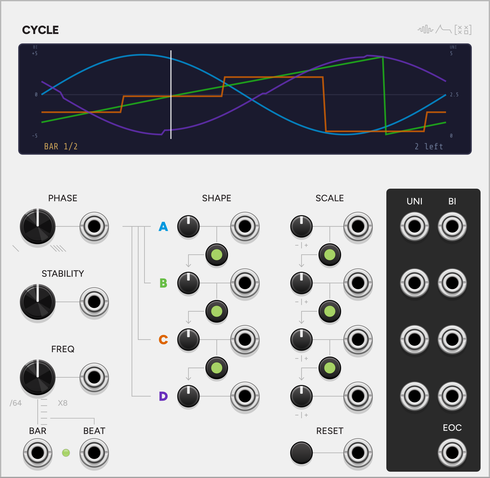 

**[Cycle on signalfunctionset.com →](https://signalfunctionset.com/projects/cycle)**

A four-channel LFO that thinks in bars, not Hertz. All four outputs (A/B/C/D) run the same cycle but can be spread, scaled, and shaped independently, and the whole bank locks to a musical bar via clock and bar inputs, so patch it into Meter and every modulation lands on the grid. Unpatched, it free-runs in Hz like an ordinary LFO. It's the tempo-synced companion to Drift.

**Features:**
- **Bar-locked timing**: BAR is the timing authority: Cycle hard-aligns its cycle to every downbeat, so it can't drift out of phase. FREQUENCY becomes a musical divider/multiplier (64 bars … ⅛ bar) when locked, or 0.02–20 Hz when free.
- **Shape ring**: each channel morphs through sine → triangle → saw → square → staircase → stepped-random → back to sine. The loop is closed, so shape CV and link offsets wrap continuously instead of clamping.
- **Clock-quantized steps**: patch CLOCK and the staircase / stepped-random shapes advance one step per pulse, so they land on real beats. Stepped-random generates a fresh set of voltages each cycle, shared by all four channels.
- **Per-channel depth**: bipolar SCALE per channel (negative inverts), plus global PHASE spread to fan the channels across the cycle and Drift-style STABILITY for amplitude wander.
- **Linking with offsets**: shape/scale link buttons gang adjacent channels (on by default); a linked channel's knob becomes a wrapping (shape) or bounded (scale) offset from the group leader.
- **Display**: all four waveforms with a playhead, bar gridlines, a bar-position readout, and bipolar/unipolar voltage scales on the edges.

**Controls:** per channel, Shape and Scale; global, Frequency, Phase, Stability and Reset, plus the shape/scale link buttons.
**Inputs:** Bar, Clock, Reset, Frequency CV, Phase CV, Stability CV, and per channel: Shape CV and Scale CV.
**Outputs:** per channel, Uni (0–5V) and Bi (±5V); plus an end-of-cycle trigger.

See [docs/cycle-manual.md](docs/cycle-manual.md) for the full manual.

#### Gravity

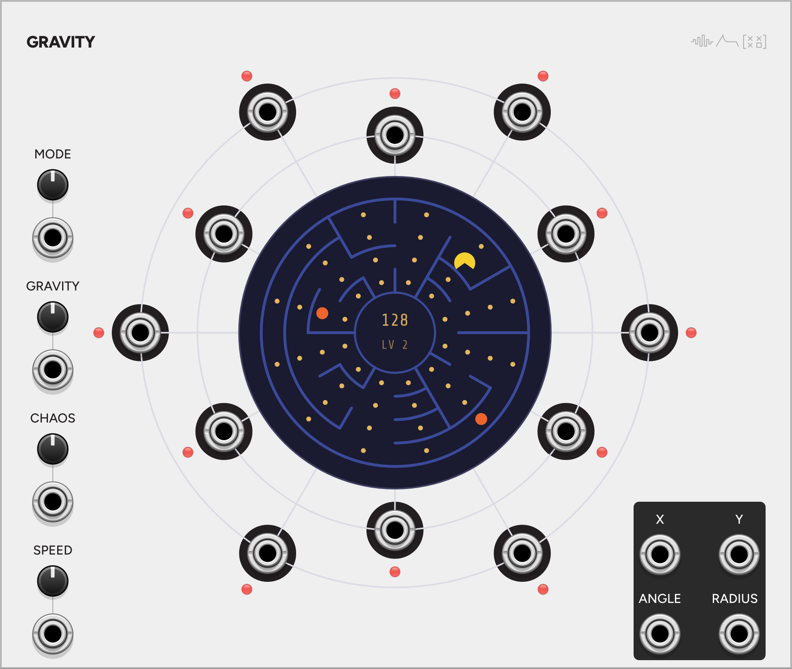 

**[Gravity on signalfunctionset.com →](https://signalfunctionset.com/projects/gravity)**

A multi-mode chaos and motion engine. A single moving point, driven by one of six very different physical or generative systems, is read out as a set of control voltages: bipolar X/Y position, radius, angle, six "sector" distance CVs, and six boundary-ray gates. One small set of controls (Speed, Chaos, and a mode-dependent Gravity) reshapes whatever engine is running, and a large circular display shows exactly what the voltages are doing.

**The six modes:**
- **Pendulum**: A double pendulum (RK4). The lower bob is the tracked point; Chaos sets the energy. Drag either joint to relaunch (ragdoll).
- **Gravity Well**: A spring-bound rocket orbits a central sun, perturbed by heavy outer planets. Always bounded, so it can't escape or get captured.
- **Billiards**: Elastic balls in the circle; the cue is the tracked point, any ball fires gates. Drag the cue for a slingshot launch.
- **Hungry Man**: A random single-width Pac-Man maze; chases big dots, eats small ones, scores (1/5) and advances levels with a fresh maze each time. Chaos = big-dot count, Gravity = center/edge bias.
- **Turtle**: A LOGO-style turtle drawing generative artwork. Gravity biases common vs esoteric commands; a live instruction log and long-persistence trail are shown.
- **Pattern**: A turtle tracing spirograph / Maurer-rose figures, always built from integer-degree divisions of 360 so each figure closes cleanly. Gravity sets the form (simple roses → woven rose-stars → dense webs); Chaos sets the intricacy.

**Controls:**
- **MODE** (snap): Selects the active engine (also CV-selectable, 0–10V spans all six)
- **SPEED**: Time scale / draw speed
- **CHAOS** (0–1): Complexity. Energy, ball/dot count, command rate, or figure intricacy, depending on mode
- **GRAVITY** (±1): Mode-dependent. Pull direction, sun strength, dot bias, command bias, or pattern form

**Inputs:**
- **SPEED CV, CHAOS CV, GRAVITY CV, MODE CV**: One per knob, in the left-hand column

**Outputs:**
- **X / Y** (±5V): Position of the tracked point
- **RADIUS** (±5V): Distance from center (−5 = center, +5 = rim)
- **ANGLE** (±5V): Angle relative to the gravity direction
- **SECTOR 1–6** (0–10V): Six morph-crossfaded distance CVs, one per 60° wedge
- **GATE 1–6** (0/10V): Retriggerable gates as the point crosses each boundary ray (with activity LEDs)

**Context Menu:**
- Relaunch (kick), Clear drawing (Turtle/Pattern), Gate hold (tight/medium/gluey), Trail length

See [docs/gravity-manual.md](docs/gravity-manual.md) for the full manual.
#### Trace

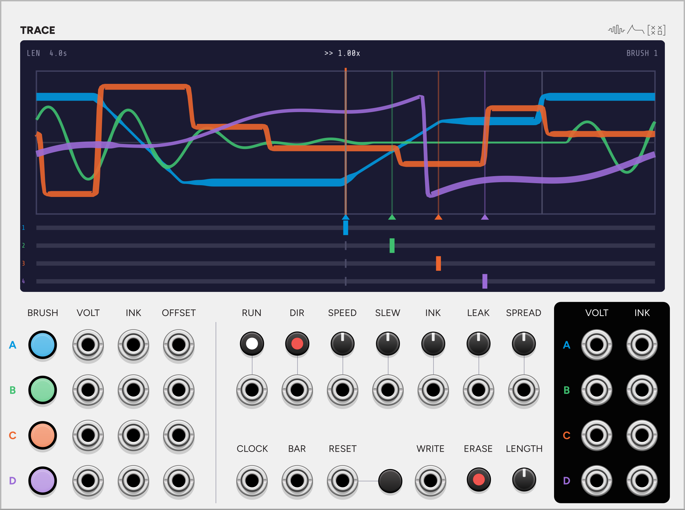 

A paper loop and four brushes. You draw four CVs onto moving paper, or let the patch draw them, and four read heads play them back. Part Oramics, which read drawn shapes off moving film; part chart recorder, whose pens sit at different points along the drum, which is why the read offsets here are per lane rather than global.

**Features:**
- **The transport is uncoupled from the brush.** Every other draw-a-shape module is a static editor: you see the whole loop, edit it as an object, and playback is a cursor sweeping your artwork. Here the paper moves whether you're drawing or not, which is what makes it an instrument. It also gives three behaviours for free, decided by nothing but where the mouse is: left of NOW you're editing what just played, right of it you're composing the future with lead time, on it you're performing.
- **Ink is a second dimension.** The brush lays down weight as well as position, so every lane carries two signals. Ink accumulates over repeated passes and pools where the line sits still, which makes the thickness track "how settled is this line": sustains heavy, transitions light, without anyone having drawn it.
- **Events come from the shape, not the value.** Each lane classifies its slope as rising, falling or flat and fires on the transitions, so a scribble makes notes where it turns around and no quantization is involved.
- **The paper is a length, not a duration.** LENGTH sets how many cells go round and SPEED sets how fast they pass the head, so speeding up shortens the loop rather than compressing what's drawn on it.
- **Per-lane read offsets.** Copy one shape across all four lanes, spread the heads, and you have four phase-shifted reads of a single gesture.

**Controls:** Speed, Length, Slew, Ink, Leak, Spread, Run, Reverse, Reset, and five brushes (four lanes plus erase).
**Inputs:** Per lane, draw CV, thickness and head offset; globally Clock, Bar, Reset, Run, Reverse, and CV for Speed, Slew, Ink, Leak and Spread.
**Outputs:** Per lane, Value, Value-at-offset and Ink; globally Loop.

**Context menu:** Per lane, Range, Read (smooth or stepped), Quantize, Clear and Copy to lane; globally Stroke weight, Clocks per bar, Clear all paper.

> **The brush can't be down while the paper runs backwards.** That's stated as a rule about state rather than "a direction change lifts the brush", because the state version already answers what happens if you press the mouse while reversed, where an edge rule has to answer that separately and gets it wrong. A brush writing onto paper moving the other way retraces over what it just laid down, so the stroke eats itself.

See [docs/trace-manual.md](docs/trace-manual.md) for the full manual.

#### Field

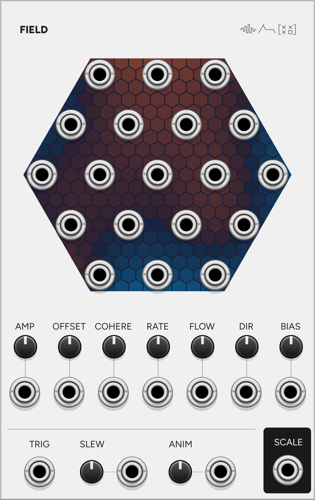 

Nineteen random voltages that are one thing. The jacks sit on a hexagonal grid, and under the grid is one smooth random field, a surface in x, y and time, that each jack reads at its own position. Every control is a statement about the field, and the relation between the jacks falls out of geometry: neighbours agree because they sample nearby points of the same surface, and how nearby is what COHERENCE means.

**Features:**
- **Nineteen sample-and-holds only at COHERENCE zero.** Turn it up and the grid becomes weather: a pattern that spans several jacks and, with FLOW and DIR, travels across the plate, so the jacks fire in a spatial order rather than as unrelated sources.
- **The jacks are the display.** There's no screen: the plate behind the jacks is tiled with hexagonal cells coloured by the field, from the same functions the outputs read, so what you see under a jack is what comes out of it. Eight palettes in the menu.
- **Eleven animations**, chosen by ANIM or a volt per mode: Flow, Zoom, Spin and Random move the noise field; Life is a cellular automaton on the tiling; Rain and Wave are a damped wave equation on the cell graph, driven by drops or by crests launched from the edge facing DIR; React is Gray-Scott reaction-diffusion, Cyclic the rock-paper-scissors automaton that winds itself into spirals, Sand the Bak-Tang-Wiesenfeld sandpile, Worley a moving mosaic of drifting seeds.
- **BIAS tilts the amplitude by radius**, centre hot and rim quiet or the reverse, which is what the rings are for.
- **TRIG** turns it into a bank of sample-and-holds: a mono trigger holds all nineteen, a polyphonic one holds jack N from channel N.

**Controls:** Amplitude, Offset, Coherence, Rate, Flow, Direction, Bias, Smooth, Anim.
**Inputs:** CV for every control, and Trig (poly).
**Outputs:** Nineteen jacks, and Poly (jacks 1 to 16).

**Context menu:** Colour.

See [docs/field-manual.md](docs/field-manual.md) for the full manual.

#### Flock

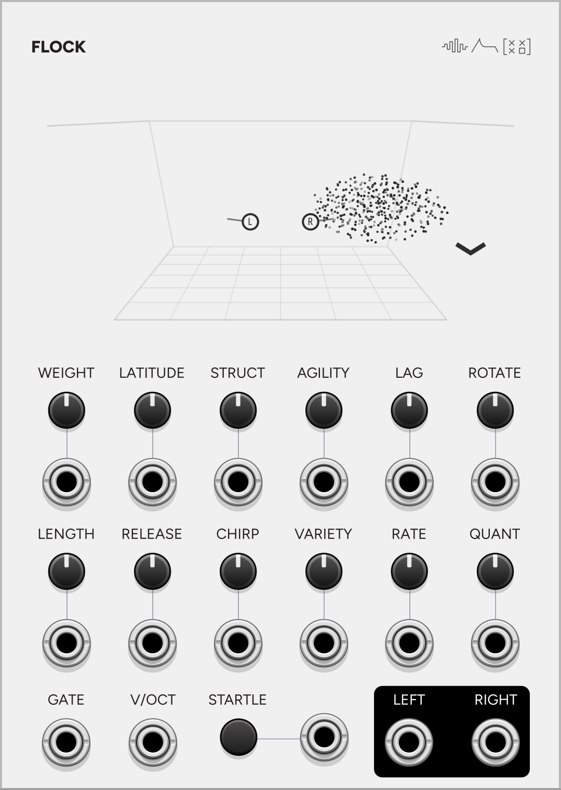 

A murmuration as a voice. Up to a thousand birds fly as a real flock, each steering by its seven nearest neighbours, and every call a bird makes is a grain. Height in the flock is pitch, so V/OCT is the roost the flock leans toward and a new note travels through the flock bird to bird rather than arriving all at once. The stereo image is the flock heard from a pair of listeners at its edge.

**Features:**
- **Persistent birds, not scheduled grains.** The flock keeps its shape between notes; LATITUDE says how many semitones that shape is worth, STRUCT gathers it at just intervals, and QUANT snaps each call toward a grid from the menu, so the same flock is microtonal or a chord.
- **LAG is a delay made of birds.** A pitch change reaches the front of the flock first and the back last, up to four seconds later.
- **STARTLE sends a hawk through.** The flock scatters past the listeners and settles over RELEASE, and the stereo field goes with it.
- **The display is the flock**, drawn in perspective on the faceplate with the listeners and the box the birds are leashed to. Drag to move the camera.

**Controls:** Weight, Latitude, Struct, Agility, Lag, Rotate, Length, Chirp, Quant, Rate, Release, Variety, Startle.
**Inputs:** Gate, V/Oct, Startle, and CV for every knob.
**Outputs:** Left, Right.

**Context menu:** Register, Quantize grid, Stereo width, Lead bird calls on the gate.

See [docs/flock-manual.md](docs/flock-manual.md) for the full manual.

##### Flock In (Expander)

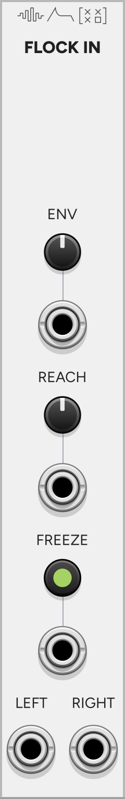 

An expander for Flock that sits immediately to its left. Patch audio in and the birds sing grains of it instead of sines: each call reads a short piece of the last few seconds of input, pitched by where the bird is in the flock.

**Features:**
- **ENV** is where each grain peaks, from a struck grain to a reversed swell.
- **REACH** is how far back the birds may read, 50 ms to 10 s; birds deep in the flock read further back, so the flock is spread through time as well as space.
- **FREEZE** holds the buffer, from the latch or a gate.

**Inputs:** Left, Right (normalled from Left), and CV for Env, Reach and Freeze.
**Outputs:** None; it speaks to the Flock on its right over the expander bus.

### Envelopes

#### Swell

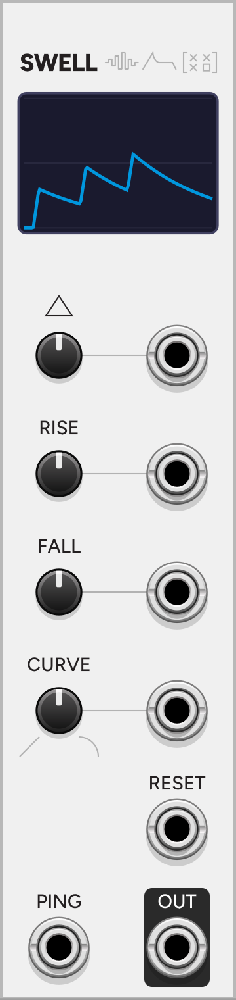 

**[Swell on signalfunctionset.com →](https://signalfunctionset.com/projects/swell)**

A ping-driven envelope generator. Each rising edge on the PING input adds a configurable voltage rise to the current envelope value, then the envelope decays back toward zero. Multiple pings stack, so you can build up a slow swell from a stream of triggers, or get a single sharp attack from a single ping.

Where a typical AD/AR envelope produces one fixed-shape ramp per gate, Swell *accumulates* contributions from every trigger and bleeds them off continuously. The output is a single 0–10V CV that smoothly soft-saturates near the ceiling and is paused from decaying while a rise is still in flight.

**Features:**
- **Additive Stacking**: Multiple in-flight rises sum together, giving naturally swelling envelopes from rapid trigger streams
- **Soft Saturation**: Output asymptotes smoothly at 10V (no hard clipping)
- **Curve Morph**: Linear → exponential blend on both rise and decay
- **Scope Display**: 1.2-second view: past trace on the left, current voltage at center, projected future trace simulated forward from the current state
- **Decay Pause During Rise**: Rises always reach their full delta (decay is held off until in-flight rises complete)

**Controls:**
- **Δ** (Delta, 0–10V): Voltage added per ping
- **Rise** (1ms–2s): Time for each ping's contribution to climb to its full value
- **Fall** (10ms–10s): Decay time constant when no pings are active
- **Curve** (Linear ↔ Exponential): Blends both rise and decay shapes

**Inputs:**
- **Ping**: Rising edge adds Δ
- **Reset**: Zeros the envelope and clears all in-flight rises
- **Δ CV / Rise CV / Fall CV / Curve CV** (±5V → ±50%)

**Outputs:**
- **CV out**: 0–10V soft-saturated envelope

#### Vac

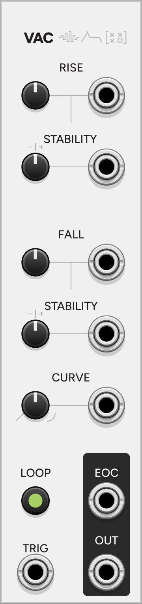 

**[Vac on signalfunctionset.com →](https://signalfunctionset.com/projects/vac)**

A semi-stable attack/release envelope generator. It has the classic A/R shape, but with a per-stage **STAB** control that adds controlled, musical cycle-to-cycle variation in timing, the way a real vactrol drifts. At STAB=0 it's a perfectly repeatable envelope; turn it up or down and each trigger's rise and/or fall stretches or shortens by a fresh random amount, so repeated patterns breathe.

**Features:**
- **Per-stage STAB**: independent bipolar stability for rise and fall. The random factor is `exp(STAB · r · ln 2.5)`, log-symmetric around 1 so a stage never collapses to zero (STAB +1 → 1×–2.5× longer, −1 → 0.4×–1× shorter).
- **Curve**: linear ↔ exponential stage shaping (with CV).
- **Loop**: latches auto-retriggering; toggling it on from idle also starts a cycle.
- **END trigger**: 1ms pulse at the end of each fall, for chaining at the envelope's natural (drifting) rate.
- **Continuous-drift mode** (context menu): the rate wobbles smoothly *through* each stage for an even more thermal feel.

**Controls:** Rise, Rise Stab, Fall, Fall Stab, Curve, Loop (LED button).
**Inputs:** Trig, Rise CV, Rise Stab CV, Fall CV, Fall Stab CV, Curve CV.
**Outputs:** Env (0–10V), End (1ms trigger).

See [docs/vac-manual.md](docs/vac-manual.md) for the full manual.

#### OP ENV

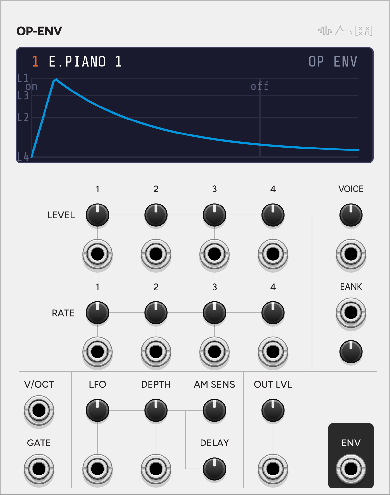 

**[OP ENV on signalfunctionset.com →](https://signalfunctionset.com/projects/op-env)**

The DX7 operator envelope, freed from the oscillator. OP ENV loads a voice from a DX7 `.syx` bank (just like Operator), takes that voice's carrier envelope, and turns it into a gate-driven 0–10V CV envelope for shaping any VCA, filter, or modulation target. On top of the loaded shape you can offset all eight DX7 EG attributes, four rates and four levels, by trimpot or CV, key-track the rates with a V/oct input, and add the DX7's global LFO tremolo.

**Features:**
- **Loads any DX7 carrier envelope**: pick a voice and its 4-rate / 4-level EG becomes the envelope shape, drawn live on screen.
- **Eight offsettable attributes**: R1–R4 and L1–L4, each ±99 by trimpot and CV, clamped to the DX7 range.
- **Key-tracked rates**: patch pitch into V/OCT for DX7 rate scaling (faster envelopes higher up the keyboard).
- **DX7 LFO tremolo**: LFO rate / depth / delay and carrier AM sensitivity, with a selectable LFO waveform.
- **Release to 0V** (default) so it behaves like an envelope generator, or switch it off for the authentic DX7 L4 release level.

**Controls:** L1–L4, R1–R4, Voice, Bank, LFO, Depth, Delay, AM Sens, Out Lvl.
**Inputs:** Gate, V/Oct, L1–L4 CV, R1–R4 CV, Voice CV, Bank CV, LFO CV, Depth CV, Out Lvl CV.
**Outputs:** Env (0–10V).

See [docs/op-env-manual.md](docs/op-env-manual.md) for the full manual.

### Utilities

#### Key

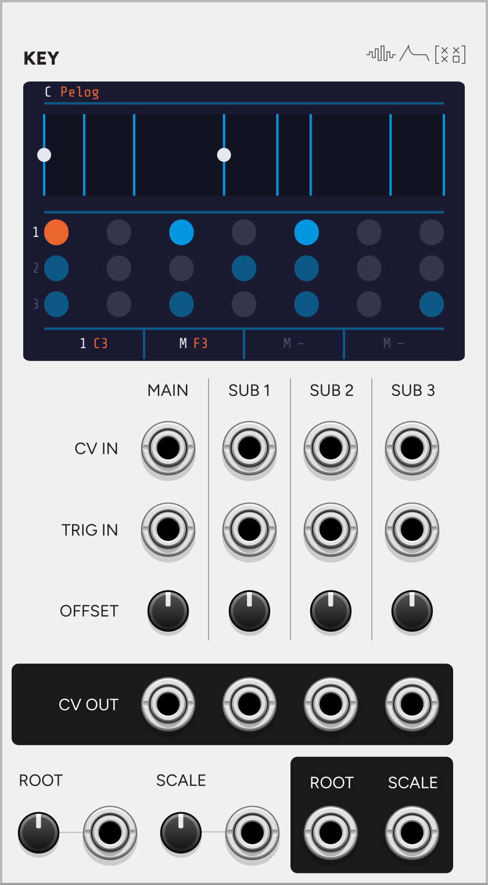 

A quantizer that isn't an island. Most of them make you set a scale by hand and then keep it in step with everything else yourself. Key reads **ROOT** (1V/oct, semitone-quantized) and **SCALE** (1V per scale) in the plugin's own convention, so Arrange, Note, Chance, Muse, Fugue, Chime, Loom and Slide all follow one key change, and Key hands the same key back out of its own ROOT and SCALE outputs. Four channels, each polyphonic to 16 voices, all sharing it. 14HP.

**Features:**
- **Three sub-scales**, one per channel: the columns are MAIN, SUB 1, SUB 2 and SUB 3, so the jack you patch into is the scale you get. They are masks over the parent scale's **degree indices**, never over absolute pitches, so `{1st, 3rd, 5th}` is a triad in Major (C E G), still a triad in Minor (C D♯ G), and D♯ G A♯ in E♭. A sub-scale is a role in the key, not a set of notes. An empty one falls back to the parent rather than going silent.
- **Sub-scales may leave the key** (menu, off by default) makes the out-of-scale cells clickable, so a sub-scale can carry an accidental: a flat 5th under a walking line, a passing tone the rest of the patch never sees. Those picks are stored as semitones from the root, because a note chosen for being outside the scale has no degree to be stored as. They transpose with ROOT and stay put when SCALE changes. A ring marks one on screen.
- **Nothing here is a 12-bit pitch mask.** Harmonic series, Pelog and Slendro carry fractional semitone intervals, and a Scala file can carry anything, so the quantizer works in "semitones within one period" against real floats. Pelog stays 0 / 1.20 / 2.70 / 5.40 / 7.00 / 8.00 / 10.40 rather than being rounded onto the chromatic grid.
- **Scala (.scl) files load** from the menu at SCALE index 19, leaving 0–18 as exactly the canonical list so cross-module SCALE CV is unaffected. Cents and ratios both parse, and **the period need not be an octave**: Bohlen-Pierce arrives as 13 degrees repeating at 19.02 semitones (3/1). The parsed scale is saved into the patch alongside the path, so it survives the file moving.
- **Two screen states.** The keyboard when the period is 12 semitones and every degree lands on one; otherwise a region strip that is linear in pitch across one period, so the gaps between its degree lines *are* the snap regions. A keyboard can only round a microtonal scale; the strip shows where it really sits. The keyboard is drawn from C whatever the root is, because you read a keyboard by its shape, and the root is marked in place. On the strip the sub-scale cells sit exactly under their degree lines, unevenly spaced on a just scale, and the footer names a note by degree and repeat rather than by the nearest 12-tone name. Scales of up to 256 degrees are handled in full.
- **On-screen editing.** Click a key to fork a custom scale; click a sub-scale cell to add or remove that degree. The rows show all twelve chromatic tones aligned under their own note, or one cell per degree when the scale isn't 12-tone.
- **A TRIG per channel**, polyphonic, turns it into a sample-and-hold: patched, that channel updates only on a trigger, and trigger channel N resamples voice N. IN and TRIG both normal left to right, with any new cable breaking the chain.
- **Hysteresis** (menu, 12 cents by default) stops a pitch sitting on a boundary from flickering. It is abandoned whenever the key or a channel's sub-scale changes, or a held note would survive outside its new scale.

**The scale bus.** ROOT OUT is 1V/oct and SCALE OUT is **polyphonic**. Channel 0 is the plain 1V-per-scale index every other module already reads. They all call `getVoltage()`, which returns channel 0 whatever the channel count, so the extension costs them nothing. Channel 1 is the period in volts, and channels 2 and up are the degrees as 1V/oct offsets from the root. That is how a microtonal or Scala scale reaches another module at all: the index rides on channel 0 as a lossy summary (Pelog resolves to Phrygian, the nearest canonical scale by pitch-class content) and the real scale rides behind it. Patch SCALE OUT into another Key and the whole key crosses intact, non-octave period and all. 14 degrees maximum, being 16 channels less the index and the period.

**Controls:** Root, Scale, and per channel: Offset.
**Inputs:** Root, Scale, and per channel: In (poly) and Trig (poly), both normalled left to right.
**Outputs:** Per channel, Out (poly); plus Root and Scale.

**Context menu:** Load Scala file, Offset in scale degrees (default) or semitones, Rounding (nearest / down / up), Sub-scales may leave the key, Hysteresis, Revert keyboard, Reset sub-scales, Sub-scales: every degree.

> **Note:** OFFSET moves in scale **degrees** by default, so +2 goes two steps up the scale and stays in key. Semitones are a menu option.

See [docs/key-manual.md](docs/key-manual.md) for the full manual.

#### Shift

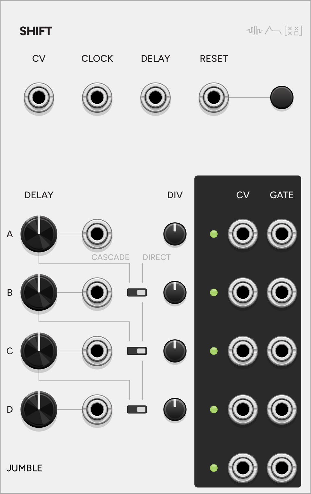 

**[Shift on signalfunctionset.com →](https://signalfunctionset.com/projects/shift)**

A 4-output CV shift register with per-lane controls. Sample input CV at the clock rate; route it through a chain of buffered delay/cascade stages with independent step counts, clock dividers, and step-CV modulation. Designed for generative-sequencer and CV-shaping work where you want a small forest of related-but-distinct CV streams from a single input.

**Features:**
- **Per-Lane Controls (×4)**: Independent N pot, Step CV input, Mode switch (parallel/cascade), Clock divider knob, CV output, Gate output, and LED
- **Parallel Mode (per lane)**: N-step delay line on the input. Output = input from N lane-clocks ago. Updates every lane-clock.
- **Cascade Mode (per lane)**: Tape-loop FIFO of length N, fed by the previous lane's value on each parent tick. CV cycles through the buffer continuously at clock rate; new content drips in at parent's rate. Cascade-on-A falls back to parallel.
- **Clock Divider Per Lane**: ÷1 / ÷2 / ÷3 / ÷4 / ÷8 (slows that lane's reads + writes; combines multiplicatively with N)
- **Disconnect Playback**: When the CV input cable is unpatched, lane reads cycle through a 16-slot full-depth history ring at clock rate so even cascade-N=1 lanes keep playing accumulated content
- **Jumble Output Pair**: CV (random pick across A/B/C/D held values, re-rolled every input clock) + accompanying CLK trigger + LED
- **Reset Button**: Paired with RESET trigger input; clears all buffers + held values

**Controls:**
- **Per Lane (×4):** N (1–16, snap), Step CV input (±5V → ±N), Mode switch (cascade left / parallel right), DIV knob (÷1 / ÷2 / ÷3 / ÷4 / ÷8, snap)
- **Reset button** + **RESET** trigger input
- **N CV** input (global, sums into every lane's N)

**Inputs:**
- **CV**: Data signal (sampled by all lanes)
- **CLOCK**: Lane-step trigger source for every lane
- **N CV**: Global N modulator
- **RESET**: Trigger to clear all lane state
- **Step CV A/B/C/D**: Per-lane N modulation

**Outputs:**
- **A / B / C / D CV**: Lane CV outputs
- **A / B / C / D GATE**: 1ms pulse on each lane tick
- **JUMBLE CV** + **JUMBLE CLK**: Random-pick S&H + accompanying clock

**Context Menu:**
- "Clear all" wipes all buffer contents, held values, jumble S&H, and all read/write/divider indices (same as a Reset trigger)

See [docs/shift-manual.md](docs/shift-manual.md) for the full manual.
#### Record

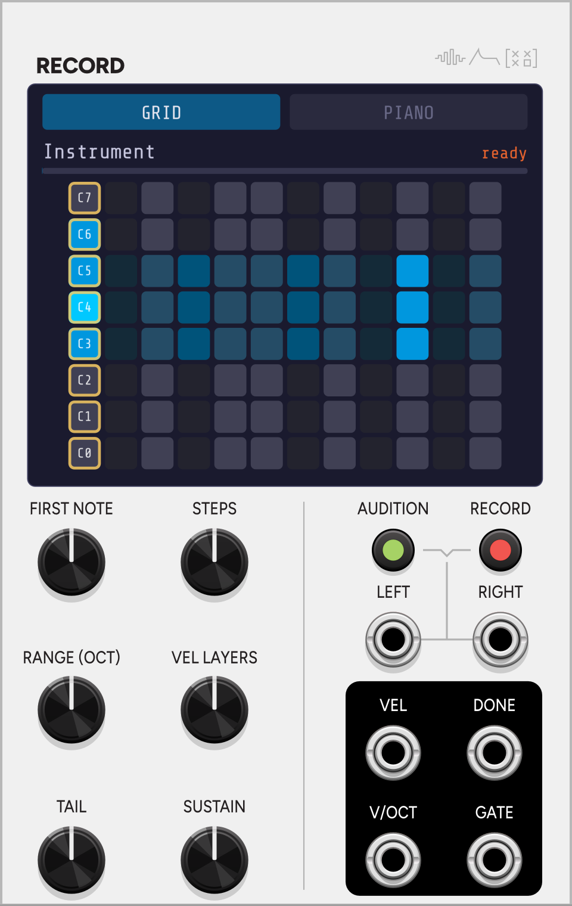 

**[Record on signalfunctionset.com →](https://signalfunctionset.com/projects/record)**

An auto-sampler. Point it at any voice in your rack: a patch you've built, a granular texture, an FM bell. Press RECORD and it plays that voice across a range of notes and velocities, captures each one, and writes a complete multisampled instrument to disk: a folder of WAVs plus an `.sfz`. The result loads straight into [Play](#play), or any sampler that reads SFZ. Record is 16HP.

**Features:**
- **Drives and listens**: outputs V/OCT + GATE + VELOCITY to your patch, records the stereo return; per capture it holds the gate for SUSTAIN, records the TAIL after release, waits for silence, and advances.
- **Sweep control**: Start note, Spacing (semitones between samples), Octaves, and Velocity layers.
- **Audition**: run the same sweep with no capture or write, to check tuning and tail length before committing.
- **Round-robins (1–4)**: capture each note several times for instruments that never repeat exactly (only worth it if the voice actually varies).
- **Loop detection**: finds a loop point on positive zero-crossings, minimising the seam error, and writes `loop_start`/`loop_end`. Best on sustained material.
- **Latency calibration**: measures your patch's round-trip delay and trims to the true onset instead of a threshold.
- **Live scope + playable pads**: see the input arriving; tap a key or pad to audition the voice you're about to sample.
- **File options**: mono/stereo, 16/24/32-bit float, normalize, auto-trim, gate vs trigger mode.

**Controls:** Start, Spacing, Octaves, Vel Layers, Tail, Sustain, Audition, Record.
**Inputs:** L / R (the voice's return).
**Outputs:** V/Oct, Gate, Velocity, Done.

See [docs/record-manual.md](docs/record-manual.md) for the full manual.

## Other Platforms

Signal Function Set modules have been ported to other hardware/software platforms:

- **[MetaModule port](https://github.com/stuart78/metamodule-SignalFunctionSet)**: Signal Function Set running on the [4ms MetaModule](https://4mscompany.com/metamodule.php).
- **[Disting NT port](https://github.com/stuart78/SignalFunctionSet-DistingNT)**: Signal Function Set ported to the [Expert Sleepers disting NT](https://www.expert-sleepers.co.uk/distingNT.html).

## Building

See [build-doc.md](build-doc.md) for detailed build instructions.

```bash
# Mac
./build.sh dev   # Development build + auto-install
./build.sh prod  # Production build for distribution

# Windows: native (run from the MSYS2 MinGW64 shell)
./build.sh dev  win   # Build + auto-install to %LOCALAPPDATA%\Rack2\plugins-win-x64
./build.sh prod win   # Production build for distribution

# Windows: cross-compile from Mac (requires MinGW and GNU coreutils)
./build.sh prod win
```

`./build.sh ... win` auto-detects whether it's running natively on Windows
(MSYS2/MinGW64) or cross-compiling from macOS.

## License

GPL-3.0-or-later. See [LICENSE](LICENSE) for details. This plugin is free
software and stays that way.

Signal Function Set is **dual licensed**. The same modules are also sold in
other formats, currently as a Max for Live pack, under proprietary terms. Both
grants come from the same copyright holder, who wrote all of this code, and a
copyright holder is not bound by a licence they grant to others. The GPL release
is unaffected by the commercial one: every version published here is GPL
forever, for everyone who has it.

That is also why the project takes bug reports rather than pull requests. See
[CONTRIBUTING.md](CONTRIBUTING.md), and [CLA.md](CLA.md) for the agreement
covering the occasional accepted contribution.
